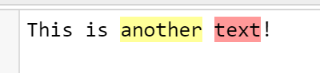
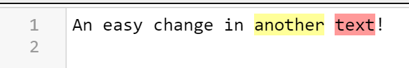
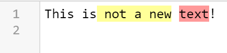

# Issues

## Recovering Non-Annotation aware Changes


### Problem: Changes inside Annotation Ranges

Text:

```text
This is another text!\n
```

Annotations:

```json
{"type":"Reference","version":"63389228c85209fedafba37f7b0279cf12eff7a1","content":"This is another text!\n"}
{"from":8,"to":15,"name":"color","color":"yellow"}
{"from":16,"to":20,"name":"color","color":"red"}
```

Annotated Text:




Non-annotation aware changes:

Inserting text independent from an annotated region: `An easy change in another text!`



But what happens when we change parts of the text that are annotated: `This is not a new text!`

Resulting annotated Text:


