# Mermaid Diagram Examples

This document showcases all types of mermaid diagrams working natively in Lively4 markdown.

## Flow Charts

### Basic Flow Chart
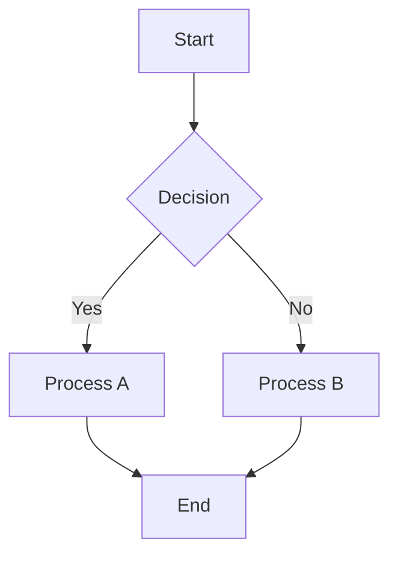

### Left-to-Right Flow Chart
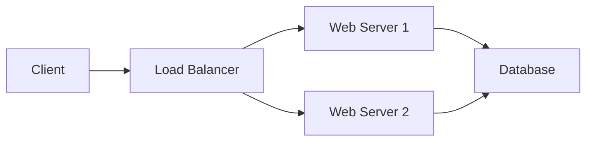

### Complex Flow Chart with Styling
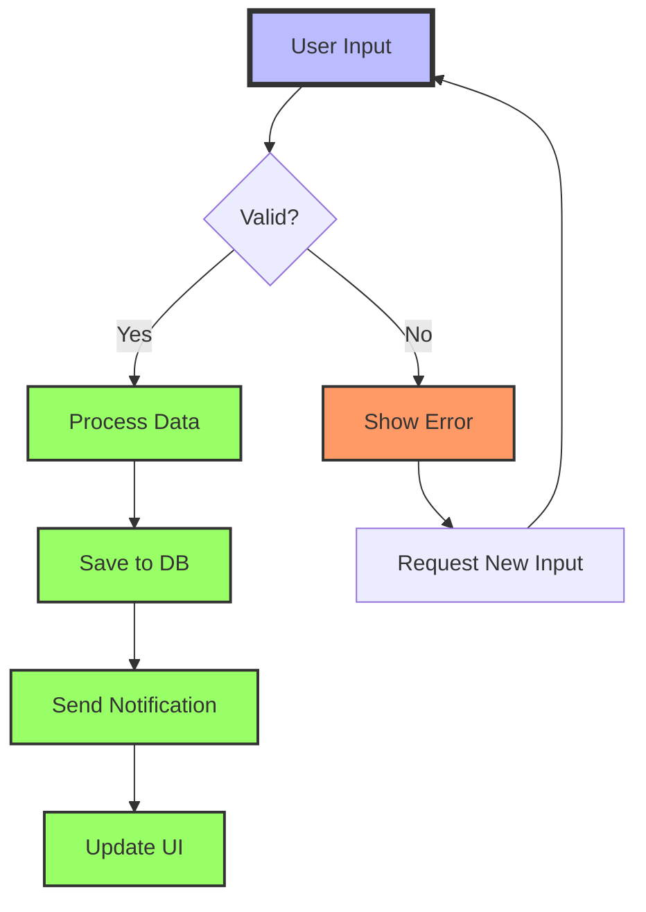

## Sequence Diagrams

### Basic Sequence Diagram
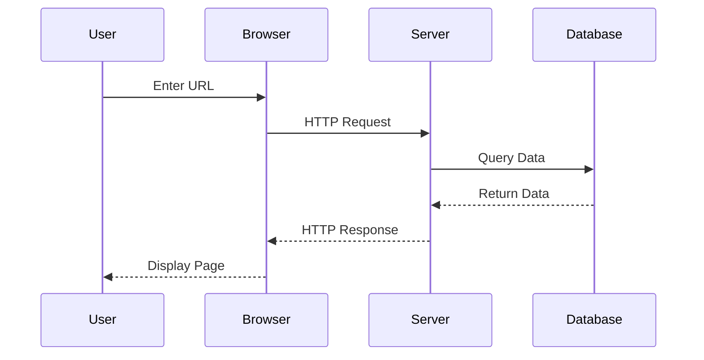

### Advanced Sequence with Loops and Conditions
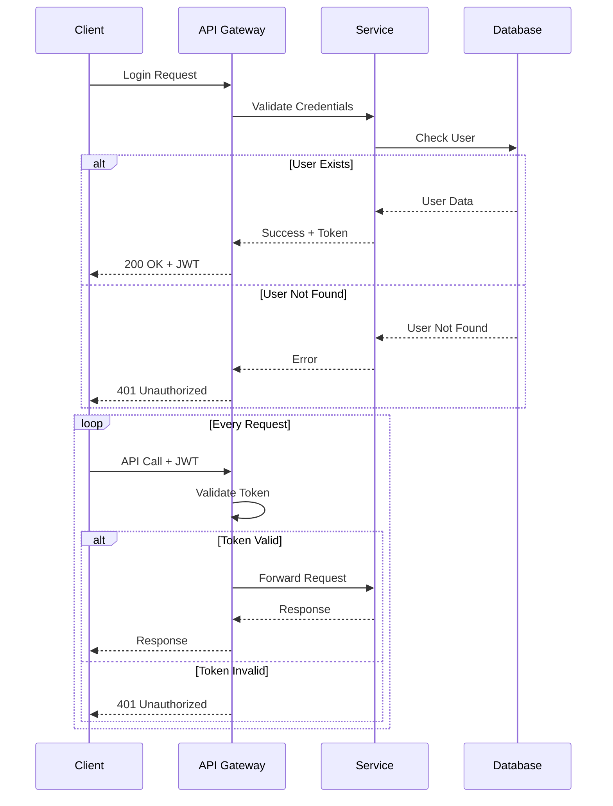

## Class Diagrams

### Basic Class Diagram
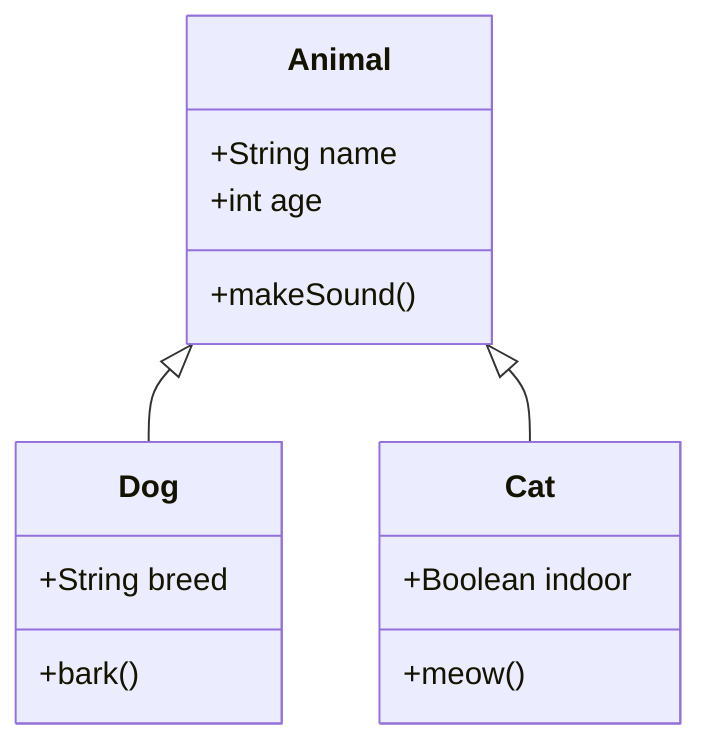

### Complex Class Diagram with Relationships
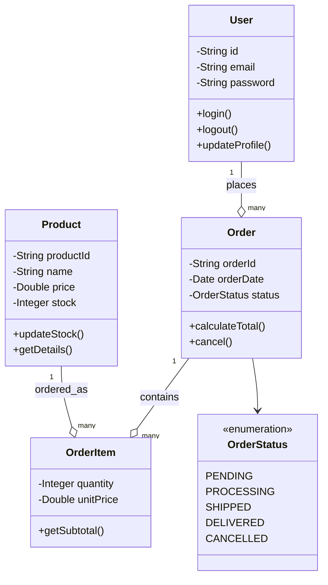

## State Diagrams

### Simple State Machine
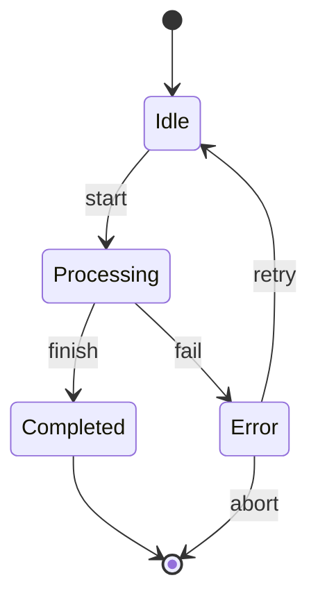

### Complex State Machine
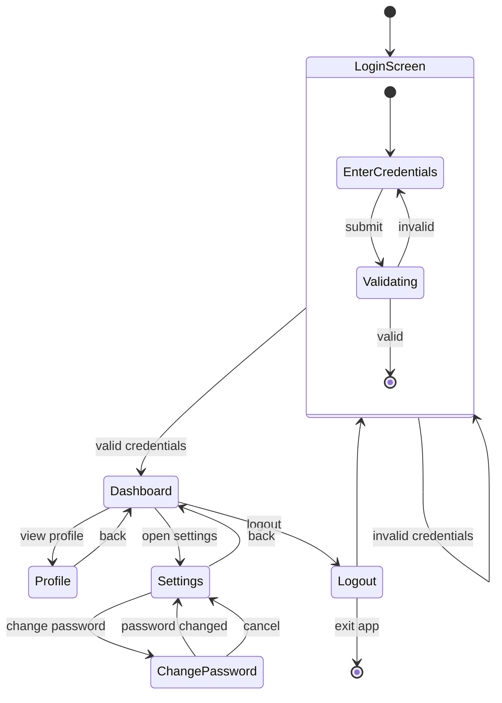

## Entity Relationship Diagrams

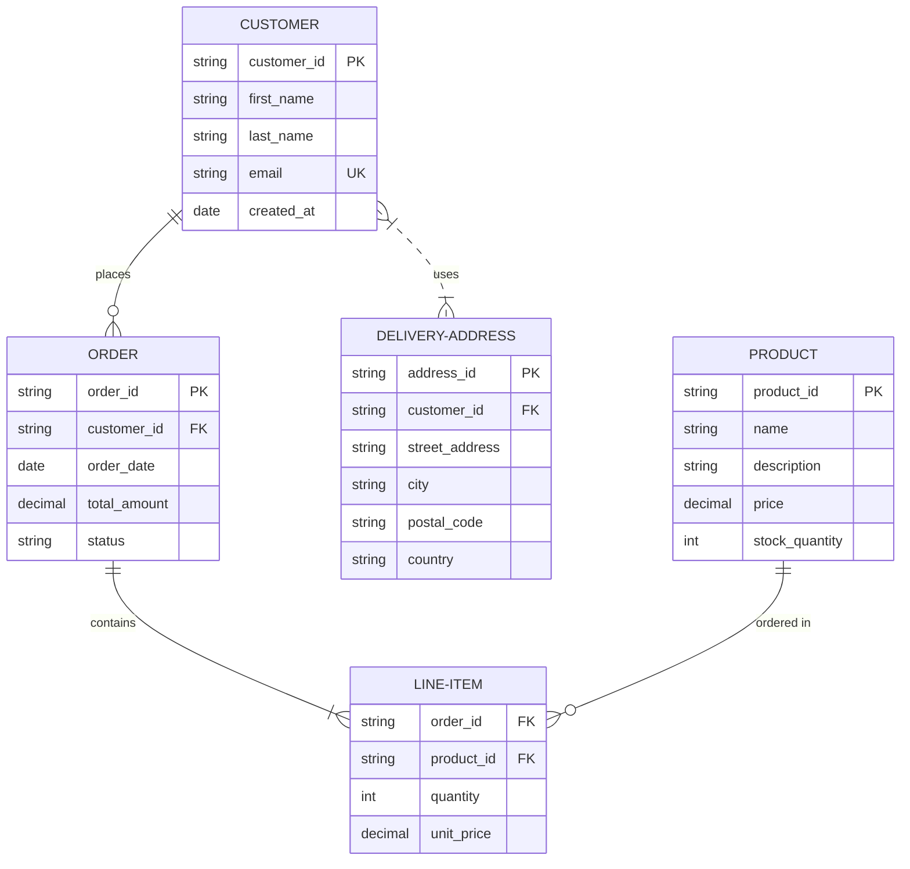

## User Journey

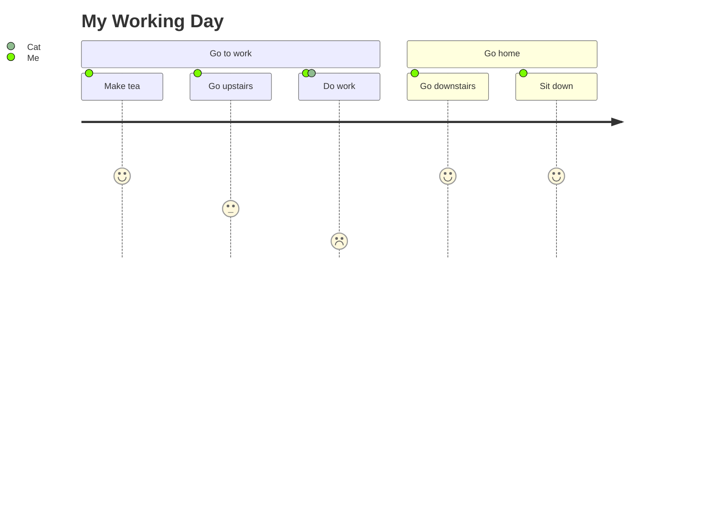

## Git Graph

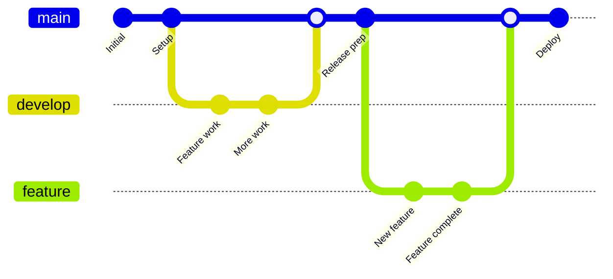

## Pie Chart

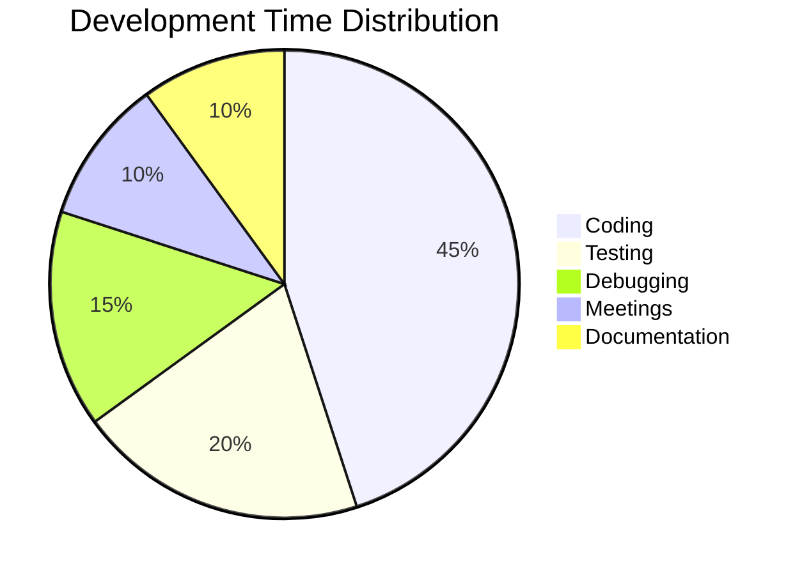

## Gantt Chart

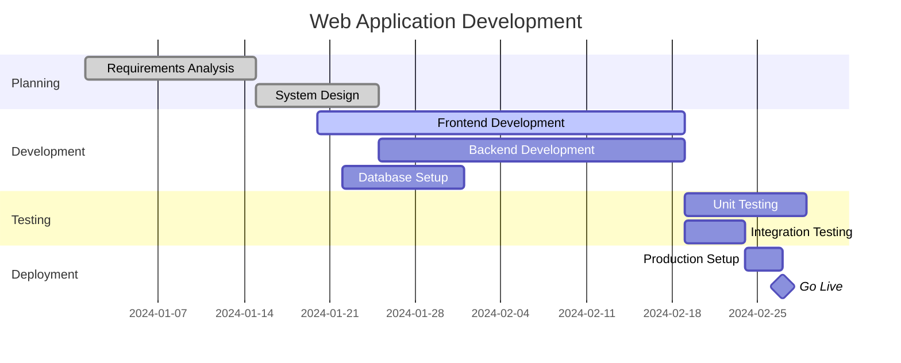

---

## Mindmap

⚠️ **Known Issue**: The `mindmap` diagram type has a compatibility issue with Lively4's environment (E.id is not a function). Mindmaps work in standalone HTML but fail within Lively4's SystemJS/Shadow DOM context.

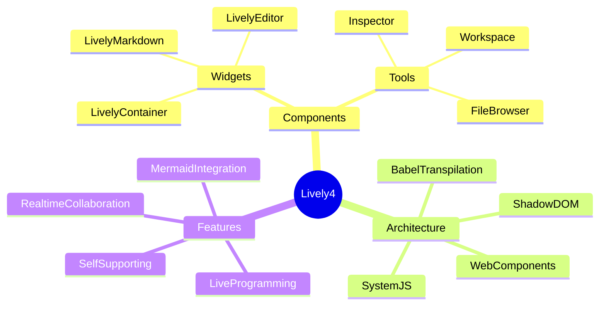

**Alternative using Flowchart:**

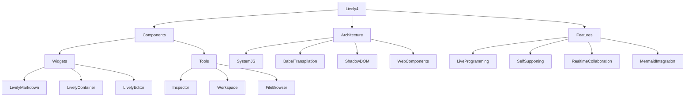

## Timeline

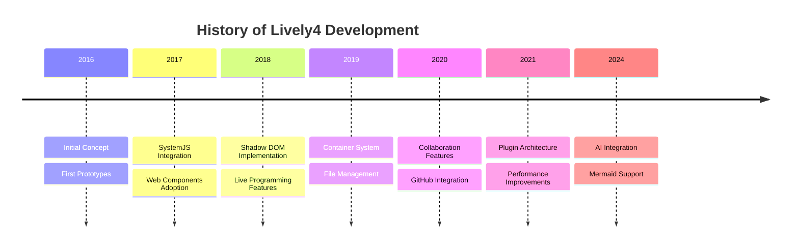

## Quadrant Chart

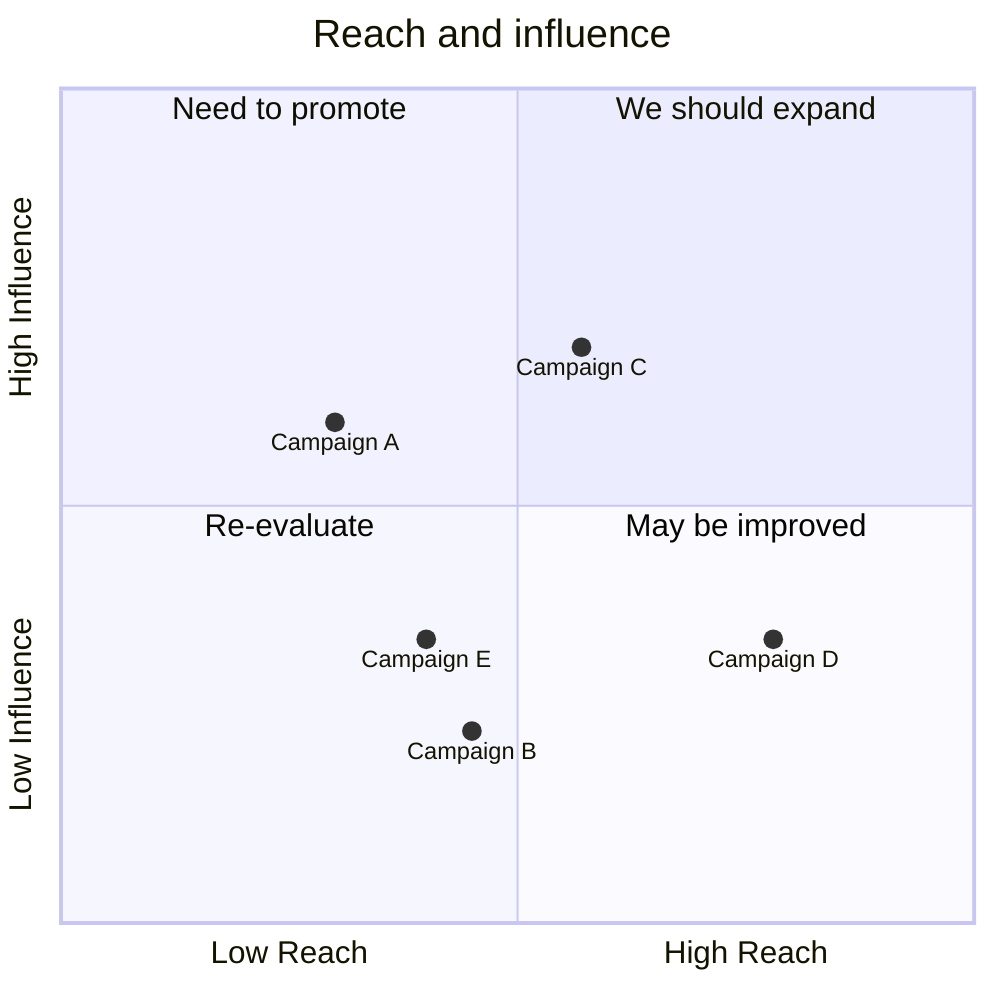

## Supported Diagram Types

The following diagram types are confirmed to work with mermaid 11.4.0 in Lively4:

- ✅ **Flow Charts** (`graph`, `flowchart`)
- ✅ **Sequence Diagrams** (`sequenceDiagram`)
- ✅ **Class Diagrams** (`classDiagram`)
- ✅ **State Diagrams** (`stateDiagram-v2`)
- ✅ **Entity Relationship** (`erDiagram`)
- ✅ **User Journey** (`journey`)
- ✅ **Git Graph** (`gitgraph`)
- ✅ **Pie Charts** (`pie`)
- ✅ **Gantt Charts** (`gantt`)
- ❌ **Mindmaps** (`mindmap`) - Lively4 environment compatibility issue
- ✅ **Timeline** (`timeline`)
- ✅ **Quadrant Chart** (`quadrantChart`)

## Tips for Using Mermaid in Lively4

1. **Syntax**: Use ````mermaid` code blocks
2. **Styling**: Add CSS classes and styling directly in diagrams
3. **Interactive**: Diagrams are fully interactive (clickable, zoomable)
4. **Responsive**: Diagrams automatically resize with the container
5. **Themes**: Mermaid respects the overall page theme
6. **Debugging**: Check browser console for mermaid syntax errors

All supported diagrams render automatically in any Lively4 markdown file! 🎉