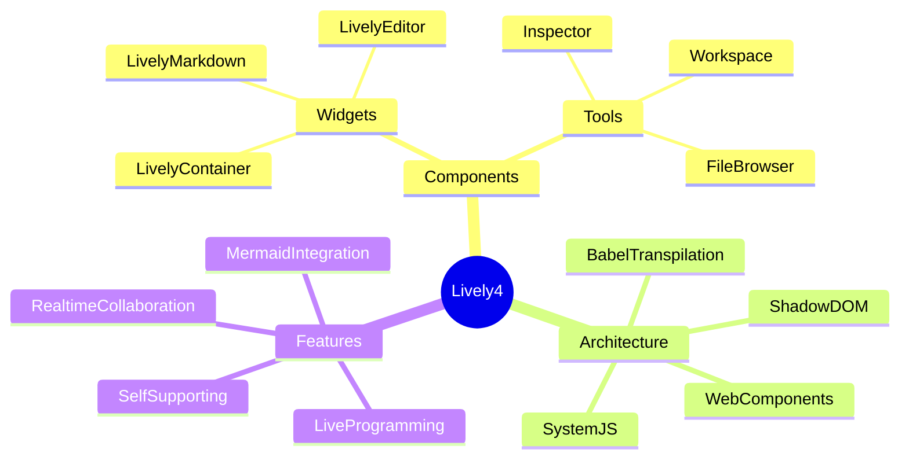

# Mermaid Diagram Issues

⚠️ **Known Issue**: The `mindmap` diagram type has a compatibility issue with Lively4's environment (E.id is not a function). Mindmaps work in standalone HTML but fail within Lively4's SystemJS/Shadow DOM context.

