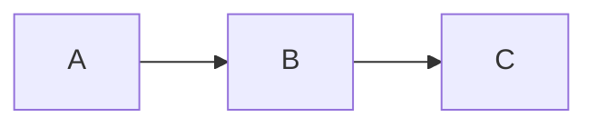
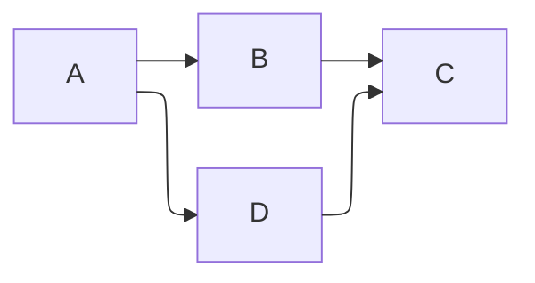
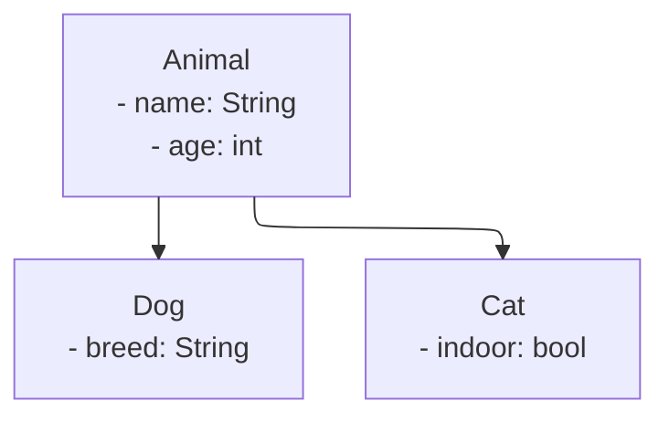

# ELK Debug Test

Open the browser console (F12) and check for:
- `[lively-markdown] ELK layout registered successfully`
- Any error messages about ELK

## Test 1: Simple Flowchart (Regular)

## Test 2: ELK Flowchart (Should be orthogonal)

## Test 3: Class Hierarchy with ELK

