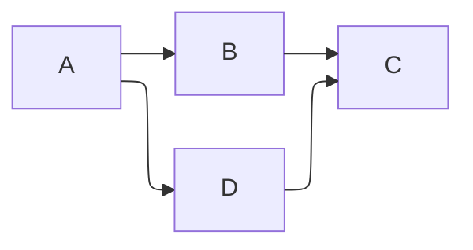
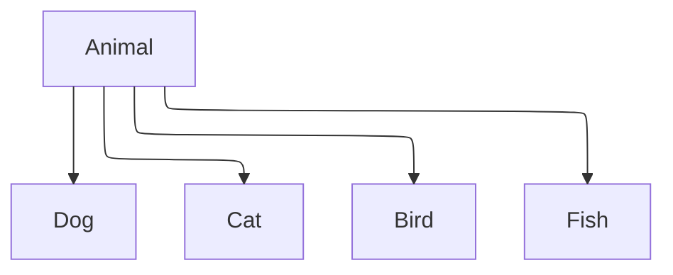

# Test ELK Renderer

This tests if the ELK renderer is working after module reload.

## Simple Orthogonal Test



## Class Diagram Test



To reload the lively-markdown module, run in workspace:
```javascript
await lively.reloadModule("src/components/widgets/lively-markdown.js")
```
