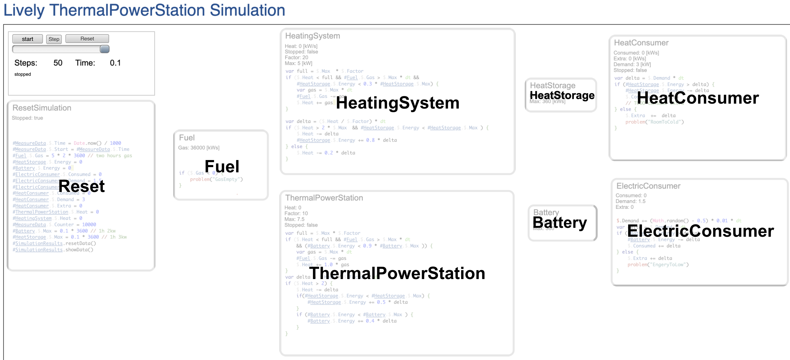
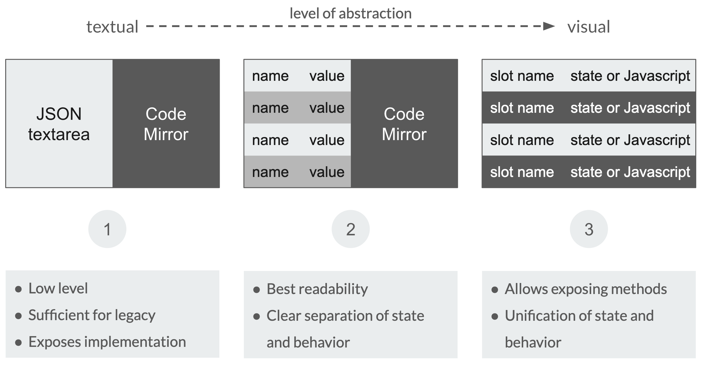

<!-- markdown-config presentation=true -->

<link rel="stylesheet" type="text/css" href="./style.css"  />
<link href='https://fonts.googleapis.com/css?family=Lato:400' rel='stylesheet' type='text/css' />
<link href='https://fonts.googleapis.com/css?family=Raleway:500,600' rel='stylesheet' type='text/css' />

[//]: # (Presentation Setup)

  

    

    <image class='logo' src='./hpi_logo.png' />
  

  

    
      Lively Simulation
    
    
      
Leonardo Hübscher, Juliane Kleinknecht

      
End User Development Seminar SS 20 Software Architectures

      
14.07.2020

    
  

  

---

  

    

      
14.07.2020

      
End User Development SS 20

      
Lively Simulation

      
Leonardo Hübscher, Juliane Kleinknecht

    

    <image class='logo' src='./hpi_logo.png' />
  

  

    <h1>Outline</h1>
    <ol class='outline'>
      <li>Dynamic Simulations</li>
      <li>Motivation</li>
      <li>Project Goal</li>
      <li>Energy Simulation</li>
      <li>Demo</li>
      <li>Improve End User Experience</li>
      <li>What's Next?</li>
    </ol>
  

  

<!-- ---

  

    

      
14.07.2020

      
End User Development SS 20

      
Lively Simulation

      
Leonardo Hübscher, Juliane Kleinknecht

    

    <image class='logo' src='./hpi_logo.png' />
  

  

    <h1>Dynamic Simulations</h1>
    <ul>
      <li>A simulation is there to make experiments on a model to get findings on the real system</li>
      <li>Simulation - used when behavior is theoretically formally to complex (so iteratively not analytically)</li>
      <li>dynamic - time dependent  &rarr; observe processes and flows</li>
        <ul>
          <li>Continuous - uses differential equation to simulate like physics</li>
          <li>Discrete - event-driven like petri-nets</li>  
          <li>Hybrid - parts of both - not enough knowledge to be continuous (example: medicine/biology)</li>
        </ul>
      <li>Normally: "More configuration than programming"</li>
    </ul>
   <!--<ul>
      <li>What is a simulation?</li>
      <li>When does somebody chooses to use a simulation?</li>
      <li>Why are simulations helpful?</li>
      <li>What is a dynamic and hybrid simulation?</li>
    </ul>
  

  

-->

---

  

    

      
14.07.2020

      
End User Development SS 20

      
Lively Simulation

      
Leonardo Hübscher, Juliane Kleinknecht

    

    <image class='logo' src='./hpi_logo.png' />
  

  

    <h1>Simulations</h1>
    
Real system &#x1f30e; &rarr; too complex &#10068; &#x1f630; &rarr; model &#x1f4dd; &rarr; simulation &#x2699;

    <ul>
      <li>Make experiments in simulation &rarr; find hypothesis &rarr; test in real world</li>
      <li><b>Dynamic simulations:</b> time dependent &#x1f551; &rarr; observe processes and flows</li>
      <!-- <li>Normally: "More configuration than programming"</li> -->
    </ul>
  

  

---

  

    

      
14.07.2020

      
End User Development SS 20

      
Lively Simulation

      
Leonardo Hübscher, Juliane Kleinknecht

    

    <image class='logo' src='./hpi_logo.png' />
  

  

    <h1>Motivation</h1>
    

      

        <ul>
        <li>Understanding the domain though reverse engineering</li></ul>
            <!--<li>We don't know the formulas  &rarr; so we tune the parameters so they fit</li>
            <li>Extrapolate data points / estimate the errors</li>
              <ul>
                <li>what happens inbetween the timesteps?</li>
              </ul>-->
        <ul>
          <li>"From whiteboard to code" - approach </li>
            <ul>
              <li>Related to: ipython notebooks &rarr; code and documentation snippets</li>
            </ul>
        </ul>
        

        

            

              
              
Bouncing Ball Example

            

        

      

      

          

            We want to enable end-users to create simulations in a visually structured way
          

        

    

  

  

---

  

    

      
14.07.2020

      
End User Development SS 20

      
Lively Simulation

      
Leonardo Hübscher, Juliane Kleinknecht

    

    <image class='logo' src='./hpi_logo.png' />
  

  

    <h1>Project Goal</h1>
    

      

        We want to enable end-users to create simulations in a visually structured way
      

    

    
      <b>Idea</b> Build a semi-graphical simulation framework
    
    <ul>
      <li><i>Starting point:</i> PoC in Lively Webwerkstatt </li>
      <li>Allow documentation  to be part of simulation</li>
      <li>Provide a way that allows simulation result investigation </li>
      <li>Proper Lively integration </li>
      <li>Port  existing <i>energy simulation</i> from PoC</li>
    </ul>
  

  

---

  

    

      
14.07.2020

      
End User Development SS 20

      
Lively Simulation

      
Leonardo Hübscher, Juliane Kleinknecht

    

    <image class='logo' src='./hpi_logo.png' />
  

  

    <h1>Energy Simulation</h1>
    

      

        <ul>
          <li>Simulate energy flow</li>
          <li>Fuel &rarr; transformer &rarr; consumer</li>
          <li>Possible hypothesis:
            <ul>
              <li>Is heat storage big enough?</li>
              <li>Is a backup system required?</li>
            </ul>
          </li>
        </ul>
      

      

        

          
          
Energy simulation in Lively Webwerkstatt [1]

        

      

    

  

  

    [1] https://lively-kernel.org/repository/webwerkstatt/demos/EnergySimulationScripted.xhtml
  

---

  

    

    <image class='logo' src='./hpi_logo.png' />
  

  

    
      <h1>Demo</h1>
      

        Energy Simulation Port
      

    
  

  

---

  

    

      
14.07.2020

      
End User Development SS 20

      
Lively Simulation

      
Leonardo Hübscher, Juliane Kleinknecht

    

    <image class='logo' src='./hpi_logo.png' />
  

  

    <h1>Demo</h1>
    
Let's use our framework for the energy simulation!

    

      

        <b>What we want to show:</b>
        <ol>
          <li>Ported simulation is working</li>
          <li>How the simulation is being edited</li>
          <li>Cell locality</li>
          <li>Cell state visualization</li>
        </ol>
      

      

        

          
          
Energy simulation in Lively4

        

      

    

  

  

---

  

    

      
14.07.2020

      
End User Development SS 20

      
Lively Simulation

      
Leonardo Hübscher, Juliane Kleinknecht

    

    <image class='logo' src='./hpi_logo.png' />
  

  

    <h1>Demo</h1>
    TODO insert screencast as backup
    <ul>
      <li>show ported energy sim without log component, run</li>
      <li>reset</li>
      <li>create log cell (or maybe drag it from the world into sim? - fancy)</li>
      <li>show connectors for battery or fuel</li>
      <li>look at the pictures and notes!</li>
    </ul>
  

  

---

  

    

      
14.07.2020

      
End User Development SS 20

      
Lively Simulation

      
Leonardo Hübscher, Juliane Kleinknecht

    

    <image class='logo' src='./hpi_logo.png' />
  

  

    <h1>Demo</h1>
    
Let's use our framework for the energy simulation!

    

      

        <b>What we have seen:</b>
        <ol>
          <li>Ported simulation works ✅</li>
          <li>Loading a simulation and adding a cell ✅</li>
          <li>Independent cells/ global state access ✅</li>
          <li>Log tables and charts ✅</li>
        </ol>
      

      

        

          
          
Energy simulation in Lively4

        

      

    

  

  

---

  

    

    <image class='logo' src='./hpi_logo.png' />
  

  

    
      <h1>Design Improvements</h1>
      

        Improve end user experience
      

    
    

      <lively-simulation-cell></lively-simulation-cell>
    

  

  

---

  

    

      
14.07.2020

      
End User Development SS 20

      
Lively Simulation

      
Leonardo Hübscher, Juliane Kleinknecht

    

    <image class='logo' src='./hpi_logo.png' />
  

  

    <h1>Managing State and Behavior</h1>
    
  

  

---

  

    

      
14.07.2020

      
End User Development SS 20

      
Lively Simulation

      
Leonardo Hübscher, Juliane Kleinknecht

    

    
  

  

    <h1>Cell views</h1>
    

      

        <ul>
          <li>PoC had <u>one</u> centralized log/ chart</li>
          <li>Each cell represents one simulation unit</li>
        </ul>
        <blockquote>
          

            An environment that works the way nonprogrammers expect is more inviting and helps users become more confident and productive. [1]
          

        </blockquote>
        

          &rarr; each unit should have it's own 
          &nbsp;&nbsp;&nbsp;&nbsp;&nbsp;state/ behavior, log, chart
        

      

      

        

          
          
each entity has different views [1]

        

      

    

  

  

    [2] Myers, B. A., Pane, J. F., &amp; Ko, A. (2004). Natural programming languages and environments. Communications of the ACM, 47(9), 47-52.
  

---

  

    

      
14.07.2020

      
End User Development SS 20

      
Lively Simulation

      
Leonardo Hübscher, Juliane Kleinknecht

    

    
  

  

    <h1>Cell views</h1>
    

      

        <ul>
          <li>PoC had <u>one</u> centralized log/ chart</li>
          <li>Each cell represents one simulation unit</li>
        </ul>
        <blockquote>
          

            An environment that works the way nonprogrammers expect is more inviting and helps users become more confident and productive. [1]
          

        </blockquote>
        

          &rarr; each unit should have it's own 
          &nbsp;&nbsp;&nbsp;&nbsp;&nbsp;state/ behavior, log, chart
        

      

      

        

          

            <lively-import src="https://lively-kernel.org/lively4/lively4-livelyenergy/demos/engery-sim/presentation/cell-views-example.html"></lively-import>
          

        

      

    

  

  

    [1] Myers, B. A., Pane, J. F., &amp; Ko, A. (2004). Natural programming languages and environments. Communications of the ACM, 47(9), 47-52.
  

---

  

    

      
14.07.2020

      
End User Development SS 20

      
Lively Simulation

      
Leonardo Hübscher, Juliane Kleinknecht

    

    <image class='logo' src='./hpi_logo.png' />
  

  

    <h1>Unit support for DSL</h1>
    

      

        
          <b>Goal</b> Allow usage of units in DSL and support automatic conversion
        
        
          <b>PoC</b> Add units as comment to state only
        
        
          <b>Solution</b> Use mathjs [3] to parse the code and work with units
        
      

      

        

          
        

      

    

    <blockquote>
      

        [Mathjs] features a flexible expression parser [...] and offers an integrated solution to work with [...] units, and matrices. Powerful and easy to use.
      

    </blockquote>
    <pre style='margin: 0;'>math.evaluate('5.08 cm + 2 inch')     // 10.16 cm</pre>  
  

  

    [3] https://mathjs.org/
  

---

  

    

      
14.07.2020

      
End User Development SS 20

      
Lively Simulation

      
Leonardo Hübscher, Juliane Kleinknecht

    

    <image class='logo' src='./hpi_logo.png' />
  

  

    <h1>Unit support for DSL</h1>
    

      

        
          <b>Goal</b> Allow usage of units in DSL and support automatic conversion
        
        
          <b>PoC</b> Add units as comment to state only
        
        
          <b>Solution</b> Use mathjs [3] to parse the code and work with units
        
      

      

        

          
        

      

    

    <blockquote>
      

        [Mathjs] features a flexible expression parser [...] and offers an integrated solution to work with [...] units, and matrices. Powerful and easy to use.
      

    </blockquote>
    <pre style='margin: 0;'>math.evaluate('5.08 cm + 2 inch')     // 10.16 cm</pre>    
    

      

        Mathjs does not fully support Javascript (f.e. loops, if/else) 
        User would have to learn mathjs to use it
      

    

  

  

    [3] https://mathjs.org/
  

---

  

    

      
14.07.2020

      
End User Development SS 20

      
Lively Simulation

      
Leonardo Hübscher, Juliane Kleinknecht

    

    <image class='logo' src='./hpi_logo.png' />
  

  

    <h1>Performance</h1>
    <ul style="margin-block-start: 0;">
      <li>Secondary requirement, yet important for UX</li>
      <li>Main bottle neck: compilation (boundEval of CodeMirror)</li>
      <blockquote style="margin: 0.5em 10px;">
        

          Calling the [function] constructor directly can create functions dynamically but suffers from security and similar (but far less significant) performance issues to eval [...] [4]
        

    </blockquote>
      <li><b>Solution</b> pre-compile javascript code of each cell</li>
      <li>technical background:
        <ul>
          <li>Create a function and pass javascript code</li>
          <li>When executing pass simulation state to pre-compiled functions as <i>this</i></li>
        </ul>
      </li>
    </ul>
  

  

    [4] https://developer.mozilla.org/en-US/docs/Web/JavaScript/Reference/Global_Objects/Function
  

---

  

    

      
14.07.2020

      
End User Development SS 20

      
Lively Simulation

      
Leonardo Hübscher, Juliane Kleinknecht

    

    <image class='logo' src='./hpi_logo.png' />
  

  

    <h1>Project Goal ✅</h1>
    

      

        We want to enable end-users to create simulations in a visually structured way
      

    

    
      <b>Idea</b> Build a semi-graphical simulation framework
    
    <ul>
      <li><i>Starting point:</i> PoC in Lively Webwerkstatt </li>
      <li>Allow documentation  to be part of simulation</li>
      <li>Provide a way that allows simulation result investigation </li>
      <li>Proper Lively integration </li>
      <li>Port  existing <i>energy simulation</i> from PoC</li>
    </ul>
  

  

---

  

    

      
14.07.2020

      
End User Development SS 20

      
Lively Simulation

      
Leonardo Hübscher, Juliane Kleinknecht

    

    <image class='logo' src='./hpi_logo.png' />
  

  

    <h1>What's Next?</h1>
    <b>Learnings &#x1f4da;</b>
      <ul>
        <li>Lively integration is easier than expected </li>
        <li>Plenty tools &amp; features &rarr; keeping overview is hard for newbies</li>
        <li>Stable internet connection required &#x1f310;</li>
        <li>Dataflow for nested components is not specified</li>
      </ul>
    <b>Next Steps &#x1f3c3;</b>
      <ul>
        <li>Mirroring of cells</li>
      </ul>
  

  

---

  

    

      
14.07.2020

      
End User Development SS 20

      
Lively Simulation

      
Leonardo Hübscher, Juliane Kleinknecht

    

    <image class='logo' src='./hpi_logo.png' />
  

  

    <h1>What's Next?</h1>
    

      

        <b>Future Work ➡️</b>
        <ul>
          <li>Gas tank example is a direction where it could go</li>
          <ul>
            <li>Variable number of entities of a cell/ array of a cells</li>
            <li>Creating a visualization/ painting component</li>
          </ul>
        </ul>
      

      

        <lively-bouncing-ball></lively-bouncing-ball>
      

    

  

  

