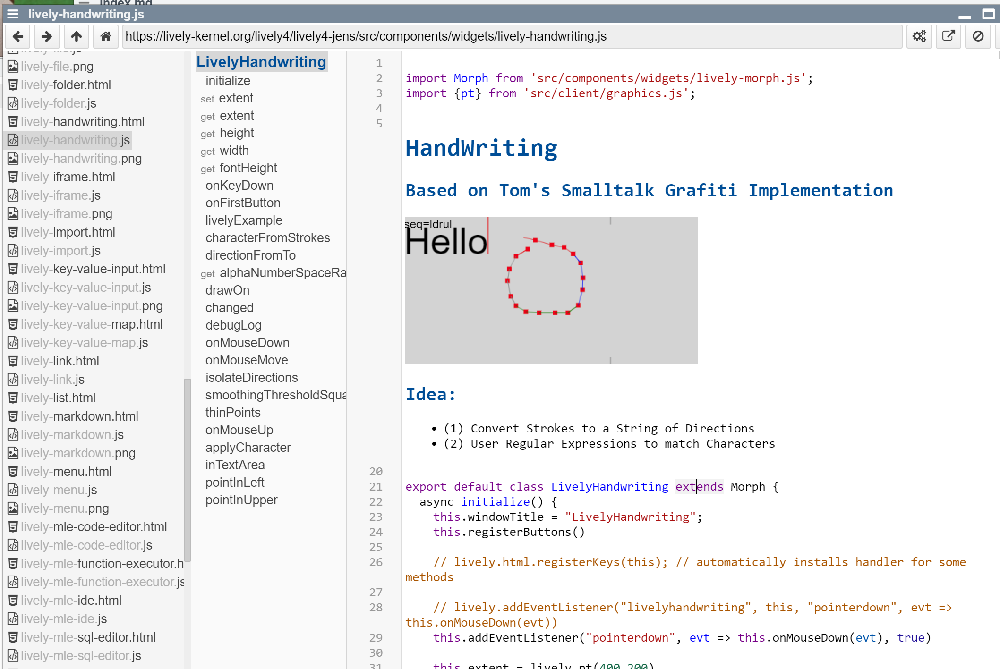

# Draft

- [tools-and-workflows](demos/tools-and-workflows/index.md)

- Example Application: Tom's Handwriting Recognizer 

<lively-handwriting style="width: 400px; height: 200px;"></lively-handwriting>

- Research Project in Lively
  - Async Expressions 
  - ContextJS
  - Polymorphic Identifiers
  - Babylonian Programming
  - Annotations

- Code in Markdown  
- but more interesting: *Markdown in Code*
  - embedding widgets in text editor (CodeMirror)
    - Example: interactive object inspector / table that pretty prints "printIts" in workspace
  - e.g. https://lively-kernel.org/lively4/lively4-jens/src/components/widgets/lively-handwriting.js
  
  - use cases
    - heading and formatted documentation in code
    - figures in code
    - code in code.... ?
    
---

## Transient Objects / #ObjectIdentity?

How to bridge persistent text and transient objects? E.g. an open inspector in a self-contained squeak image is easy to persist, but the object the inspector inspected is gone when it is loaded again. Should it point to the next best similar object, or even the object the user takes to be the same object after loading? How to treat object identity? Is the `document.body` object  always the same? 

We experimented with making object identity explicit when opening tools on them. But this would change an object the moment we look at them! We would kill the cat in Heisenberg terms on a very macro level. 

---
# Projects

- Base of a lot of [HPI seminars projects](https://lively-kernel.org/lively4/lively4-seminars/index.md)
- Our current bachelor's projects
- ...

--- 

# Current Research: Annotations

- one way to bridge "a" gab

---

# Research Project in Lively
  - Async Expressions 
  - Promises in ContextJS
  - Polymorphic Identifiers
  - Babylonian Programming
  - Annotations

---
# Our (Research) Projects in Lively
  - [Babylonian Programming](../../src/babylonian-programming-editor/presentation/index.md)
     {width=400}
  - [Async Expressions]() 
  - Promises in ContextJS
  - Polymorphic Identifiers
