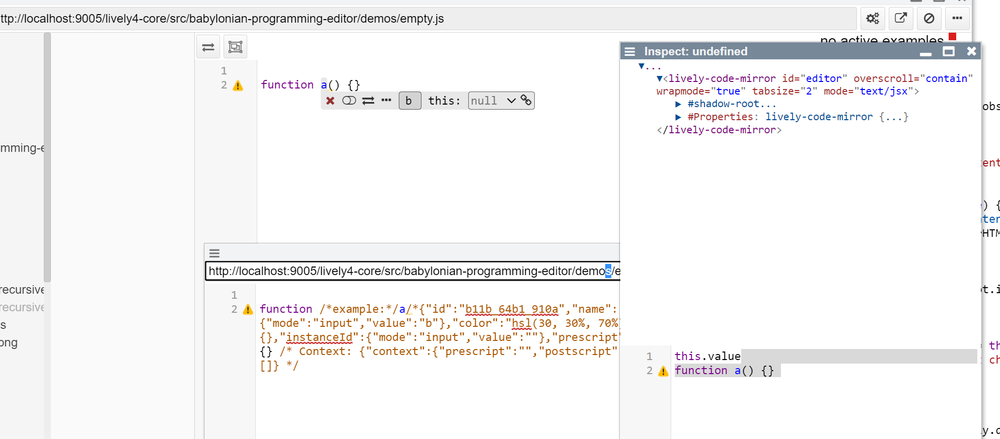

# Persistent Widgets

## Related Work

In Babylonian Programming there is also the concept of source code editing that is augmented with active widgets. 
But as we can see here, there are actually three states:

1. the source code as it is persisted on disk (including the serialize annotations embedded in JavaScript comments)
2. the clean source code without any annotations (shown in the inspector of code mirror)
3. the actual UI consisting of annotations that contain widgets

From this we can derive the architecture. At runtime code and annotations are separated (standoff-annotations / markup). When saving the code, these annotations are embedded inline. When loading the code, the annotations are interpreted and stripped form the edited source code.