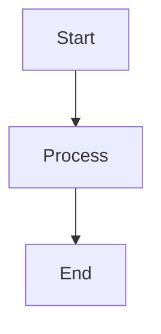
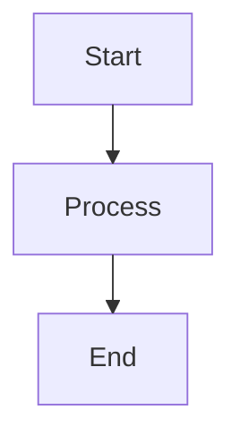
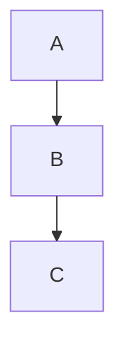

# Mermaid Diagrams in Lively4

Lively4 supports rendering Mermaid diagrams in markdown files with full ELK (Eclipse Layout Kernel) support for orthogonal edges.

## Quick Start

### Default Renderer (Dagre - Curved Edges)

Simply use mermaid code blocks in any markdown file:

````markdown

````

### ELK Renderer (Orthogonal Edges)

For ELK layout with orthogonal edges, add the `%%{init}%%` directive at the top of your diagram:

````markdown

````

**Important**: Diagrams without `%%{init}%%` use the default Dagre renderer (curved edges). Each diagram can override this individually.

## Implementation

### Challenge

Mermaid 11.x and the ELK layout plugin are modern ES modules that can't be transpiled by our Babel version. Direct imports fail:

```javascript
// ❌ This doesn't work with our Babel
import mermaid from 'https://cdn.jsdelivr.net/npm/mermaid@11.4.1/dist/mermaid.esm.min.mjs';
```

### Solution

We created `lively.loadJavaScriptModuleThroughDOM()` to load ES modules through the DOM:

```javascript
// ✅ This works!
const mermaidModule = await lively.loadJavaScriptModuleThroughDOM(
  'mermaid',
  'https://cdn.jsdelivr.net/npm/mermaid@11.4.1/dist/mermaid.esm.min.mjs'
);

const mermaid = mermaidModule.default;
```

See [src/client/lively.js:448](edit://../../src/client/lively.js:448) for implementation details.

### Integration

The lively-markdown component automatically loads and configures Mermaid+ELK when processing mermaid code blocks. See [src/components/widgets/lively-markdown.js:335](edit://../../src/components/widgets/lively-markdown.js:335).

**Key Design Decision**: 
- The component explicitly sets **dagre** as the global default renderer
- This ensures diagrams without `%%{init}%%` directive use standard curved edges
- Individual diagrams override this using `%%{init: {"flowchart": {"defaultRenderer": "elk"}} }%%`
- This gives you full control: standard behavior by default, ELK when explicitly requested

## Demo Files

- **[mermaid-renderer-examples.md](browse://mermaid-renderer-examples.md)** - ⭐ **START HERE** - Comprehensive guide with examples of all renderers and diagram types
- **[mermaid-elk-test.html](browse://mermaid-elk-test.html)** - Pure HTML/ES module reference implementation

## Usage in Your Own Code

If you need to use Mermaid in custom components, use the module loader:

```javascript
// Load Mermaid and ELK modules
const mermaidModule = await lively.loadJavaScriptModuleThroughDOM(
  'mermaid',
  'https://cdn.jsdelivr.net/npm/mermaid@11.4.1/dist/mermaid.esm.min.mjs'
);

const elkModule = await lively.loadJavaScriptModuleThroughDOM(
  'mermaid-elk',
  'https://cdn.jsdelivr.net/npm/@mermaid-js/layout-elk@0.2.0/dist/mermaid-layout-elk.esm.min.mjs'
);

const mermaid = mermaidModule.default;

// Register ELK and configure
await mermaid.registerLayoutLoaders(elkModule.default);
mermaid.initialize({
  startOnLoad: false,
  securityLevel: 'loose',
  flowchart: { defaultRenderer: 'dagre' }
});

// Render a diagram
const { svg } = await mermaid.render('diagram-id', diagramCode);
```

**Note**: Modules are cached in `window.__lively_modules__[name]` and reused automatically.

## Renderer Configuration

### Dagre (Default)
Curved edges - used when no `%%{init}%%` directive is specified.

### ELK (Orthogonal) 
Straight edges with right-angle routing - specify per diagram:

````markdown

````

Each diagram controls its own renderer independently. See [mermaid-renderer-examples.md](browse://mermaid-renderer-examples.md) for comprehensive examples.

## Versions

- **Mermaid**: 11.4.1
- **ELK Layout**: 0.2.0

## See Also

- [Main CLAUDE.md](browse://../../CLAUDE.md) - Development guidelines
- [Mermaid Documentation](https://mermaid.js.org/) - Official Mermaid docs
- [ELK Algorithm](https://www.eclipse.org/elk/) - Eclipse Layout Kernel
