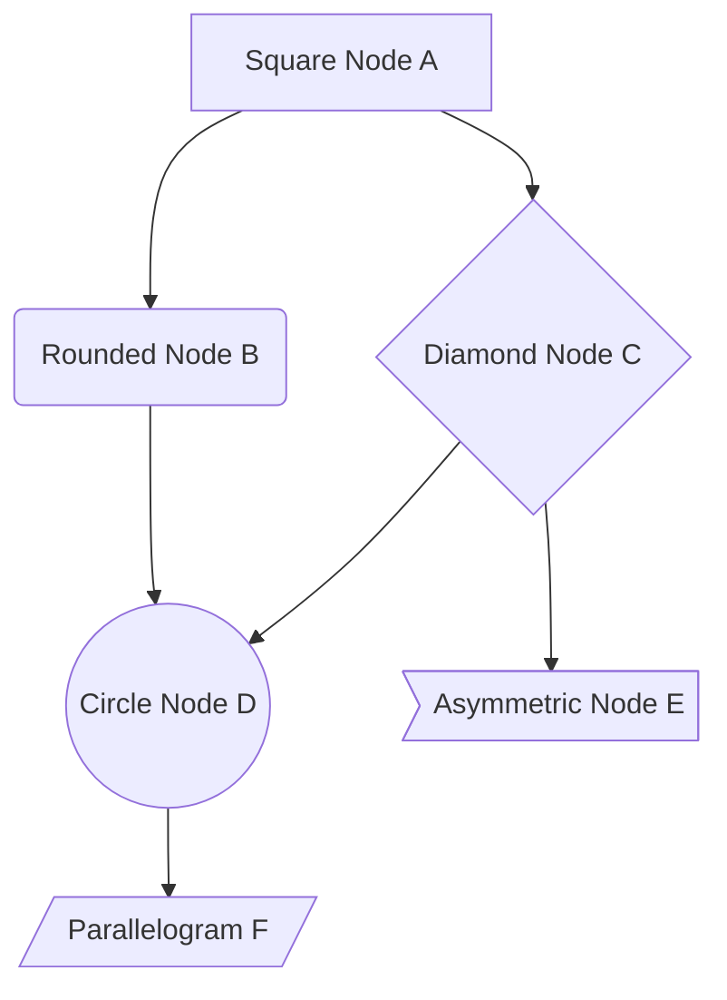
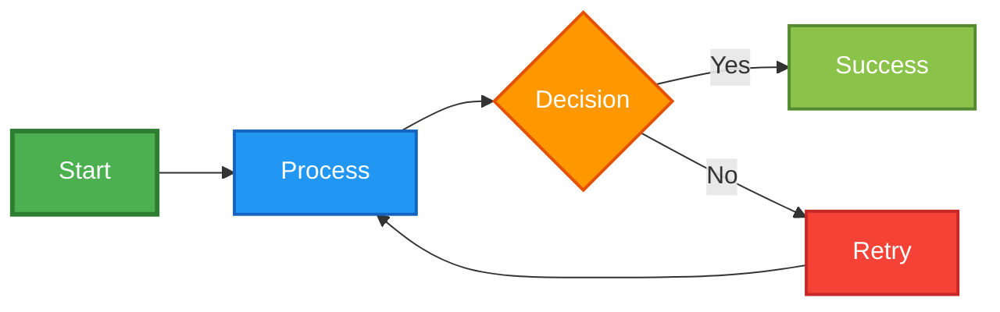
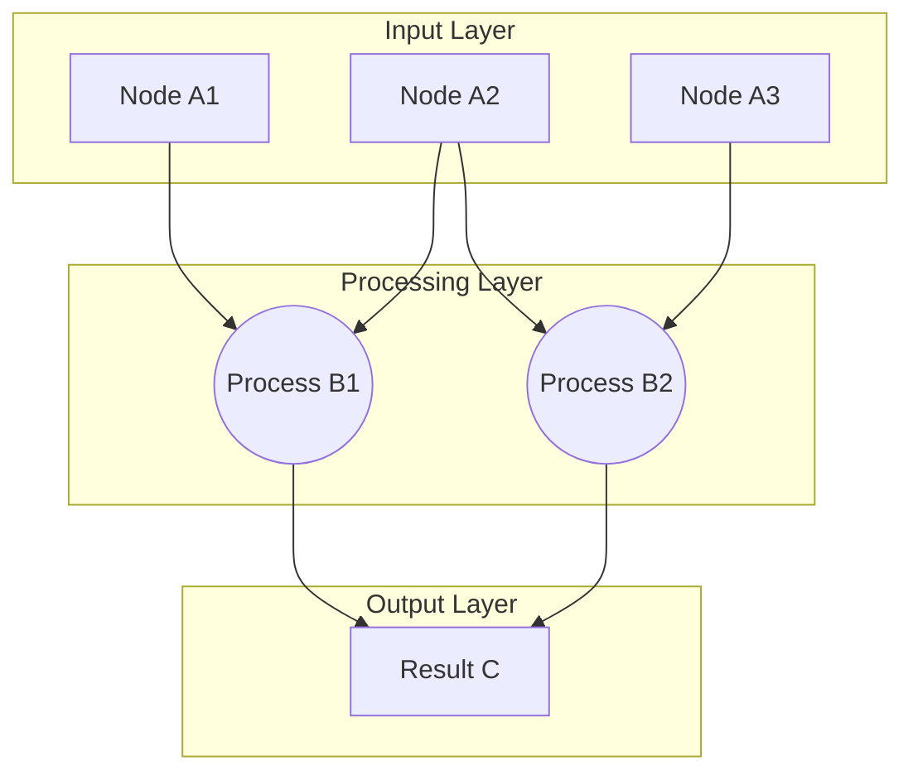
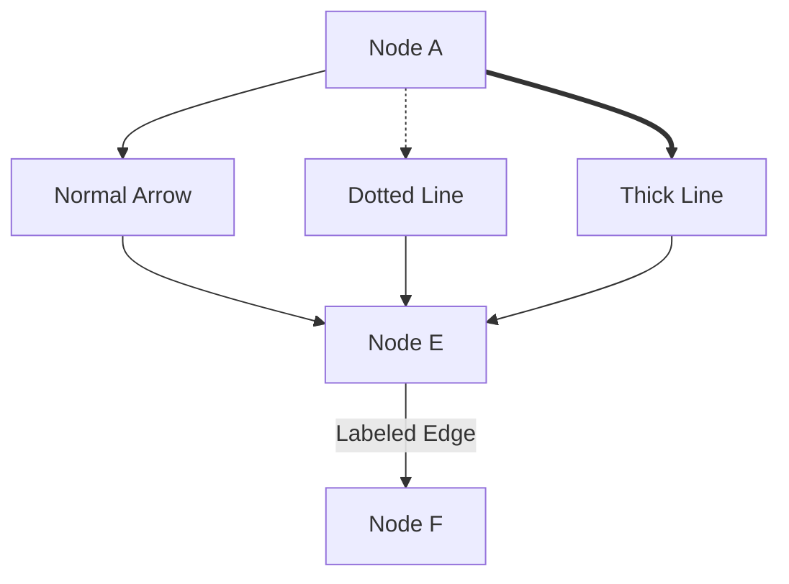
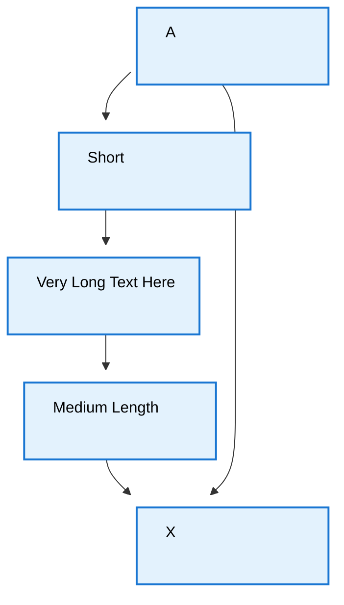
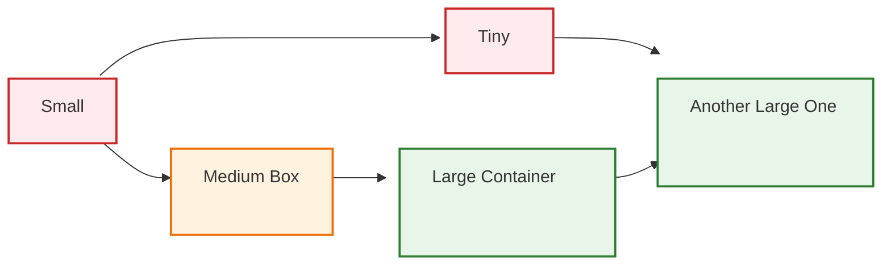

# Mermaid Graph Diagram Examples

## Basic Graph with Custom Node Shapes

## Styled Graph with Custom Classes

## Complex Layout Example

## Different Edge Styles

## Fixed-Size Boxes

## Multiple Fixed-Size Classes

