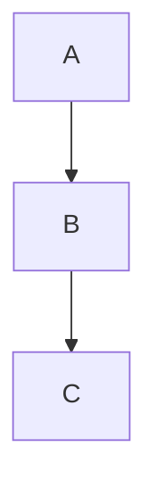
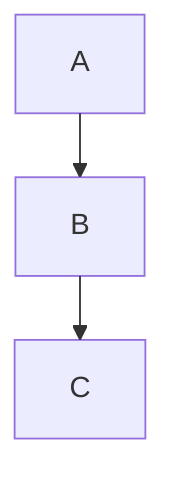
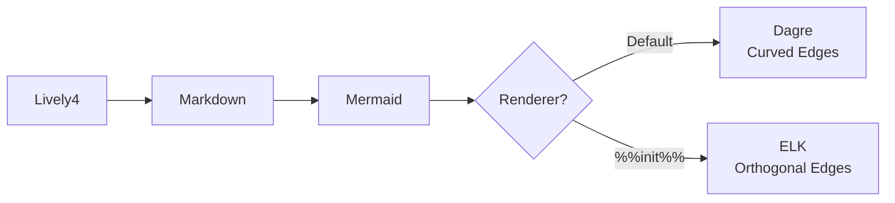
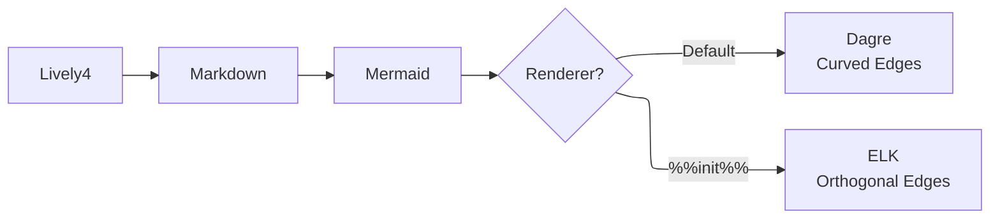

# Mermaid Diagrams with ELK Layout

Lively4 supports Mermaid diagrams with both **Dagre** (curved edges) and **ELK** (orthogonal edges) renderers.

## Quick Start

### Default (Dagre - Curved Edges)

````markdown

````

### ELK (Orthogonal Edges)

````markdown

````

## Learn More

- **[mermaid-renderer-examples.md](browse://mermaid-renderer-examples.md)** - ⭐ Comprehensive guide with all examples
- **[VERIFY.md](browse://VERIFY.md)** - Quick visual test
- **[README.md](browse://README.md)** - Full documentation and implementation details

## Live Demo



Above: Default Dagre renderer with curved edges.



Above: ELK renderer with orthogonal edges.
