# Mermaid Renderer Configuration Guide

This demonstrates the proper way to configure Mermaid diagrams with different renderers.

## Default Renderer (Dagre)

By default, Mermaid uses the **Dagre** layout algorithm with curved edges:

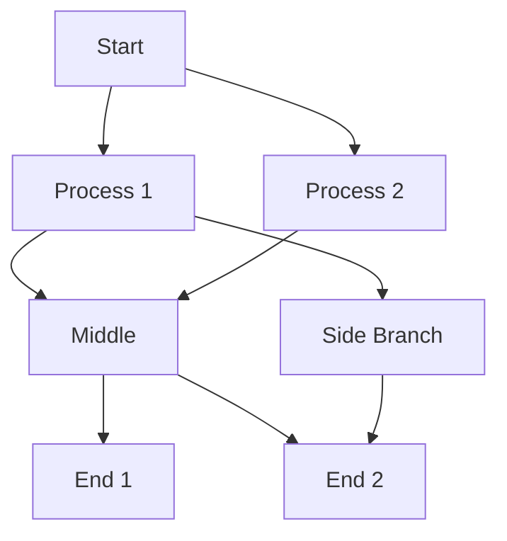

## ELK Renderer (Orthogonal Edges)

To use **ELK** layout with orthogonal (straight) edges, add the init directive:

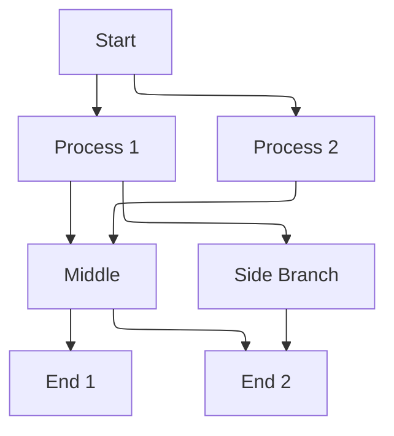

## Comparing Renderers Side-by-Side

### Dagre (Default) - Curved Edges

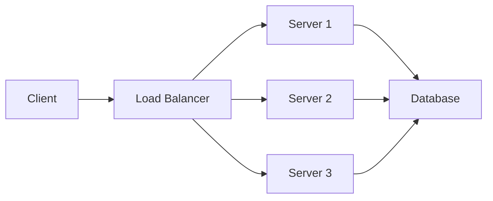

### ELK - Orthogonal Edges

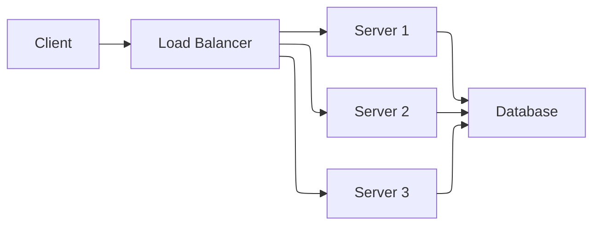

## Other Diagram Types

Mermaid supports many diagram types. The renderer configuration mainly affects flowcharts and graphs.

### Sequence Diagram (No Renderer Config Needed)

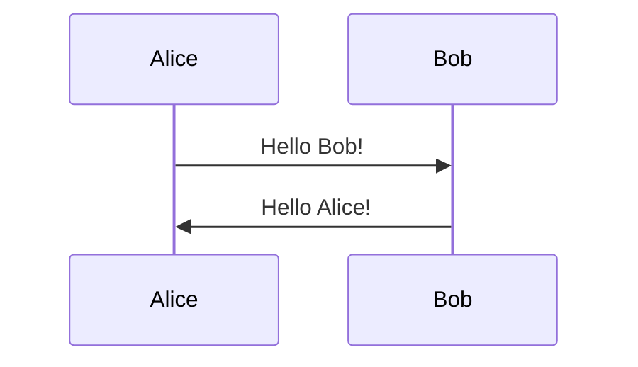

### Class Diagram (No Renderer Config Needed)

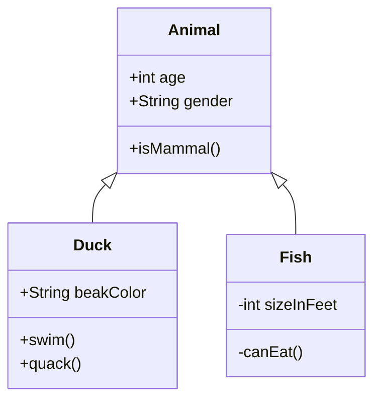

### State Diagram (No Renderer Config Needed)

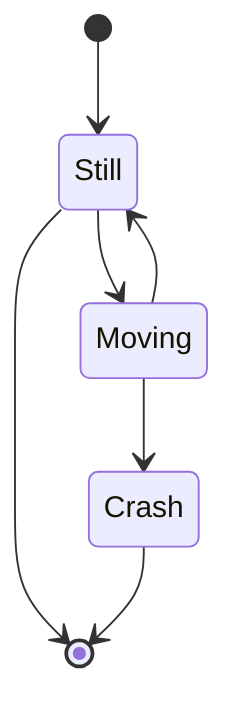

## Configuration Reference

### Basic Init Directive Syntax

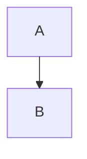

### Multiple Configuration Options

You can combine multiple configuration options:

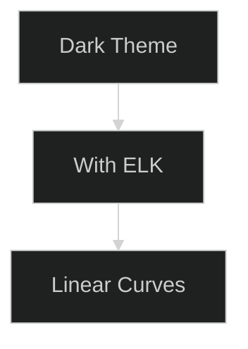

### Theme Options

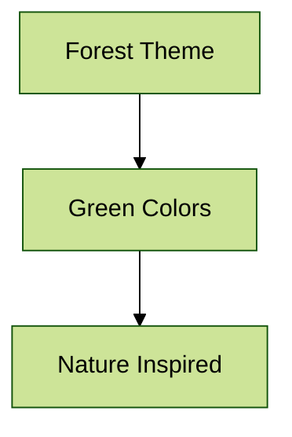

## When to Use Each Renderer

### Use Dagre (Default) When:
- You want smooth, curved edges
- Your diagram has organic, flowing relationships
- You prefer the traditional Mermaid look
- Rendering performance is critical (Dagre is faster)

### Use ELK When:
- You need orthogonal (right-angle) edges
- Your diagram represents technical architecture or circuits
- You want a more "technical drawing" appearance
- You have complex routing needs between many nodes

## Common Patterns

### Architecture Diagrams → ELK

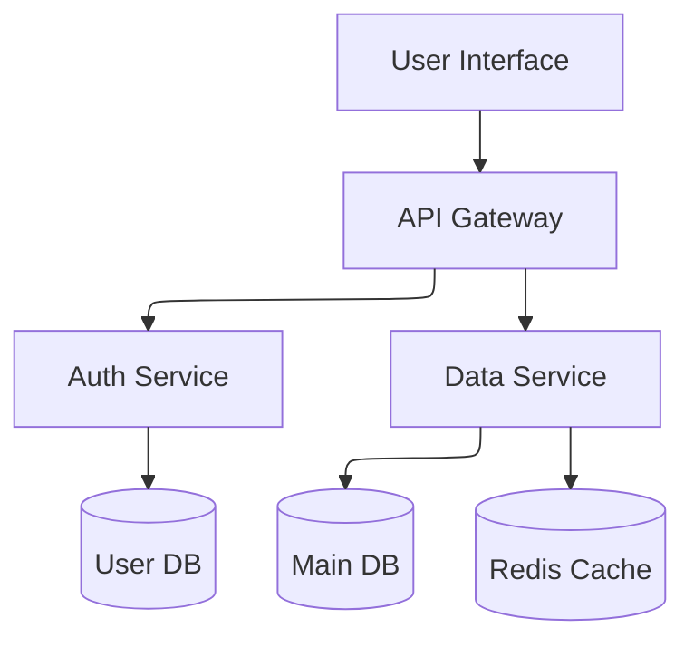

### Process Flows → Dagre

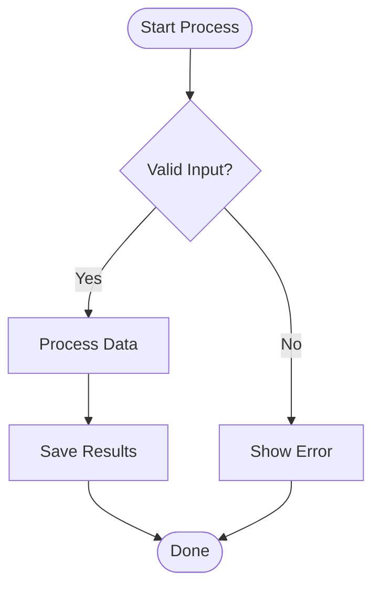

## How It Works

1. **Module Loading**: lively-markdown automatically loads Mermaid and ELK modules
2. **ELK Registration**: The ELK layout engine is registered with Mermaid
3. **Per-Diagram Config**: Each diagram's `%%{init}%%` directive configures that specific diagram
4. **Default Behavior**: Diagrams without init directive use Mermaid's default (Dagre) renderer

## See Also

- [Mermaid Configuration Documentation](https://mermaid.js.org/config/configuration.html)
- [Mermaid Flowchart Documentation](https://mermaid.js.org/syntax/flowchart.html)
- [ELK Algorithm Documentation](https://www.eclipse.org/elk/)
