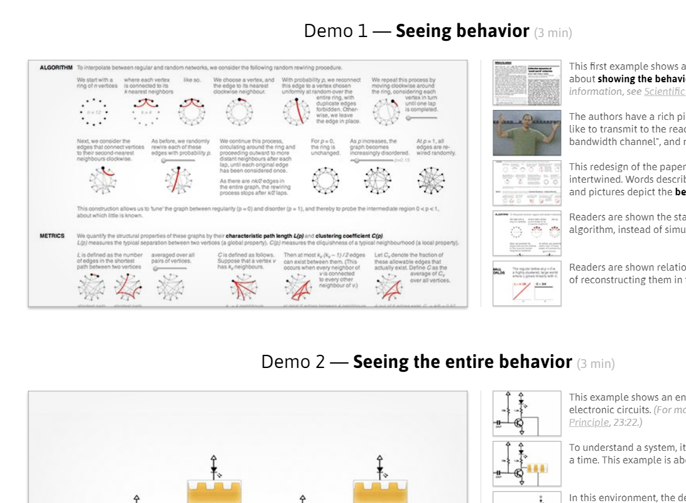

# Related Work Demo Videos 

- [Webstrates: Shareable Dynamic Media, PREVIEW 0:30min](https://www.youtube.com/watch?v=1IU7aFZMep0) 
  - #TitleSlide #AudioCommentary #FastTyping #Timelaps #TwoPanes  #RealShots
  - <iframe width="560" height="315" src="https://www.youtube.com/embed/1IU7aFZMep0" frameborder="0" allow="accelerometer; autoplay; encrypted-media; gyroscope; picture-in-picture" allowfullscreen></iframe>
- [Codestrates: Literate Computing with Webstrates, VIDEO, 5min](https://www.youtube.com/watch?v=yUaPWBZq63w)
  - #FastTyping #AudioCommentary #Actors
  - <iframe width="560" height="315" src="https://www.youtube.com/embed/yUaPWBZq63w" frameborder="0" allow="accelerometer; autoplay; encrypted-media; gyroscope; picture-in-picture" allowfullscreen></iframe>
- LIVE 2018: SVG Programming By Direct Manipulation of Intermediates
  - #TitleSlide #TextSlides #Timelaps  #AudioCommentary #TwoPanes 
  - <iframe width="560" height="315" src="https://www.youtube.com/embed/9JcKnJyufD8" frameborder="0" allow="accelerometer; autoplay; encrypted-media; gyroscope; picture-in-picture" allowfullscreen></iframe>
- [Chalktalk Javascript Demo - Presented by Ken Perlin 1:20s](https://vimeo.com/235048369)
  -  #NoAudio #NoCode #NoText #Demo
  - <iframe src="https://player.vimeo.com/video/235048369" width="640" height="400" frameborder="0" allow="autoplay; fullscreen" allowfullscreen></iframe>

## [Future Programming Workshop (vimeo)](https://vimeo.com/user27827062)

- [Patrick Dubroy: Moonchild](https://vimeo.com/97711824)
  - #AudioCommentary #Code #Figure #Links
  - <iframe src="https://player.vimeo.com/video/97711824" width="640" height="360" frameborder="0" allow="autoplay; fullscreen" allowfullscreen></iframe>
- [Yair Chuchem: Lamdu: Towards a next generation IDE](https://vimeo.com/97713439)
  - #AudioCommentary #Code #Highlights #KeyPressedVisual 
  - <iframe src="https://player.vimeo.com/video/97713439" width="640" height="360" frameborder="0" allow="autoplay; fullscreen" allowfullscreen></iframe>
- David Broderick: Kaya: Declarative Reactive
  - #AudioCommentary #Slides #BigFont #CodeSnippets #Figure
  - <iframe src="https://player.vimeo.com/video/97712270" width="640" height="360" frameborder="0" allow="autoplay; fullscreen" allowfullscreen></iframe>

<a href="https://vimeo.com/97712270">David Broderick: Kaya: Declarative Reactive</a> from <a href="https://vimeo.com/user27827062">Future Programming Workshop</a> on <a href="https://vimeo.com">Vimeo</a>.

## Bret Victor

- Bret Victor. Inventing on Principle
  - <iframe src="https://player.vimeo.com/video/36579366" width="640" height="360" frameborder="0" allow="autoplay; fullscreen" allowfullscreen></iframe>
- [Bret Victor. *Stop Drawing Dead Fish*. 2013, 53min](https://vimeo.com/64895205)
  - <iframe src="https://player.vimeo.com/video/64895205" width="640" height="360" frameborder="0" allow="autoplay; fullscreen" allowfullscreen></iframe>
- [Bret Victor. *Drawing Dynamic Visualizations*, Stanford HCI Seminar, 2013, 35min]
  - <iframe src="https://player.vimeo.com/video/66085662" width="640" height="360" frameborder="0" allow="autoplay; fullscreen" allowfullscreen></iframe>
- [Bret Victor. *Media for Thinking the Unthinkable*. 2013]
  - <iframe src="https://player.vimeo.com/video/67076984?portrait=0" width="640" height="360" frameborder="0" allow="autoplay; fullscreen" allowfullscreen></iframe>
 - 

# CHI

- [Managing Messes in Computational Notebooks](https://www.youtube.com/watch?v=mRT4qVwBa_g)
- [Concept-Driven Visual Analytics](https://www.youtube.com/watch?v=1FEHafliU1o)
- [AutoFritz: Autocomplete for Prototyping Virtual Breadboard Circuits](https://www.youtube.com/watch?v=58qEe2YhGIk)
- [RePlay: Contextually Presenting Learning Videos Across Software Applications](https://www.youtube.com/watch?v=oyUa6wSaYv4)
- [An Interactive Environment for Exploring Trade-offs in HCI Experiment Design](https://www.youtube.com/watch?v=g9ZBPBTxT1k)
- [Non-Linear Editing of Text-Based Screencasts](https://www.youtube.com/watch?v=rGNJqaZdDTo)
- [Rousillon: Scraping Distributed Hierarchical Web Data](https://www.youtube.com/watch?v=6SeZlm4TraU)
- [Fusion: Opportunistic Web Prototyping with UI Mashups](https://www.youtube.com/watch?v=x2FYkAivXaQ)

# Questions:

- Scope: #Standalone, #WithSlides, #WithAbstract, #WithPaper, #PartOfPresentationm, #LiveCommentaryNeeded
- Audience: #ScientificPeers, #OtherResearchers, #IndustryGuests, #Internet, #MomAndDad (Bachelorpodium)
- Material: #Screencast, #Slides, #AutioCommentary, #Actors, #RealShots 
- Story: #NoAudio, #Subtitles, #Audio