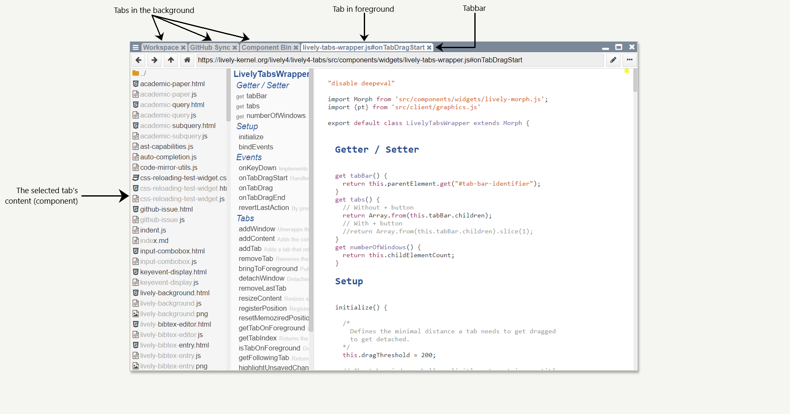
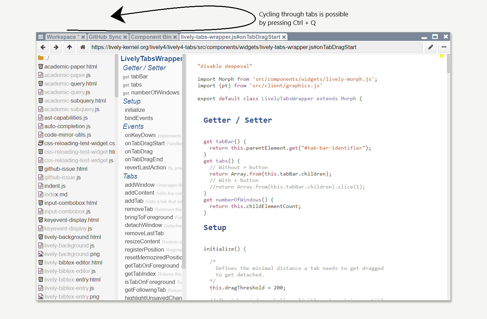
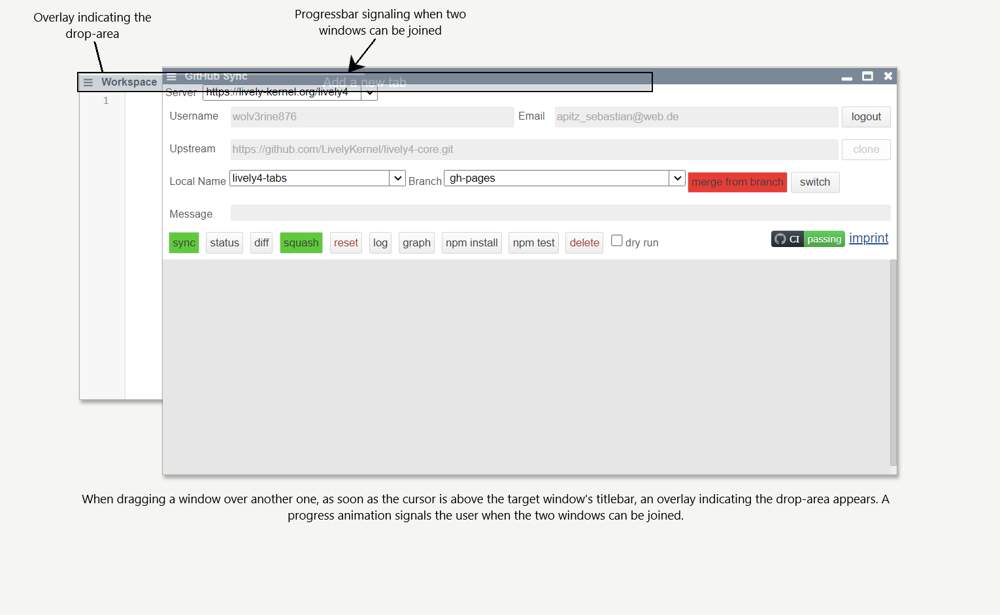
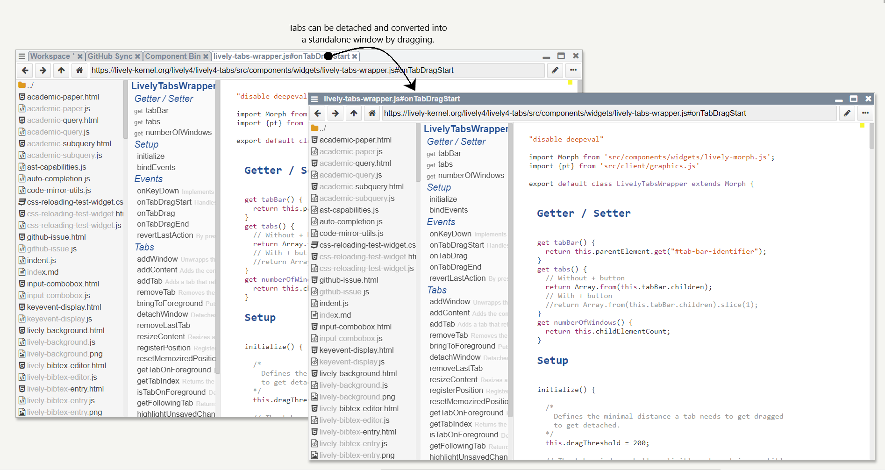
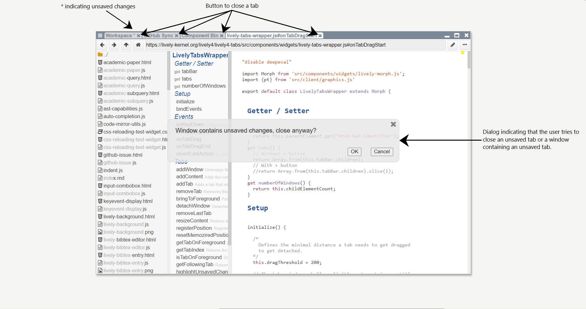
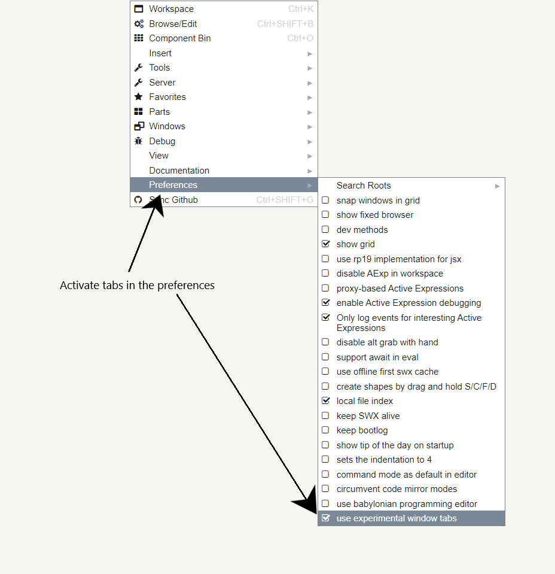

# Lively Tabs and Windows

## Abstract

### Context
In this student project, we looked at the organization of content in Lively4. Lively4 is a web-based integrated development environment (IDE) that can be accessed via a unique resource identifier (URL) like any other website. In contrast to the typical webpage users know from the world-wide-web that displays their content in a single window provided by the browser, Lively4 utilizes windows inside the browser for that purpose. In other words: Like operating systems (OS) and their desktops, Lively4 uses a world on which windows containing content can be freely placed. Counter to a classical desktop, Lively4's world is an infinite canvas. Therefore, a sizeable and moveable viewport is used to show a finite part of the world.

### Problem
This approach implies a lot of flexibility, as content can be placed nearly anywhere inside the application - for example, next to each other for increased multitasking. But with more files to edit, the general overview decreases as the viewport can only display a limited amount of information in a readable manner. Hence, windows start overlapping each other and the workplace starts to get unorganized.

### Solution
To tackle this problem and as the name of this project suggests, we wanted to implement tabs for Lively4. Tabs are typically organized horizontally at the top of a window and switch the window's content to the one they are representing by clicking - following the style of a physical, paper-based file system. Famous examples are Browsers and other IDEs like Google Chrome or Visual Studio Code. But in contrast to Lively4's approach, purely tab-based applications have one significant disadvantage: by displaying one content at a time, multitasking is fairly limited. Therefore, we decided to implement a hybrid solution by allowing windows inside Lively4's world to be tabbed (see below).

This can be compared to a browser that uses tabs inside the application but can be freely placed and sized on the OS' desktop. This way, the user can decide between better multi-tasking by using Lively4's windows and more overview by aggregating content using tabs.

#### Functional
To make the new feature as intuitive as possible, we implemented common functions users know from browsers. In general, tabs and content can be switched by clicking on them. As visual feedback, the selected one is highlighted. Furthermore, it is possible to cycle through all tabs by using the implemented keyboard shortcut (see below).

To create a tabbed window, one needs to drag two windows over each other.  As soon as the cursor is over the destination window's title bar, an animation occurs signaling when the two windows can be joined (see below).

This way we try to avoid accidental aggregation when a user just tries to reposition windows next to or over each other. To convert a tab into a stand-alone window, it is possible to reverse the before mentioned gesture: by dragging a tab, its content is placed in the world using a classical window (see below). 

Moreover, tabs can easily be closed using the integrated close button. The application then conveniently checks for unsaved edits and prompts the user to confirm the process in case changes would be lost (see below).

#### Technical
From a technical perspective, most of our work was done by introducing a new intermediary component called the lively-tabs-wrapper. From the window's point of view, the lively-tabs-wrapper behaves like a normal component and can therefore be a direct child of a window. In contrast, it aggregates multiple normal components and mocks the window's functionality and properties like sizing and the title. This way, the implemented solution is as universal and compatible as possible. One challenge was introduced by Lively4's persistence as it only stores the state of the Document Object Model (DOM). Thus, the lively-tabs-wrapper keeps its necessary state in the DOM at all times. This implies that a mechanism must be introduced to manage the displayed child component as all are part of the DOM and would be rendered otherwise. By utilizing the Cascading Style Sheet (CSS) property 'display', the lively-tabs-wrapper tells the browser which elements do not need to be rendered by setting it to 'none'. As soon as tabs get switched, the selected one is displayed by setting 'display' to 'block' and the old one hidden by applying 'none' again.
### Conclusion
All in all the project successfully added a highly requested feature to the Lively4 IDE. By introducing tabs for windows inside the world, which comes in handy especially on small screens, we increased the ability to organize content and therefore hope to boost user experience in general.

## Setup
Setting up tabs in Lively4 is simple (see below).

By right-clicking on the world and expending 'Preferences' a drop-down menu opens. Enable 'use experimental window tabs' and start using tabbed windows as described in the above abstract under Solution > Functional.

## Known Bugs
As soon as the lively-tabs-wrapper contains a lively-code-mirror and the page gets reloaded (Ctrl + R) an error is thrown. We were able to trace the bug to lively-container.getPath(). This method reads and encodes the displayed path from the input element at the top called 'container-path'. Unfortunately, it seems like the element's value is not set at that moment and therefore null. We do not understand why this happens, as the lively-code-mirror behaves normally when it is added by the user and no changes to the way Lively4 loads the world were done.