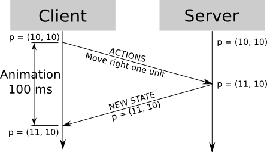

<!-- markdown-config presentation=true -->

<link rel="stylesheet" type="text/css" href="../../../../src/client/presentation.css"></link>
<link rel="stylesheet" type="text/css" href="style.css"></link>

<script>
import Presentation from "src/components/widgets/lively-presentation.js"
Presentation.config(this, {
    pageNumbers: true,
    logo: "https://lively-kernel.org/lively4/lively4-seminars/PX2018/media/hpi_logo.png"
})
</script>


<div class="title">
  Croquet — Replicated Computation
</div>

<div class="authors">
  <u>Teresa Lasarow</u>
</div>

<div class="credentials">
  20.07.2021<br>
  <br>
  Software Architectures HPI
</div>

---

# Once upon a time - Croquet

- <b>Croquet</b> as shared virtual 3D environment for collaboration of multi-users
  - Supports communication, highly scalable collaboration, resource sharing, and synchronous computation
  - TeaTime architecture &rarr; basis for object-object communication and world/object synchronization, including initial content synchronization while user joins a world

<br>
<p class="source">https://theses.liacs.nl/pdf/2009-06SjaakWolff.pdf - Figure 1</p> 
<p class="source">Paper: Croquet - A collaboration system architecture - Figure 4</p>

---

# Distributed Computing Systems

### Communication
- <b>Communication</b> as central part of computing experience, e.g., multi-player games, multi-user apps etc.
- <b>Distributed System</b> &rarr; collection of independent components located on different machines (nodes) that share messages with each other in order to achieve common goals<br>
<br>


---

# Distributed Computing Systems

### Client-Server
- Most popular architecture for distributed systems
- Use-Case: Cheating &rarr; "never trust the client"
- One single node (Server) is in charge of determining game state advancements
- Drawback: Server could be a bottleneck<br>
<br>


<p class="source">https://www.gabrielgambetta.com/client-side-prediction-server-reconciliation.html</p>

---

### Demo

##### Simulation in Croquet

---

# "Don't repeat yourself" - Or do you?
- <b>Distributed systems</b> &rarr; often makes a lot of sense to have many of one thing<br>
<br>
  - <b>Redundancy</b> &rarr; duplicate components of a system
    - Doesn't really help if a redundant node is out of synch with original<br>
    <br>
  - <b>Replication</b> &rarr; is what makes duplicated values actually usefull 
    - Ensures that the redundant node (a replica) is identical to all of its other copies

---

# "Don't repeat yourself" - Or do you?

### Replicated Computation
- A process of keeping copies of data at various locations or in serialized time
  - require processes to handle incoming events<br>
  <br>
- Pro's: Reduce user waiting time, increased availability and increased performance<br>
  <br>
- Challenge: Consistency through sharing of information among redundant resources such as software and hardware<br>
  <br>
- Replica is deterministic &rarr; Produce the same result

---

# Today is - Croquet
- No more 3D-virtual environment, no more portals, no more avatars<br>
  <br>
- A bit-identical synchronization system<br>
  <br>
- Applications are developed as though they are local, single-user experiences &rarr; Only one client<br>
  <br>
- Replicator serves as event mirror

---

# Demo 

#### Dice Example


---

# Croquet - Software Participants

## The Model - Replicated Object
- Instances created with create() but new<br>
  <br>
- Initialized via init() but constructor() &rarr; only initialized the first time the object comes into existence in the session<br>

```javascript
class RootModel extends Croquet.Model {
  init(options={}) {
    super.init();
    this.sceneModel = options.sceneModel;
  }
}
```

---

# Croquet - Software Participants

## The View - Non-Replicated Object
- Independent local view <br>
  <br>
- Provides mechanism to hook into the replicated model simulation<br>

```javascript
class DiceView extends Croquet.View {
  constructor(model) {
    super(model);
    this.model = model;
  }
}  
```

---

# Croquet - Software Participants

## The Reflector
- Stateless, public, message-passing services located in the cloud<br>
  <br>
- Received events from a user are mirrored to all session joined users<br>
  <br>


---


# Croquet - Software Participants

## Events
<b>Communication</b> between Model and View
- publish - sending events<br>
  <br>
- subscribe - receiving events<br>
  <br>
- event-handling ...
  - <b>Model-to-Model:</b> event-handler is executed immediately
  - <b>Model-to-View:</b> event is queued and handled by local view
  - <b>View-to-View:</b> event is queued and handled in the same update cycle
  - <b>View-to-Model:</b> transmitted to the reflector and mirrored to all users

---

# Croquet - Software Participants

## The Session
- Instantiating the root model (for new session) or resuming a snapshot
```javascript
Croquet.Session.join({
  appId: "org.lively.croquet.dice",
  name: "DiceByModel", 
  password: "super_safe", 
  model: RootModel, 
  view: RootView,
}); 
```

---

# Dice Architecture 

#### User starts a session &rarr; Model and View is initialized


---

# Dice Architecture 

#### Other users join the same session &rarr; Use of the same session-id


---

# Dice Architecture 

#### User3 clicks dice to roll it &rarr; publish the event to the reflector


---

# Dice Architecture 

#### Reflector mirrors the incoming event to all replica of the Model in the current session


---

# Dice Architecture 

#### Model publish calculation result to corresponding view


---

# Futur Work 
- Stress test<br>
  <br>
- Benchmark

---

# Merci

#### Thank you for your attention!

---


