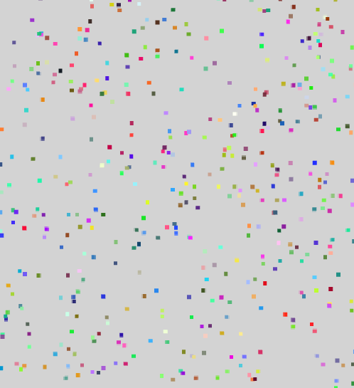

<!-- markdown-config presentation=true -->

<style data-src="../../../../src/client/presentation.css"></style>

<script>
import Presentation from "src/components/widgets/lively-presentation.js"
Presentation.config(this, {
    pageNumbers: true,
    logo: "https://lively-kernel.org/lively4/lively4-jens/media/lively4_logo_smooth_100.png"
})
</script>


<div class="title">
  Shadama
</div>

<div class="authors">
  by Halil Göcer
</div>

<div class="credentials">
  2021<br>
  <br>
  Hasso-Plattner-Institute Potsdam
</div>

---

# Shadama

Shadama is a Web programming environment for particle simulations that run on the GPU.

- Programs are written using an own programming language.
- Parts of the program are translated to the OpenGL Shading Language and run on the GPU.
- Other parts are translated to JavaScript and run on the CPU.
- Coding environment supports live programming.
- Uses web technologies such as WebGL 2.0 and OpenGL Shading Language version 3.0.
- Currently, it only supports 2D particle simulations.

Source: [@Oshima2017SPS]{style="position:absolute; bottom: 8px; left:20px; font-size:1em"}

---

# Language

Shadama has its own programming language that has similarities to Javascript and is inspired from [StarLogo](https://en.wikipedia.org/wiki/StarLogo).

### Example code

```javascript
program "Fill"
breed Turtle (x, y, r, g, b, a)

static setup() {
  Turtle.setCount(3000);
  Turtle.fillRandom("x", 0, 512);
  Turtle.fillRandom("y", 0, 512);
  Turtle.setColor();
  Turtle.draw();
}


def setColor() {
  this.r = this.x / 512;
  this.g = this.y / 512;
  this.b = 0.0;
  this.a = 1.0;
}

```

Source: [@Oshima2017SPS]{style="position:absolute; bottom: 8px; left:20px; font-size:1em"}

---

## Static functions

- Static functions will be translated to JavaScript and run on the CPU.
- They are defined using the keyword `static`.
- They can be controlled and used in the UI.

Look at [01-static-functions.shadama](edit://demos/swd21/particles/tutorial/01-static-functions.shadama) for further information.

Source: [@Oshima2017SPS]{style="position:absolute; bottom: 8px; left:20px; font-size:1em"}

---


## Breed + Methods

- Breeds are a programming concept to define particle types.
- Methods can only be called from static functions on a breed.
- Methods will be translated to OpenGL shaders and run on the GPU.
- Methods are defined using the keyword `def`.

Look at [02-breed-and-methods.shadama](edit://demos/swd21/particles/tutorial/02-breed-and-methods.shadama) for further information.

Source: [@Oshima2017SPS]{style="position:absolute; bottom: 8px; left:20px; font-size:1em"}

---

## Built-in methods

### For breeds or patches
- `draw()`: Draws the breed or patch based on [`x`, `y`, `r`, `g`, `b`, `a`] to the canvas.
### Only for breeds
- `setCount(count)`: Sets the number of particles per breed.
- `fillRandom(name, min, max)`: Sets the specified property to a random number between the boundaries.
- `fillRandomDir(dxName, dyName)`: Sets the specified properties to a random 2D unit vector.
- `fillSpace(xName, yName, xDim, yDim)`: Sets `xDim * yDim` particles within an area specified by `xDim` and `yDim`.
### Only for patches
- `diffuse(name)`: Diffuses the specified property of the patch to neighboring cells.

Source: [@Oshima2017SPS, @Shadama2021]{style="position:absolute; bottom: 8px; left:20px; font-size:1em"}

---

## Built-in primitive functions

The following primitive functions can be called inside methods and run on the GPU:

- `abs(x)`: Returns absolute value of `x`.
- `ceil(x)`: Returns ceil of `x`.
- `floor(x)`: Returns floor of `x`.
- `sqrt(x)`: Returns square root of `x`.
- `cos(x)`: Returns cosine of `x`.
- `sin(x)`: Returns cosine of `x`.
- `min(a, b)`: Returns minimum of `a` and `b`.
- `max(a, b)`: Returns maximum of `a` and `b`.
- `pow(a, b)`: Returns `a` to the power of `b`.
- `random(seed)`: Returns random value based on `seed`.

Source: [@Oshima2017SPS, @Shadama2021]{style="position:absolute; bottom: 8px; left:20px; font-size:1em"}

---

## Patch

- Particles cannot interact with each other directly.
- Patches are a programming concept to enable interaction between particles.
- A patch is a 2D grid on which particles can write/read data.

Look at [03-patch.shadama](edit://demos/swd21/particles/tutorial/03-patch.shadama) for further information.

Source: [@Oshima2017SPS]{style="position:absolute; bottom: 8px; left:20px; font-size:1em"}

---

## Variables

### Local variables

- Local variables can only be defined inside methods.
- They are defined using the keyword `var`.
- The scope of a local variable is the always the whole method.
- Within a method the declaration of a variable name must be unique.

#### Example code:
```javascript
def average() {
  var avg = (this.x + this.y) / 2.0;
  this.x = avg;
  this.y = avg;
}
```

Source: [@Oshima2017SPS]{style="position:absolute; bottom: 8px; left:20px; font-size:1em"}

---
## Variables

### Static function variables

- Static function variables can only be defined inside static functions.
- They are defined using the keyword `var`.
- They are visible to all static functions.
- They are not visible to methods.
- The declaration of a static function name must be unique.

#### Example code:
```javascript
static setup() {
  var begin = 1;
}

static loop() {
  if (begin) {
    begin = 0;
  }
}
```

Source: [@Oshima2017SPS]{style="position:absolute; bottom: 8px; left:20px; font-size:1em"}

---


## Variables

### Built-in static function variables

- `mousemove`: Returns object with x and y properties with current mouse position.
- `mousedown`: Returns object with x and y properties with mouse down position.
- `mouseup`: Returns object with x and y properties with mouse up position.
- `time`: Returns elapsed seconds since start as float.
- `width`: Returns width of Shadama canvas as float.
- `height`: Returns height of Shadama canvas as float.
- `Display`: Returns object on which certain system primitives such as `Display.clear()` and `Display.loadProgram()` can be invoked.

Source: [@Oshima2017SPS]{style="position:absolute; bottom: 8px; left:20px; font-size:1em"}

---

## Control structures

- Shadama only supports the `if` statement.
- An `else` statement after the `if` is also supported.
- However, `else if` is not supported.

#### Example code:
```javascript
static loop() {
  if (time > 5.0) {
    // Do something if time is higher than 5.0
  }
  else{
    // Do something if time is lower or equal 5.0
  }
}
```

Source: [@Oshima2017SPS]{style="position:absolute; bottom: 8px; left:20px; font-size:1em"}

---


##  Parallelism

It's possible for two or more nearby turtles to write into the same patch cell. Which value gets stored in the patch is non-deterministic.

Also, updates to turtle properties and patch properties are not visible until after the method is run. Consider the following method:

```javascript
def test() {
  if (this.r > 0) {
     this.r = 0;
  } else {
     this.r = 1;
  }
  this.b = this.r;
}
```

Even though the last line reads `this.b = this.r;`, the `r` property and `b` property will not be equal after the invocation. This is because the update to the `r` property seen earlier does not take effect until after the method call is finished.

---

# Examples

## Moving particles

In this example, the particles move in the canvas and bounce on the canvas borders.


See [04-moving-particles.shadama](edit://demos/swd21/particles/tutorial/04-moving-particles.shadama)

---
# Examples
## Persistent smell

This example shows how it is possible that particles interfere with their surroundings through the use of patches.
Therefore the particles access the nearest cell of a patch during the movement and change its state.

See [05-persistent-smell.shadama](edit://demos/swd21/particles/tutorial/05-persistent-smell.shadama)

---
# Examples
## Non persistent smell

In the following examples, the smell decays over time. The examples show two different possible ways to implement this behavior.
In both examples it is necessary to access all cells of a patch to implement the decay.
Therefore, you can use a helper breed that covers the whole canvas and does not move.

Example code to access all cells of a patch:

```javascript
// Helper to access all cells
breed AllCells (x, y)
patch Field (r, g, b, a)
  
static setup() {
  AllCells.fillSpace("x", "y", width, height);
  loop.start();
}

static loop() {
  AllCells.decay(Field);
}
```
---
# Examples
## Non persistent smell - variations
### Decrement-based

In this example, the smell decays by decrementing it by a certain amount on every tick.

See [06a-nonpersistent-smell-decrementbased.shadama](edit://demos/swd21/particles/tutorial/06a-nonpersistent-smell-decrementbased.shadama)

### Time-based

In this example, the smell decays by using the time variable to calculate the elapsed time of a smell.

See [06b-nonpersistent-smell-timebased.shadama](edit://demos/swd21/particles/tutorial/06b-nonpersistent-smell-timebased.shadama)

---


## Disease distribution

This example combines multiple concepts and features of Shadama to for a simulation of the distribution of a disease.

From part A - E more and more characteristics will be added to the simulation.

### Part A: Characteristics of the simulation:

- The humans move (randomly).
- A human can be infected or healthy.
- In the beginning a certain amount is infected.


See [07a-disease-distribution.shadama](edit://demos/swd21/particles/tutorial/07a-disease-distribution.shadama)

---

## Disease distribution

### Part B: Characteristics of the simulation:

- Previous characteristics
- Infected humans spread pathogens.
- The pathogens decrease over time.
- Healthy humans become infected when they get in contact with pathogens.

See [07b-disease-distribution.shadama](edit://demos/swd21/particles/tutorial/07b-disease-distribution.shadama)

---
## Disease distribution

### Part C: Characteristics of the simulation:

- Previous characteristics
- Infected humans become healthy again after a period of time.

See [07c-disease-distribution.shadama](edit://demos/swd21/particles/tutorial/07c-disease-distribution.shadama)

---
## Disease distribution

### Part D: Characteristics of the simulation:

- Previous characteristics
- Humans have a value for their immunity.
- After a human heals from an infection, the human becomes immune.


See [07d-disease-distribution.shadama](edit://demos/swd21/particles/tutorial/07d-disease-distribution.shadama)

---
## Disease distribution

### Part E: Characteristics of the simulation:

- Previous characteristics
- 50% of the humans are immune from the beginning.


See [07e-disease-distribution.shadama](edit://demos/swd21/particles/tutorial/07e-disease-distribution.shadama)

---

# Ideas to improve Shadama

- Simplify access to all fields
- Add support for constants
- Add support for adjustable variables using UI (e.g. slider)
- Modulo on non static functions is not implemented
- Random function inside methods is not documented and behaves oddly
- Support keyboard input, this probably allow us to develop a game like snake

---

* * *


This is a summary of [/~ohshima/shadama2/live2017](http://tinlizzie.org/~ohshima/shadama2/live2017/) with additional info and samples.

---
{width=100}

---
# References
<lively-bibtex src="./bibliography.bib"></lively-bibtex>
---
