<!-- markdown-config presentation=true -->

<style data-src="../../../../src/client/presentation.css"></style>

<script>
import Presentation from "src/components/widgets/lively-presentation.js"
Presentation.config(this, {
    pageNumbers: true,
    logo: "https://lively-kernel.org/lively4/lively4-jens/media/hpi_logo.png"
})
</script>


<div class="title">
  Shadama
  <br>
  <p>Particle-based simulations</p>
</div>

<div class="authors">
  by Halil Göcer
</div>

<div class="credentials">
  2021<br>
  <br>
  Hasso-Plattner-Institute Potsdam
  <br>
  Software Architecture Group
</div>

---

# What is Shadama?

Shadama is a Web programming<br> environment for particle simulations<br>that run on the GPU{style="position:absolute; bottom: 230px; padding-left:10px; padding-right:10px; font-size:1.8em"}

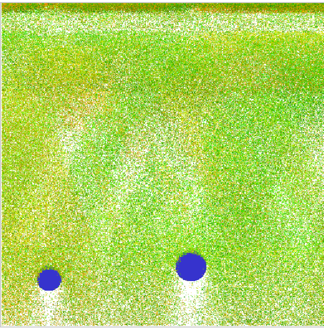{style="position:absolute; bottom: 100px; right: 50px; width:400px"}

Source: [@Oshima2017SPS]{style="position:absolute; bottom: 8px; left:20px; font-size:1em"}

---

# Previous projects and inspirations

- 1996: Squeak Etoys (child-friendly programming environment)
- 2001: StarLogo (agent-based simulation language for education)
- 2005: Kedama (particle simulation system for Etoys)

### Sqeak Etoys{style="position:absolute; bottom: 310px; left: 32px"}
### StarLogo{style="position:absolute; bottom: 310px; left: 302px"}
### Kedama{style="position:absolute; bottom: 310px; left: 617px"}

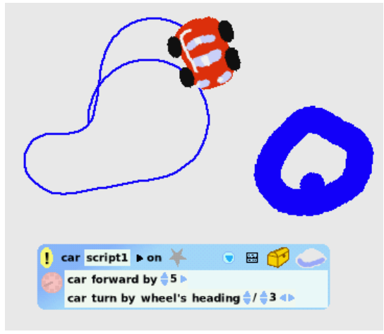{style="position:absolute; bottom: 100px; left: 30px; width:250px"}
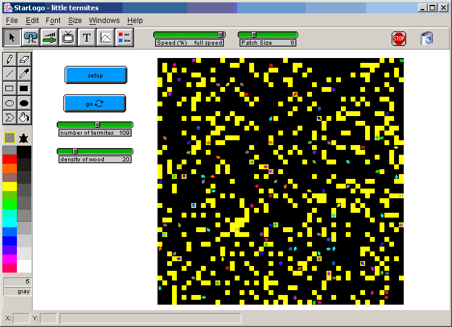{style="position:absolute; bottom: 100px; left: 300px; width:295px"}
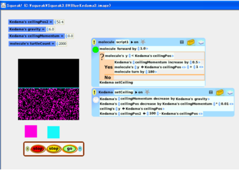{style="position:absolute; bottom: 100px; left: 615px; width:300px"}


Source: [@Kay2005Etoys], [@Oshima2015Kedama], [@StarLogo2015]{style="position:absolute; bottom: 8px; left:20px; font-size:1em"}

---

# Why Shadama?

- GPU acceleration allows to perform particle simulations with a large number of particles
- Writing code that runs on the GPU is usually difficult
- Shadama has its own programming language which is easy to learn
- Coding environment supports live programming
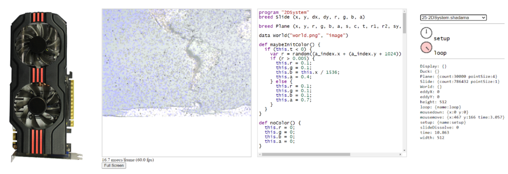{style="position:absolute; bottom: 70px; left: 125px; width:700px"}

Source: [@Oshima2017SPS]{style="position:absolute; bottom: 8px; left:20px; font-size:1em"}

---

# Demo: Forest Fire

<video width="920" height="450" controls>
  <source src="img/forestfire.mp4" type="video/mp4">
</video>

Source: [@Shadama2021]{style="position:absolute; bottom: 8px; left:20px; font-size:1em"}

---

# Shadama - Under the hood

- Parts of the program are translated to the OpenGL Shading Language and run on the GPU
- Other parts are translated to JavaScript and run on the CPU
- Uses web technologies such as WebGL 2.0 and OpenGL Shading Language version 3.0

### Example shader code
```c++
  #version 300 es
  precision highp float;
  layout (location = 0) in vec2 a_index;
  layout (location = 1) in vec2 b_index;
  uniform sampler2D u_value;
  uniform vec2 u_half;
  out vec4 v_color;
  void main(void) {
      vec2 clipPos = (b_index + u_half) * 2.0 - 1.0;
      gl_Position = vec4(clipPos, 0, 1.0);
      gl_PointSize = 1.0;
      ivec2 fc = ivec2(a_index);
      v_color = texelFetch(u_value, fc, 0);
  }
```

---

# Language

Shadama has its own programming language that has similarities to Javascript and is inspired from [StarLogo](https://en.wikipedia.org/wiki/StarLogo).

### Example code

```javascript
program "Fill"
breed Turtle (x, y, r, g, b, a)

static setup() {
  Turtle.setCount(3000);
  Turtle.fillRandom("x", 0, 512);
  Turtle.fillRandom("y", 0, 512);
  Turtle.setColor();
  Turtle.draw();
}


def setColor() {
  this.r = this.x / 512;
  this.g = this.y / 512;
  this.b = 0.0;
  this.a = 1.0;
}

```

Source: [@Oshima2017SPS]{style="position:absolute; bottom: 8px; left:20px; font-size:1em"}

---

## Static functions

- Static functions will be translated to JavaScript and run on the CPU
- They are defined using the keyword `static`
- They can be controlled and used in the UI

<script>
  <button style="font-weight:bold; font-size:1em, padding-left:20px" click={async () => {
    var url = "https://lively-kernel.org/lively4/swd21-particles/demos/swd21/particles/tutorial/01-static-functions.shadama"
    var comp = await lively.openBrowser(url, true)
    comp.parentElement.toggleMaximize()
  }}>Open code example
  </button>
</script>


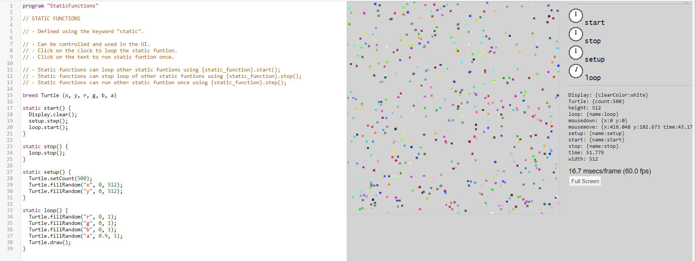{style="position:absolute; bottom: 60px; left:20px; width:800px; border: 1px solid SteelBlue;"}


Source: [@Oshima2017SPS]{style="position:absolute; bottom: 8px; left:20px; font-size:1em"}

---


## Breed + Methods

- Breeds are a programming concept to define particle types
- Methods can only be called from static functions on a breed
- Methods will be translated to OpenGL shaders and run on the GPU
- Methods are defined using the keyword `def`

<script>
  <button style="font-weight:bold; font-size:1em, padding-left:20px" click={async () => {
    var url = "https://lively-kernel.org/lively4/swd21-particles/demos/swd21/particles/tutorial/02-breed-and-methods.shadama"
    var comp = await lively.openBrowser(url, true)
    comp.parentElement.toggleMaximize()
  }}>Open code example
  </button>
</script>

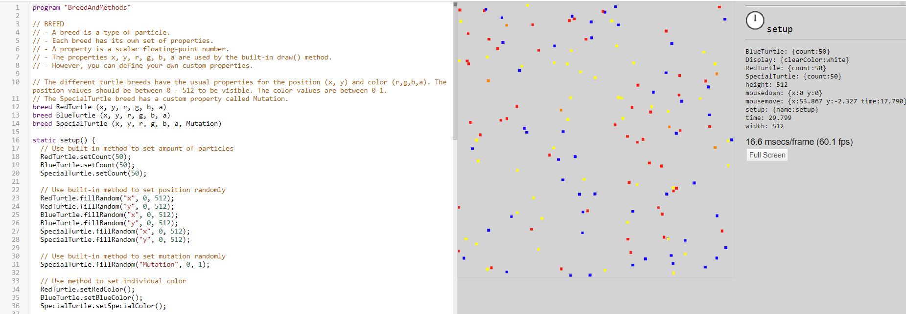{style="position:absolute; bottom: 60px; left:20px; width:770px; border: 1px solid SteelBlue;"}


Source: [@Oshima2017SPS]{style="position:absolute; bottom: 8px; left:20px; font-size:1em"}

---

## Communication using patches

The instances of a breed (particles) cannot interact with each other directly.
However, they can use an indirection to communicate with other particles.


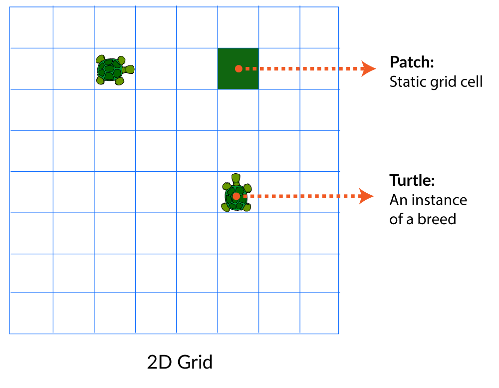{style="position:absolute; bottom: 5px; left: 150px; width:580px"}

---

## Communication using patches

The instances of a breed (particles) cannot interact with each other directly.
However, they can use an indirection to communicate with other particles.


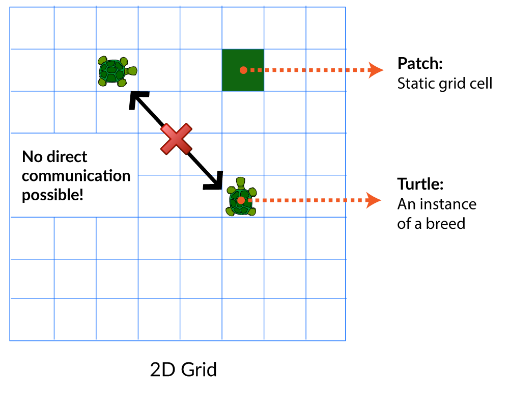{style="position:absolute; bottom: 5px; left: 150px; width:580px"}


---

## Communication using patches

The instances of a breed (particles) cannot interact with each other directly.
However, they can use an indirection to communicate with other particles.


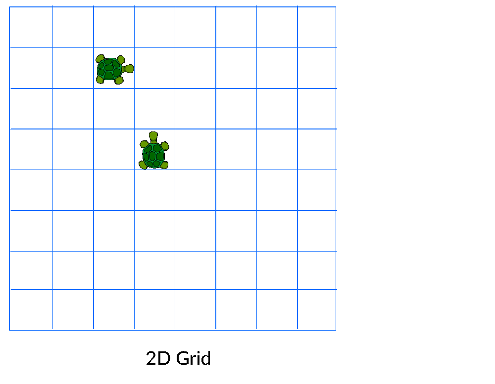{style="position:absolute; bottom: 5px; left: 150px; width:580px"}

<script>
  <button style="position:absolute; width: 100px; bottom: 70px; right:260px; font-weight:bold; font-size:1em, padding-left:20px" click={async () => {
    var url = "https://lively-kernel.org/lively4/swd21-particles/demos/swd21/particles/tutorial/03-patch.shadama"
    var comp = await lively.openBrowser(url, true)
    comp.parentElement.toggleMaximize()
  }}>Open code example
  </button>
</script>


---

## Built-in methods

### For breeds or patches
- `draw()`: Draws the breed or patch based on [`x`, `y`, `r`, `g`, `b`, `a`] to the canvas
### Only for breeds
- `setCount(count)`: Sets the number of particles per breed.
- `fillRandom(name, min, max)`: Sets the specified property to a random number between the boundaries
- `fillRandomDir(dxName, dyName)`: Sets the specified properties to a random 2D unit vector
- `fillSpace(xName, yName, xDim, yDim)`: Sets `xDim * yDim` particles within an area specified by `xDim` and `yDim`
### Only for patches
- `diffuse(name)`: Diffuses the specified property of the patch to neighboring cells

Source: [@Oshima2017SPS, @Shadama2021]{style="position:absolute; bottom: 8px; left:20px; font-size:1em"}

---

## Built-in primitive functions

The following primitive functions can be called inside methods and run on the GPU:

- `abs(x)`: Returns absolute value of `x`
- `ceil(x)`: Returns ceil of `x`
- `floor(x)`: Returns floor of `x`
- `sqrt(x)`: Returns square root of `x`
- `cos(x)`: Returns cosine of `x`
- `sin(x)`: Returns cosine of `x`
- `min(a, b)`: Returns minimum of `a` and `b`
- `max(a, b)`: Returns maximum of `a` and `b`
- `pow(a, b)`: Returns `a` to the power of `b`
- `random(seed)`: Returns random value based on `seed`

Source: [@Oshima2017SPS, @Shadama2021]{style="position:absolute; bottom: 8px; left:20px; font-size:1em"}

---


## Variables

### Local variables

- Local variables can only be defined inside methods
- They are defined using the keyword `var`
- The scope of a local variable is the always the whole method
- Within a method the declaration of a variable name must be unique

<br>

#### Example code:
```javascript
def average() {
  var avg = (this.x + this.y) / 2.0;
  this.x = avg;
  this.y = avg;
}
```

Source: [@Oshima2017SPS]{style="position:absolute; bottom: 8px; left:20px; font-size:1em"}

---
## Variables

### Static function variables

- Static function variables can only be defined inside static functions
- They are defined using the keyword `var`
- They are visible to all static functions
- They are not visible to methods
- The declaration of a static function name must be unique

#### Example code:
```javascript
static setup() {
  var begin = 1;
}

static loop() {
  if (begin) {
    begin = 0;
  }
}
```

Source: [@Oshima2017SPS]{style="position:absolute; bottom: 8px; left:20px; font-size:1em"}

---


## Variables

### Built-in static function variables

- `mousemove`: Returns object with x and y properties with current mouse position
- `mousedown`: Returns object with x and y properties with mouse down position
- `mouseup`: Returns object with x and y properties with mouse up position
- `time`: Returns elapsed seconds since start as float
- `width`: Returns width of Shadama canvas as float
- `height`: Returns height of Shadama canvas as float
- `Display`: Returns object on which certain system primitives such as `Display.clear()` and `Display.loadProgram()` can be invoked

Source: [@Oshima2017SPS]{style="position:absolute; bottom: 8px; left:20px; font-size:1em"}

---

## Control structures

- Shadama only supports the `if` statement
- An `else` statement after the `if` is also supported
- However, `else if` is not supported

<br>

#### Example code:
```javascript
static loop() {
  if (time > 5.0) {
    // Do something if time is higher than 5.0
  }
  else{
    // Do something if time is lower or equal 5.0
  }
}
```

Source: [@Oshima2017SPS]{style="position:absolute; bottom: 8px; left:20px; font-size:1em"}

---


# Examples

## Moving particles

- Particles move in the canvas and bounce on the canvas borders

<script>
  <button style="font-weight:bold; font-size:1em, padding-left:20px" click={async () => {
    var url = "https://lively-kernel.org/lively4/swd21-particles/demos/swd21/particles/tutorial/04-moving-particles.shadama"
    var comp = await lively.openBrowser(url, true)
    comp.parentElement.toggleMaximize()
  }}>Open code example
  </button>
</script>


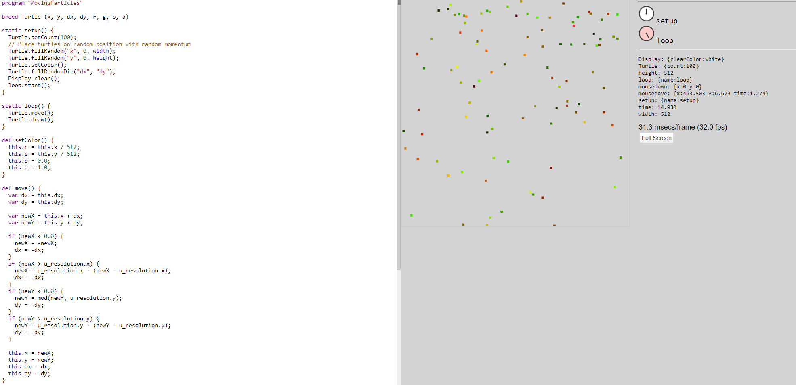{style="position:absolute; bottom: 60px; left:20px; width:620px; border: 1px solid SteelBlue;"}

---
# Examples
## Persistent smell

- Particles interfere with their surroundings through the use of patches
- Particles access the nearest cell during the movement and change its state

<script>
  <button style="font-weight:bold; font-size:1em, padding-left:20px" click={async () => {
    var url = "https://lively-kernel.org/lively4/swd21-particles/demos/swd21/particles/tutorial/05-persistent-smell.shadama"
    var comp = await lively.openBrowser(url, true)
    comp.parentElement.toggleMaximize()
  }}>Open code example
  </button>
</script>


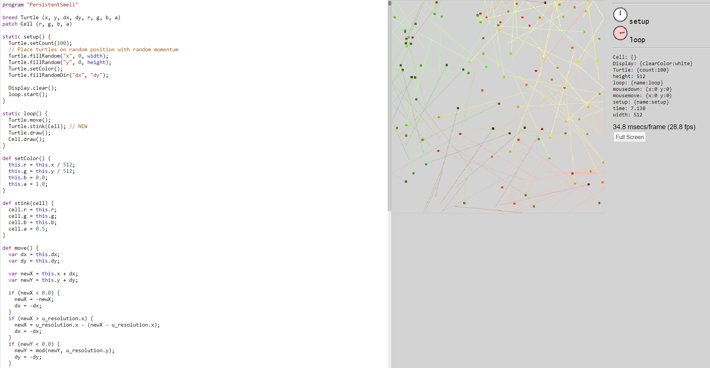{style="position:absolute; bottom: 60px; left:20px; width:510px; border: 1px solid SteelBlue;"}


---
# Examples
## Non persistent smell

- Smell decays over time
- Decay can be implemented time-based or decrement-based
- Access to all cells is required for the decay

### Example code to access all cells:

```javascript
// Helper to access all cells
breed AllCells (x, y)
patch Cell (r, g, b, a)
  
static setup() {
  AllCells.fillSpace("x", "y", width, height);
  loop.start();
}

static loop() {
  AllCells.decay(Cell);
}
```
---
# Examples
## Non persistent smell - variations
### Decrement-based

- Smell decays by decrementing it by <br>a certain amount on every tick

<script>
  <button style="font-weight:bold; font-size:1em, padding-left:20px" click={async () => {
    var url = "https://lively-kernel.org/lively4/swd21-particles/demos/swd21/particles/tutorial/06a-nonpersistent-smell-decrementbased.shadama"
    var comp = await lively.openBrowser(url, true)
    comp.parentElement.toggleMaximize()
  }}>Open code example
  </button>
</script>


### Time-based

- Smell decays by using the time variable <br>to calculate the elapsed time of a smell

<script>
  <button style="font-weight:bold; font-size:1em, padding-left:20px" click={async () => {
    var url = "https://lively-kernel.org/lively4/swd21-particles/demos/swd21/particles/tutorial/06b-nonpersistent-smell-timebased.shadama"
    var comp = await lively.openBrowser(url, true)
    comp.parentElement.toggleMaximize()
  }}>Open code example
  </button>
</script>

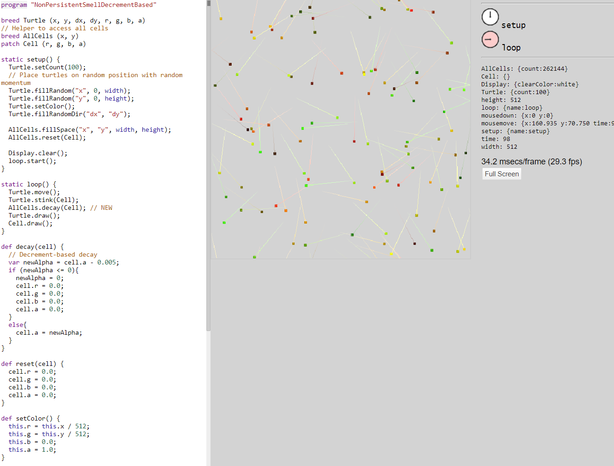{style="position:absolute; bottom: 130px; right:30px; width:400px; border: 1px solid SteelBlue;"}

---


## Disease distribution

- Combines multiple concepts and features of Shadama for a simulation of the distribution of a disease
- From part A - E more and more characteristics will be added to the simulation

<br>

### Part A: Characteristics of the simulation:

- The humans move (randomly)
- A human can be infected or healthy
- In the beginning a certain amount is infected

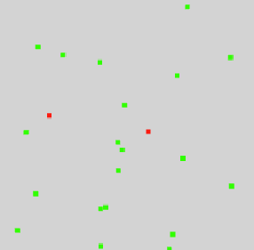{style="position:absolute; bottom: 120px; right:80px; width:250px; border: 4px solid SteelBlue;"}

<script>
  <button style="font-weight:bold; font-size:1em, padding-left:20px" click={async () => {
    var url = "https://lively-kernel.org/lively4/swd21-particles/demos/swd21/particles/tutorial/07a-disease-distribution.shadama"
    var comp = await lively.openBrowser(url, true)
    comp.parentElement.toggleMaximize()
  }}>Open code example
  </button>
</script>

---

## Disease distribution

<br><br>

### Part B: Characteristics of the simulation:

- Previous characteristics
- Infected humans spread pathogens
- The pathogens decrease over time
- Healthy humans become infected <br> when they get in contact with pathogens

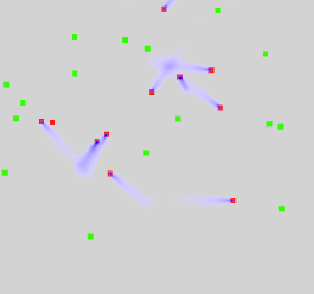{style="position:absolute; bottom: 175px; right:80px; width:300px; border: 4px solid SteelBlue;"}

<script>
  <button style="font-weight:bold; font-size:1em, padding-left:20px" click={async () => {
    var url = "https://lively-kernel.org/lively4/swd21-particles/demos/swd21/particles/tutorial/07b-disease-distribution.shadama"
    var comp = await lively.openBrowser(url, true)
    comp.parentElement.toggleMaximize()
  }}>Open code example
  </button>
</script>

---
## Disease distribution

### Part C: Characteristics of the simulation:

- Previous characteristics
- Infected humans become healthy again after a period of time

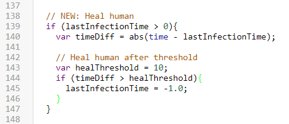{style="border-left: 4px solid SteelBlue;"}

<script>
  <button style="font-weight:bold; font-size:1em, padding-left:20px" click={async () => {
    var url = "https://lively-kernel.org/lively4/swd21-particles/demos/swd21/particles/tutorial/07c-disease-distribution.shadama"
    var comp = await lively.openBrowser(url, true)
    comp.parentElement.toggleMaximize()
  }}>Open code example
  </button>
</script>

---
## Disease distribution

### Part D: Characteristics of the simulation:

- Previous characteristics
- Humans have a value for their immunity
- After a human heals from an infection, the human becomes immune

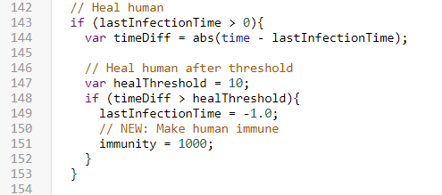{style="border-left: 4px solid SteelBlue;"}

<script>
  <button style="font-weight:bold; font-size:1em, padding-left:20px" click={async () => {
    var url = "https://lively-kernel.org/lively4/swd21-particles/demos/swd21/particles/tutorial/07d-disease-distribution.shadama"
    var comp = await lively.openBrowser(url, true)
    comp.parentElement.toggleMaximize()
  }}>Open code example
  </button>
</script>

---
## Disease distribution

### Part E: Characteristics of the simulation:

- Previous characteristics
- 75% of the humans are immune from the beginning

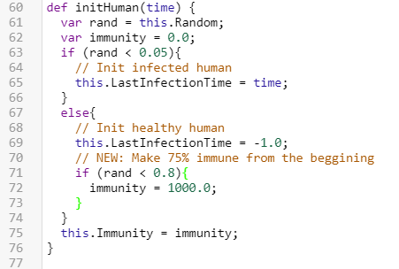{style="border-left: 4px solid SteelBlue;"}

<script>
  <button style="font-weight:bold; font-size:1em, padding-left:20px" click={async () => {
    var url = "https://lively-kernel.org/lively4/swd21-particles/demos/swd21/particles/tutorial/07e-disease-distribution.shadama"
    var comp = await lively.openBrowser(url, true)
    comp.parentElement.toggleMaximize()
  }}>Open code example
  </button>
</script>

---

# Ideas to improve Shadama

- Simplify access to all cells
- Add a way to access neighboring cells
- Add support for adjustable variables using UI (e.g. slider)
- Random function inside methods is not documented and behaves oddly
- Support keyboard input

## Bonus: Snake in Shadama
[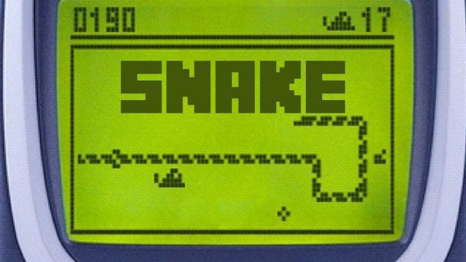{style="width: 300px; border: 4px solid SteelBlue; display: block; margin-left: 0px; margin-right: auto;"}](edit://demos/swd21/particles/tutorial/snake.shadama)


---

# References

<lively-bibtex src="./bibliography.bib"></lively-bibtex>

