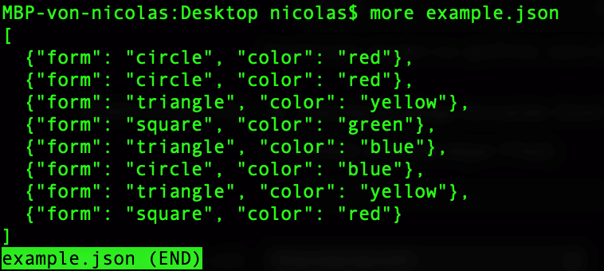
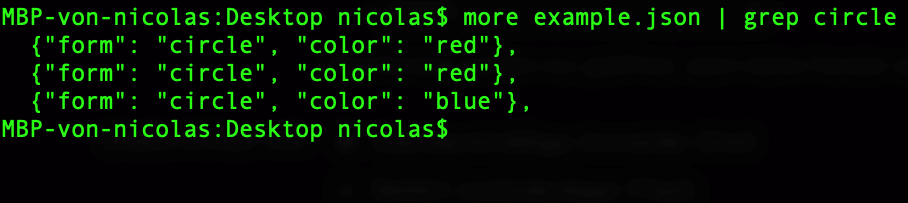
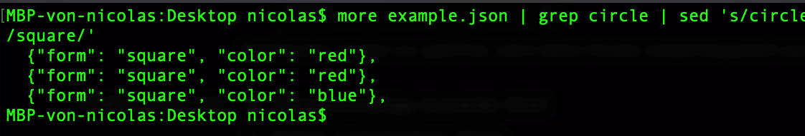
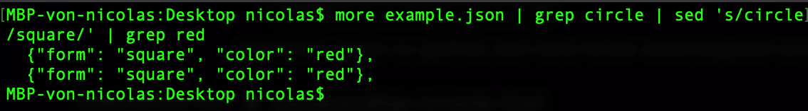

<!-- markdown-config presentation=true -->

<link rel='stylesheet' href='https://lively-kernel.org/lively4/swd21-pipes-and-filters/demos/swd21/pipes-and-filters/presentation/src/html/styles.css'>

  Pipes and Filters

  Sven Kästle & Nicolas Walk

  Summer  2021
   
   
  HPI - Software-Design Seminar  
  Software Architecture Group

---
# Pipes and Filters
---
# Pipes and Filters
## grep

<pre>
  <code> more example.json</code>
</pre>

---
# Pipes and Filters
## grep

<pre>
  <code> more example.json | grep circle </code>
</pre>

---
# Pipes and Filters
## grep

<pre>
  <code> more example.json | grep circle | sed 's/circle/square/'</code>
</pre>

---
# Pipes and Filters
## grep

<pre>
  <code> more example.json | grep circle | sed 's/circle/square/' | grep red</code>
</pre>

---
# Pipes and Filters
## Architectual pattern

"Pipes and Filters" is an architectual software pattern used for specific cases 

  other pattern examples are 
* Layers
* Broker
* model-view-controller (MVC)

those are are not interchangeable 

Every pattern is used under certain circumstances

---
# Pipes and Filters
## Motivation

Under what circumstances do we need pipes and filters?

**It can be used when**
* there is a big process
* that manipulates data
* that can be devided into multiple steps
* that steps can be run simultaneously

**A pipes and filters system consists of**
* a datasource
* pipes
* filters
* a datasink

---

# Processing Pipeline
---
# Processing Pipeline
## Datasource

{#dataSource}

**Function:** 
* provides the datachunks for the processing pipeline and its subsequent components
* datachunks are the pieces of data that the logic of the filters is applied to
 

---
# Processing Pipeline
## Datasource
### log stream
<pre>
<code>2021-06-27 15:20:37.224881+0200 0x14d      Default     0x0                  0      0    kernel: (AirPortBrcmNIC) ARPT: 97029.211335: DequeueTime: 0xaaaaaaaa
2021-06-27 15:20:37.224885+0200 0x14d      Default     0x0                  0      0    kernel: (AirPortBrcmNIC) LastTxTime: 0x7a69c6b8
2021-06-27 15:20:37.224888+0200 0x14d      Default     0x0                  0      0    kernel: (AirPortBrcmNIC) PHYTxErr:   0x0000
2021-06-27 15:20:37.224892+0200 0x14d      Default     0x0                  0      0    kernel: (AirPortBrcmNIC) PHYTxErr:   0x0000</code>
</pre>

Every log entry is one datachunk for the processing pipeline

---
# Processing Pipeline
## Datasource
### textfile
<pre>
<code>Lorem ipsum dolor sit amet, consetetur sadipscing elitr, 
sed diam nonumy eirmod tempor
invidunt ut labore et dolore magna aliquyam erat, sed diam voluptua.
At vero eos et accusam et justo duo dolores et ea rebum. Stet clita
kasd gubergren, no sea takimata sanctus est Lorem ipsum dolor sit amet.</code>
</pre>

Each word of the text is one datachunk for the processing pipeline.

---
# Processing Pipeline
## Datasource
### objects

Also objects can be used as an input
<pre>
<code>[
  {"form": "circle", "color": "red"},
  {"form": "circle", "color": "red"},
  {"form": "triangle", "color": "yellow"},
  {"form": "square", "color": "green"},
  {"form": "triangle", "color": "blue"},
  {"form": "circle", "color": "blue"},
  {"form": "triangle", "color": "yellow"},
  {"form": "square", "color": "red"}
]</code>
</pre>

Each list entry is a datachunk for the processing pipeline

{#dataChunks}

Each geometric figure represents one datachunk in the processing pipeline

---
# Processing Pipeline
## Pipe

{#pipe}

Pipes are the connector between
* datasource and filter
* filter and datasink
* filter and filter

The pipe 
* transmits datachunks
* buffers data (fifo buffer)
* synchronizes adjacent active filters

---
# Processing Pipeline
## Filter
  
{#filter}

Filters are the processing units of a pipes and filters system  
The input data is either
* reduced
* enriched
* or transformed

the filter can be activated by 
* precedent pipe (passive filter)
* following pipe (passive filter)
* the filter itself (active filter)

---
# Processing Pipeline
## Datasink

{#complete}

Is the output of the system  

from the last filter of the processing pipeline  
the datachunks are piped into the datasink

common datasinks are
* files
* terminal
* an animation

---

# Szenario
---
# Szenario
## active filter - passive pipe

{#pipeline1}

**The active filter pulls the data from the precedeing passive pipe.**

---
# Szenario
## active pipe - passive filter

{#pipeline2}

**The active pipe pushes and calls the passive filter.**

---
# Szenario
## multiple active filters

{#pipeline3}

**The passive pipes between the two active filters synchronising the filtering pipeline.**

* The workload is devided. Each filter manipulates one attribute of the given object.

---
# Szenario
## multiple active buffered filters

{#pipeline4}

**Buffered pipes can influence the pipeline flow by bottlenecking the whole pipeline with a small buffer size.**

* Buffers can slow down the pipeline, if needed.
* A small buffer size may create a bottleneck.

---
# Szenario
## modular components

{#pipeline5}

**The filters can be changed (modularity) inside the pipeline.**

---
# Szenario
## two active filters with error handling

{#pipeline8}

**What happens if objects are pushed through the system that are mutable from the outside?**

---
# Szenario
## t-filter

{#pipeline6}

**With a t-shaped pipline, the output of a filter can be piped into multiple destinations.**

---

# Szenario
## grep

{#pipeline7}

<pre>
  <code> more example.json | grep circle | sed 's/circle/square/' | grep red</code>
</pre>

---

# Conclusion

* Pipes and Filters are either active of passive.
* Splitting up of workload with multiple smaller filter.
* The pipeline is modular; every part is interchangeable.
  * This may lead to an easy maintainability.
* T-shaped pipelines can be used to filter in parallel.
<!-- spacer -->
<!-- spacer -->
## Challenges
* Each part can potentially bottleneck the whole pipeline.
* Data manipulation can lead to false results or system failure.
  * Filter may not be applicable to the object
  * proper error handling is needed 

