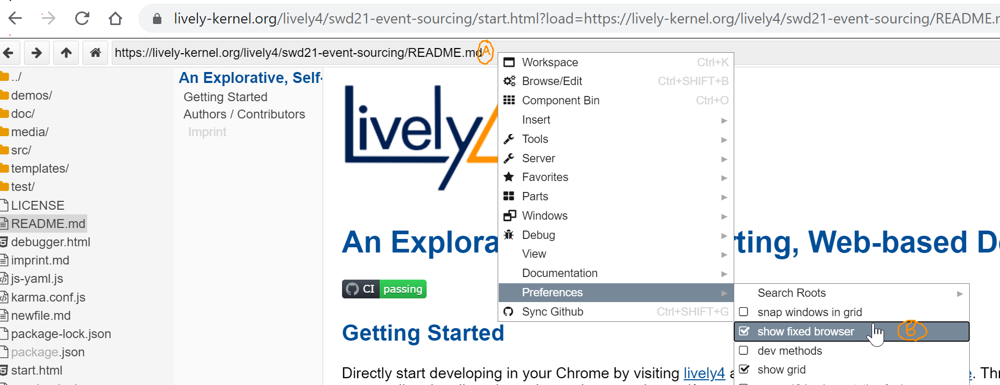
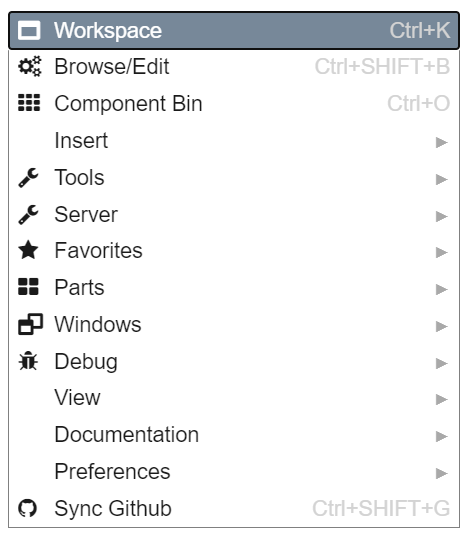
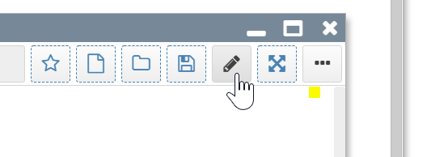
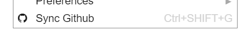

# First Steps

- browse in lively
- disable fixed browser
  - 
    - (A) right click into lively navigation bar to get world context menu
    - (B) disable "fixed browser"
- open tools in windows 
  - world context menu
    - {width=200px}
    - right click in background
  - #Workspace
    - CTRL+P print it: execute snipped of code and print result in workspace
    - CTRL+D do it
  - browser
- explore runtime
  - #Halo
    - Alt + right click: open halo on global element
    - Shift + right click: open halo on deep element
    - repetition cycles...
- edit anonymously
  - switch to edit mode 
    - {width=200px}
- login github
  - login button in sync tool
- sync repository 
  - {width=200px}
  - check edit history with "status"
  - enter meaningful in message and squash auto commits
  - show diff with "diff"
  - sync with "sync" (bidirectionally with repository on github)
  - #BestPractice: sync before starting to work to minimize possibility of merge conflicts
  