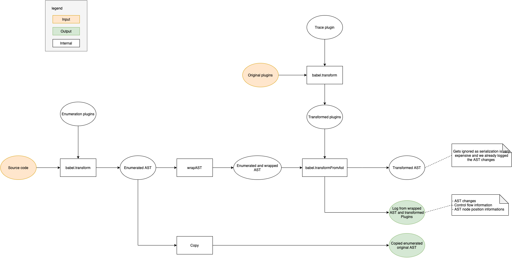
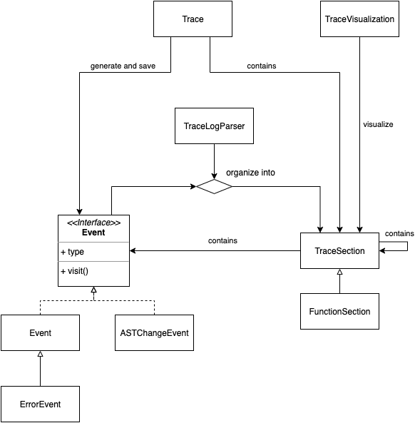

## Projektidee
Das Projekt soll dabei helfen Babel plugins zu debuggen. Dafür bedient es sich dynamischer Analyse und zeichnet zum einen ausgeführte Instruktionen aus (über das trace plugin), zum anderen werden Veränderungen am AST aufgezeichnet und den Instruktionen zugeordnet. Diese Aufzeichnung werden dann visualisiert. Dadurch liegt die gesamte Ausführungshistorie offen und kann beliebig exploriert vorwärts und rückwärts exploriert werden. Die Aufzeichnung der Veränderungen ermöglicht es auch die Zwischenschritte der AST Transformation zu betrachten. Es wird also für die gesamte Aufzeichnung aufgelöst, welche Instruktionen ausgeführt wurden und welche Änderungen am AST diese vorgenommen haben.

Das aktuelle Dokument versucht einen Überblick über das Projekt zu verschaffen.


## Babel plugin tracer (trace plugin)
Ein Babel Plugin, das auf andere Plugins angewandt wird. Es geht davon aus, dass es als einziges Plugin auf diese angewandt wird! Es behandelt noch nicht alle Fälle die in source code vorkommen können, aber die grundlegenden wie Funktionsaufrufe sind abgedeckt. 

Das Plugin umgibt die meisten Instruktionen mit einem log, dass diese gleich beginnen und wenn sie vorbei sind (vereinfachtes Beispiel: ```if(true) {}``` wird zu ```trace.startCondition(); if(true) {}; trace.endCondition()```). Die logs bekommen eine Nummer als Parameter, die die originale Position der Anweisung kodieren. Soll ein Wert für den log gespeichert werden, nimmt die log Funktion diesen entgegen und gibt ihn auch wieder zurück, um eine korrekte Ausführung zu erhalten (vereinfachtes Beispiel: ```if(true) {}``` wird zu ```if(trace.test(true)) {}```).

## AST wrapping
Um Veränderungen am AST mitzuschreiben wird dieser gewrapt. Dazu wird der gesamte AST traversiert und für alle AST Knoten werden properties durch getter und setter ersetzt. Die setter können dann immer mitschneiden welche Veränderung vorgenommen wurde (da getter/setter zusätzliches Verhalten einführen, aber sich syntaktisch nicht von normalen public properties unterscheiden arbeiten sie ohne Probleme mit dem bestehenden Babel code). Veränderungen an Arrays können auf diesem Weg nicht getrackt werden, weswegen diese in Proxies gepackt werden, die dann Veränderungen melden können.

## Copy AST
Das mitschneiden der Veränderungen erfordert es Teile des ASTs zu kopieren (sonst würden die kopierten Objekte immer noch durch AST-Transformationen verändert werden wenn nur eine Referenz gespeichert wird). Da sich in der Praxis gezeigt hat, dass es zu unperformant ist des gesamten AST zu kopieren, sollte es auch wirklich nicht viel mehr als nötig sein. 

Um dies umzusetzen werden die Knoten des ursprüngliche AST des zu transformiernden codes mit IDs versehen. Diese Identifizieren die Knoten zum einen eindeutig, geben aber auch an welcher Knoten bereits existiert hat. Wird eine Änderung vorgenommen kann über die ID eindeutig bestimmt werden welchem Knoten diese zuzuordnen ist (auch über serialisierungsgrenzen hinweg, da alles vom WebWorker serialisiert werden muss; siehe nächster Abschnitt) Wird ein neuer Knoten eingefügt kann dieser daran erkannt werden, dass er keine ID besitzt. Dieser muss dann eine ID erhalten, komplett kopiert werden und ein gewrapt werden. Kopiert werden nur neue AST Knoten. Für bereits bekannte AST Knoten wird ein Objekt mit deren ID abgelegt. Dieses kann dann unter Kenntnis des gesamten ASTs vor dieser Veränderung aufgelöst werden (da der Knoten ja zu dem Zeitpunkt bereits bekannt war, und somit auch sein muss wenn alle Veränderungen vor der aktuellen angewandt wurden). Alles andere wird mit einer normalen deep Copy kopiert (in der Annahme, das dies nur kleine Objekte sind und nicht so teuer).


## Plugin explorer worker
Der  Plugin explorer worker nimmt source code und ein Array von Plugin Urls entgegen und generiert aus diesen einen Trace der Ausführung. Dieser Prozess wurde in eine WebWorker ausgelagert, um eine frische JavaScript Umgebung zu erhalten. Normalerweise hat lively ein vorkonfiguriertes SystemJS, welches sich um imports von Files kümmert. Im WebWorker kann SystemJS so konfiguriert werden, dass nur das Trace Plugin auf allen importierten Code angewandt wird (wodurch auch imports von Plugins mit dem nötigen Trace code versehen werden).

Der grobe Ablauf ist wie folgt:


{height=400px}


Die gesendeten Daten müssen serialisiert werden um diese vom WebWorker in den normalen Kontext zu schicken, wobei Objektidentität verloren geht.

## Plugin load promise
Eine einfache Art den  Plugin explorer worker zu nutzen. Aktuelle wird jedes mal ein komplett neuer Worker erstellt. Dies bedeutet auch, dass potenziell mehrmals nutzbare imports, wie zB von SystemJS, nicht ausgenutzt werden. Die Worker werden jedes mal neu erstellt, da ich bisher noch keine Weg fand imports von plugins Zuverkässig wieder zu unloaden. Diese müssen auch jedes mal neu geladen werden, damit sie richtig indiziert werden. Werden sie nicht richtig unloaded kann das nicht passieren und spätere Schritte (zB auflösen von Positionen) wird fehlerhaft, da Daten nicht erstellt/gesammelt wurden.


## Trace
```Trace``` ist die zentrale Klasse, für welche während der gesamten Aufzeichnung der Plugins sichergestellt ist, dass eine Instanz global über ```window[Trace.traceIdentifierName]``` verfügbar ist.

Ihre Aufgabe ist es zum einen den Tracelog zu generieren und zu speichern. Dazu stellt die Klasse Methode bereit, die die nötigen Instanzen von ```Event```, ```ErrorEvent``` oder ```ASTChangeEvent``` mit den nötigen Daten erstellen. Diese Methoden werden aus dem vom trace plugin generierten code aufgerufen (also den transformierten plugins).

Auch erstellt der Trace die IDs für AST Knoten, die aus der Nummer der aktuell ausgeführten Pluginmethode und einer für den gesamten AST globalen Nummer.

```Trace``` registriert weiterhin die Positionen von AST Knoten im Quelltext und speichert diese mit einigen Speicheroptimierungen. Die dadurch vergebenen Positions-IDs kann Trace auch wieder auflösen.

## Events
Es gibt normale ```Event```s, ```ErrorEvent```s und ```ASTChangeEvent```s (diese erben nicht von Event, da sie nicht genug Gemeinsamkeiten habe, obwohl das der Name implizieren würde). 

```Event```s sind für Instruktionene, ```ErrorEvent```s für Fehler, die die Ausführung des Tracings unterbrechen (aktuell wird es also maximal eins im log geben), und ```ASTChangeEvent```s sind für Veränderungen des ASTs.

```Event```s können ```ASTChangeEvent```s enthalten. Dies ist der Fall wenn eine Instruktion ein Veränderung am AST vornimmt. Dann wird der TraceLogParser das ```ASTChangeEvent```s dem zugehörigen ```Event``` zuordnen.

```ASTChangeEvent```s enthalten alle Informationen über einen Veränderung des ASTs und können diese auf einen AST anwenden (gegeben diese ist im richtigen Zustand, d.h. alle AST Veränderungen, die vor der aktuellen Veränderung passieren, wurden auf den AST angewandt. Dies ist der Fall, da das ```ASTChangeEvent``` eventuell auf einen AST knoten zugreigen will, der erst durch eine Änderung am AST erstellt wurde)

## TraceLogParser
Der ```TraceLogParser``` ist ein recursive Descent Parser, der dafür verantwortlich ist den generierten Log zu säubern und zusammengehörige Events zusammenzufassen. Es erzeugt aus den ```Event```s, ```ErrorEvent```s und ```ASTChangeEvent```s ein Composite aus ```TraceSection``` und ```Event```s,```ErrorEvent```s und ```ASTChangeEvent```s.

Um ihn besser zu verstehen sollten zunächst die Struktur der geparsten Events (sie übernehmen die Rolle der Tokens beim sonstigen parsen) verstanden werden. Die meisten treten in Paaren auf, manche in speziellen Fällen aber nicht (zB kein conditionEnd wenn innerhalb der Bedingung ein return ist).

## TraceVisualization
Die vom ```TraceLogParser``` zurückgegeben Liste von Composites wird von der ```TraceVisualization``` visualisiert. Sie zeigt das Composite in einer Liste verschachtelt (TraceSection beinhalten wieder andere und Events) an. Über diese kann gehovert werden. Dann wird gezeigt an welcher Stelle in welchem Plugin sich die Instruktion über die gehovert wurde befindet und wie der AST des zu transformierenden Quelltextes vor und nach dieser Instruktion aussieht. 

Instruktionen die eine Veränderung am AST herbeiführen und alle in der Composite Struktur über ihr stehenden werden orange eingefärbt (zur besseren Navigation). Fehler werden rot eingefärbt (da dies Fehler sind die die Ausführung abgebrochen haben sind sie immer die letzte Instruktion).

Eine Visualiserung kann im Plugin explorer angefordert werden indem auf das Lupensymbol bei den Buttons oben rechts gedrückt wird (dies stößt natürlich den gesamten Prozess an und visualisiert dann die im Plugin explorer aktuell selektierten Plugins und den aktuell eingegeben Quelltext zusammen).

## Gesamteinordnung
Das folgende Klassendiagramm dient dazu einen Überblick über den Zusammenhang der Klassen nach Generierung der Event (also mit den Ergebnissen des workers) zu erhalten.

{height=600px}


## How to Debug the trace plugin
Es ist möglich das trace plugin mit sich selbst zu debuggen. Dazu wird einfach eine Kopie des Plugins (aktuell in demos/tom/plugin-backup.js) an den WebWorker übergeben als Plugin übergeben. Die Kopie ist nötig, da SystemJS das trace plugin ganz am Anfang laden muss und dies nun gecached vorhält. Würde man versuchen das originale trace plugin noch einmal zu laden würde einfach auf diese Version zugegriffen werden, anstatt das Plugin zu transformieren. Dies wird mit diesem Workaround eines zweiten Files umgangen.

**Sollte die Kopie zur Weiterentwicklung verwendet werden, nicht vergessen die gewünschten Änderungen am Ende in das originale Plugin zu kopieren.**


## Future ideas
* Proxy für alle AST Knoten (dadurch bekommt man neben den Änderungen an den bereits existierenden Properties auch das erstellen und setzen neuer Properties mit)
* Highlight den Knoten/den Quelltextteil auf dem eine Änderung vorgenommen wird
* Diff was ist dazu gekommen; was wurde entfernt während des changes
* AST-compare sollte direkt die Änderung aufgeklappt haben (cool: farblich markieren)
* Im Plugin code markieren und anzeigen welche konkreten Traces darüber gelaufen sind
* "brushing and linking"
  - **whence** and **whither** === wohin und woher
  - **What if** === Was wäre, wenn

## Known problems
* Wenn zu viele Daten generiert werden (weil entweder das plugin oder der gegebene Code zu viel sind) ist der Worker nicht mehr in der Lage dazu die Daten zu senden, was darin endet, dass das TraceVisualization Tool nicht mehr funktioniert. Dies liegt anscheinend daran, dass während eines Aufrufs von JSON.stringify der Fehler: _rangeerror invalid string length_ geworfen wird