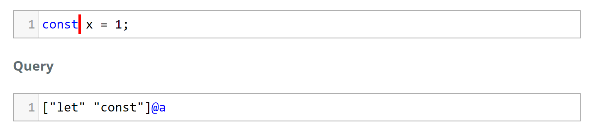
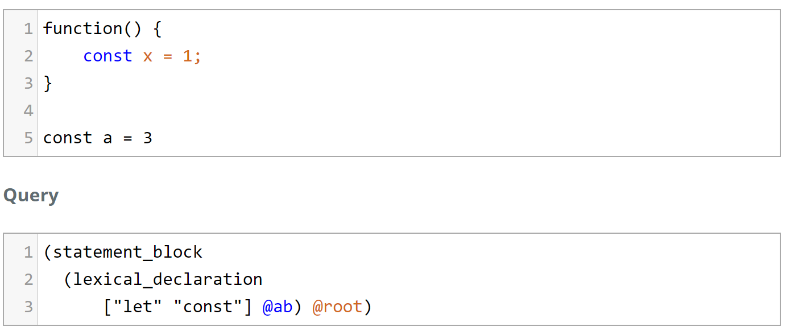

# TreeSitter Experiments

&#128522;

It works....

## Next Step

- [X] import tree-sitter in Lively4
- [ ] convert tree-sitter tree to domain object tree

###

- 

## Root Bindings

- a binding matches a @root
- can have a context
- and named sub-matches (call can be referenced)

