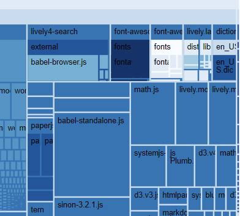
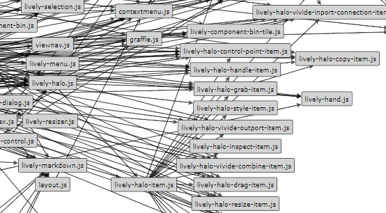

# Visualizations

[workflows](../../doc/workflows/visualizations.md) | [architecture](../../doc/architecture/visualizations.md)

### File TreeMap

- [journal entry](browse://doc/journal/2018-04-17.md)

```javascript
lively.files.visualizeFileTreeMap(lively4url)
lively.files.visualizeFileTreeMap(lively4url + "/src/client")
```
  

  
### Lively Modules

[lively-module-graph](open://lively-module-graph) 


  
  