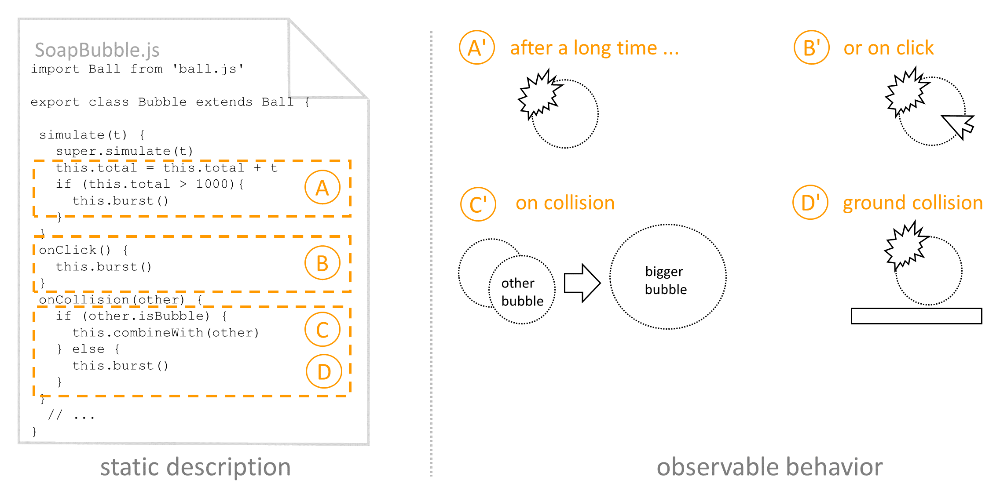

Designing a Live Development Experience   for Web Components

<u>Jens Lincke</u>, Stefan Ramson, Patrick Rein,   Robert Hirschfeld, Marcel Taeumel, Tim Felgentreff

Software Architecture Group  Hasso Plattner Institute  University of Potsdam, Germany

PX/17.2, October 22, 2017, Vancouver, Canada

---

X

<!-- - Level of Preserving Context -->

# Live Development of Web Components

- Background 
  - Lively Kernel, a Smalltalk like development environment in the browser 
- Motivation 
  - Transfer programming experience of Lively Kernel to plain HTML 
  - No new framework or new language for better live programming
  - But better live programming with HTML and JavaScript
- Problem 
  - No full control of framework, because of standard browser technology
  - Plain HTML does not provide abstractions
  - JavaScript does not provide enough reflection
  - Web Components provide abstraction, but lack run-time development support
- Approach
  - Preserve the context while giving immediate feedback through instance migration

---

X

# Lively Kernel Development Experience

- Morphic framework with Halo tools 
- Evolve tools and applications while using them 
- Wiki-like collaboration while working on code and objects

<!--

-->
---

X

    
# Lively4

- Programming Experience in a Web-based Self-supporting Environment
  - Collaborative, though wiki like GitHub backed approach
  - Live / explorative in a Smallalk / Lively Kernel like way
  - <u>BUT:</u> ... with just "standard" Web technology?
- Lively4: New implementation of Lively Kernel ideas, tools, practices 
  - Make use of other plain JavaScript and HTML technology to easier build the environment
  - Allow to target content not created directly in Lively4 with our tools
- Long list of desired features, e.g.:
  - Be loadable into any Web page (directly or through browser extensions)
  - Use cloud resources for loading, mixing, and storing content

---

X

# Web Components in Modern Browsers

 are defined in (A), but at run-time the template is copied and the structure is redundant (C).")

---

X

<!-- # Live Web Component Migration -->

# Live Web Component Migration 

- JavaScript objects and HTML elements
- Object mutation and HTML element migration
- Approach
  - Modify the source code of Web Components (HTML and JS) 
  - Control the instantiation (use the latest template and class)
  - Existing instances are migrated 
  - Run initialization code and (re-)applying the persisted state
- Challenges
  - Loosing object identity
  - "Stale code" and dangling event listeners
  - Performance due to potentially big scope of reloads
  - Level of preserving context (white vs black listing)
  - Dynamic elements in static templates

---

X

# Different Kinds of Feedback in the System

<!--

--- 

X

# Related Work

- Squeak / Smalltalk 
- Lively Kernel
- Live Programming
- Cascading Tree Sheets

-->

--- 

X

# Conclusion

- Contributions 
  - Explorative and live programming experience in a Web-based environment
  - Working with plain HTML elements vs. special framework
  - Live programming experience for Web Components
- Design Decisions
  - Object graph vs. DOM (references vs. explicit name) 
  - Mutable vs. immutable past (migration vs. mutation)
- Ongoing challenge
  - Practical usability vs live and explorative programming experience

---

X

Designing a Live Development Experience   for Web Components

<u>Jens Lincke</u>, Stefan Ramson, Patrick Rein,   Robert Hirschfeld, Marcel Taeumel, Tim Felgentreff

Software Architecture Group  Hasso Plattner Institute  University of Potsdam, Germany

---

X

## Designing a Live Development Experience   for Web Components

- Explorative and live development environments 
  - Flourish the most when they can impose restrictions
  - Enhance the experience of editing code: immediate feedback and direct manipulation 
- Example: Lively Kernel's user interface (UI) framework Morphic 
  - Working with graphical objects in direct way 
  - Giving immediate feedback during development. 
- Lively4 
  - Similar development experience 
  - Targeting general HTML elements. 
- New abstraction mechanism: Web Components 
  - Use plain HTML as building blocks for our tools
  - <u>But:</u> miss proper capabilities to support run-time development
- Approach 
  - Use object migration to provide immediate feedback

PX/17.2, October 22, 2017, Vancouver, Canada

