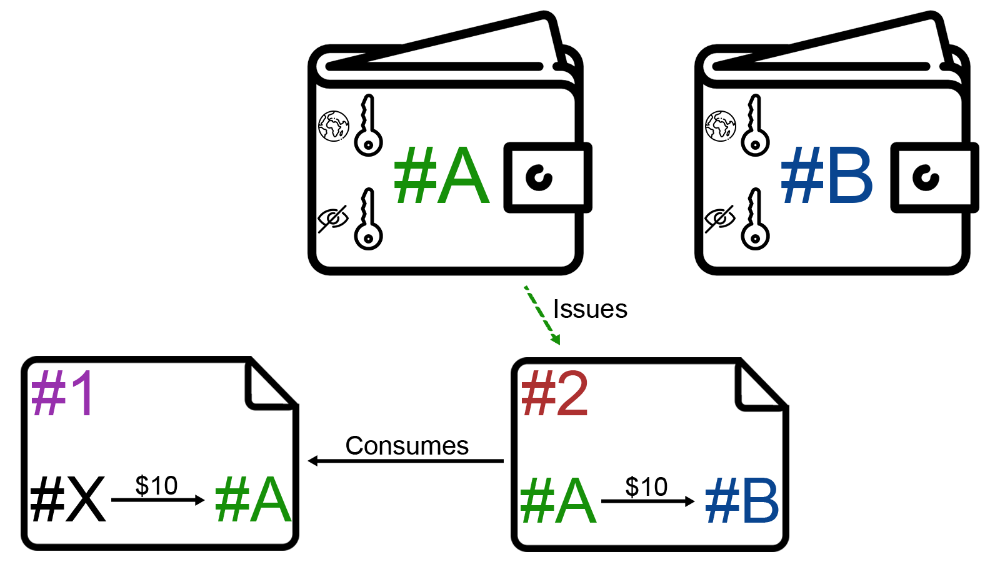
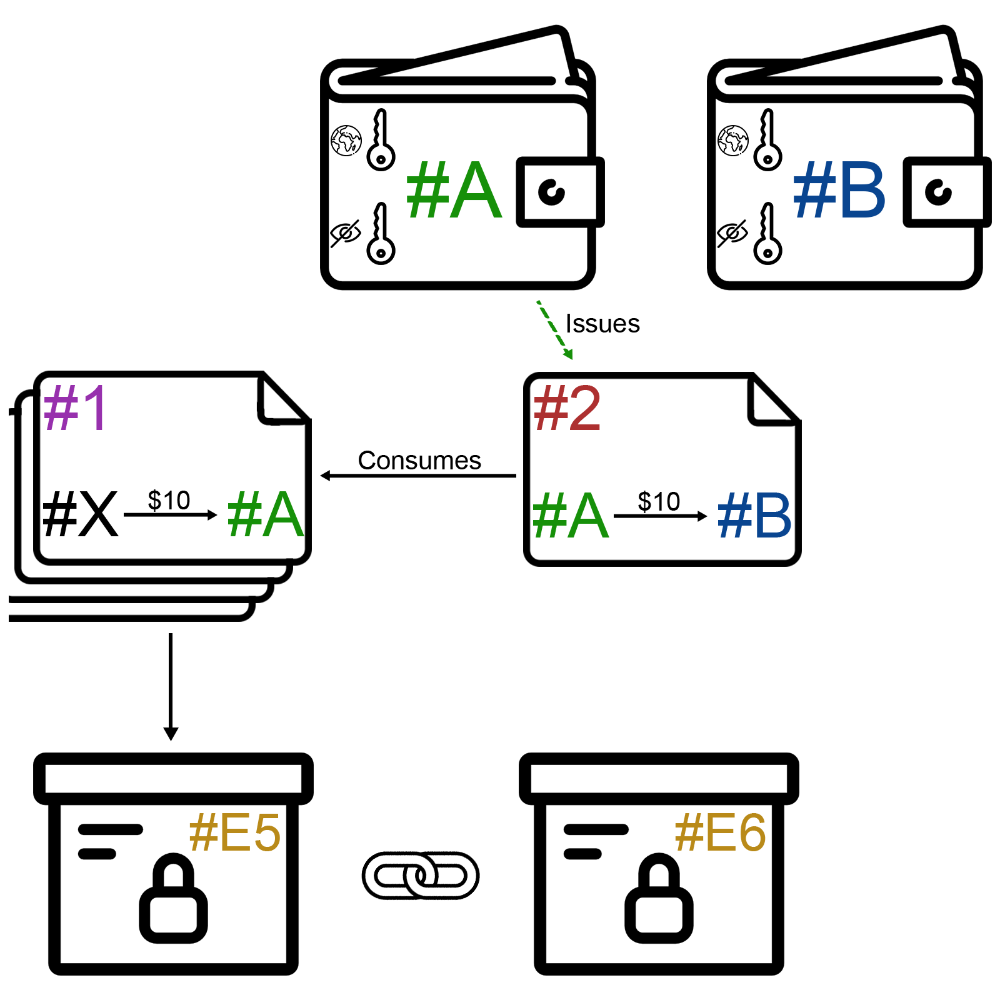
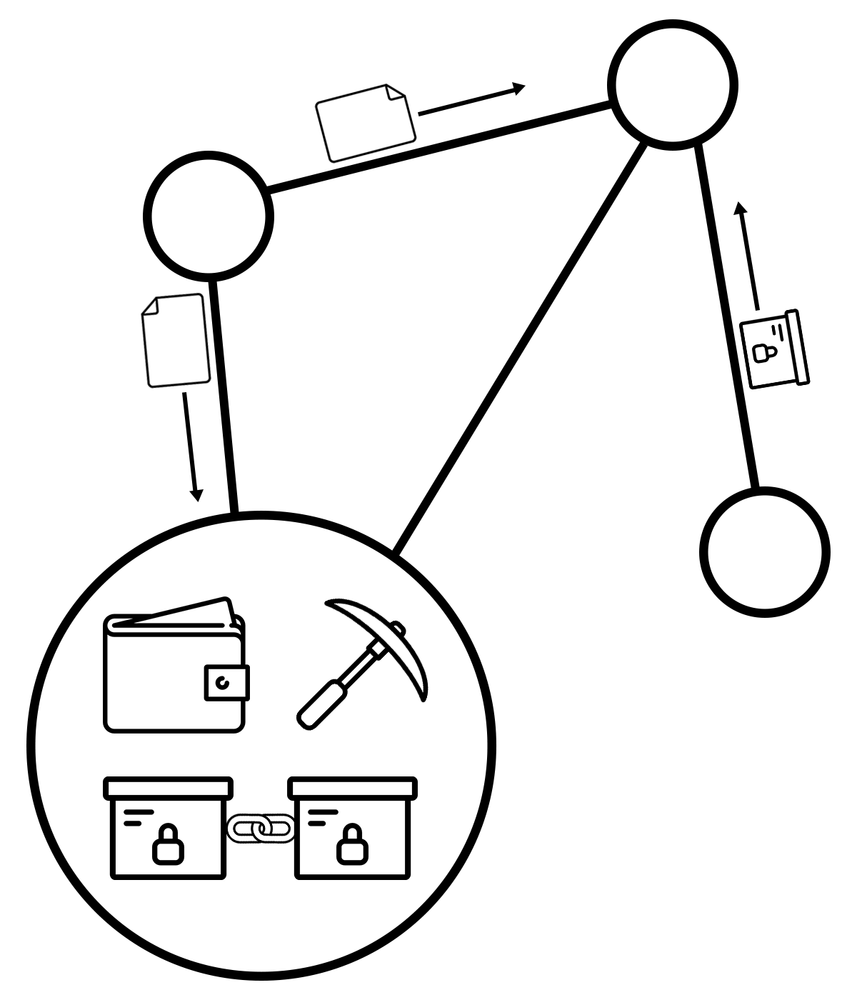

<!-- markdown-config presentation=true -->

<!-- begin styles -->
<link rel="stylesheet" type="text/css" href="doc/PX2018/style.css"  />
<link rel="stylesheet" type="text/css" href="src/client/lively.css"  />
<link rel="stylesheet" type="text/css" href="templates/livelystyle.css"  />
<link rel="stylesheet" type="text/css" href="doc/PX2018/project_1/endterm-presentation/assets/style.css"  />

<style>
  .lively-slide {
    border: 1px solid rgb(220,220,220)
    page-break-before: always;
  }
  p {
    font-size: 18pt
  }
  pre:not(#LOG) {
    background-color:  rgba(240,240,250,1);
    padding: 6px;
    width: 800px;
  }
</style>
<!-- end styles -->

<!-- begin script -->
<script>
import {hideHiddenElements, toggleLayer, showVariable, runExampleButton} from "src/client/essay.js";
</script>
<!-- end script -->

<div class="title">
  PX 2018: Blockchain - Endterm Presentation
</div>

<div class="authors">
  Johannes Schneider, Julian Weise
</div>

<div class="credentials">
  Software Architecture Group <br>Hasso Plattner Institute<br> University of Potsdam, Germany
</div>


<script>
  import {presentationPrintButton} from "src/client/essay.js"
  presentationPrintButton(this)
</script>

<script>
  import {presentationFullscreenButton} from "src/client/essay.js"
  presentationFullscreenButton(this)
</script>


---
<h1 class="centralized">Introduction</h1>


---


<p class="center subtitle">Previous century: researches invented continuously</p>
<p class="credits">Icons made by <a href="https://www.freepik.com/">Freepik</a> from <a href="https://flaticon.com">www.flaticon.com</a></p>

---


<p class="center subtitle">Problem: same ideas by multiple researchers</p>
<p class="credits">Icons made by <a href="https://www.freepik.com/">Freepik</a> from <a href="https://flaticon.com">www.flaticon.com</a></p>

---


<p class="center subtitle">Solution: write down idea and send to yourself</p>
<p class="credits">Icons made by <a href="https://www.freepik.com/">Freepik</a> from <a href="https://flaticon.com">www.flaticon.com</a></p>

---


<p class="center subtitle">Post office clerk will stamp each letter with timestamp</p>
<p class="credits">Icons made by <a href="https://www.freepik.com/">Freepik</a> from <a href="https://flaticon.com">www.flaticon.com</a></p>

---


<p class="center subtitle">Researcher has proof for invention at specific point of time</p>
<p class="credits">Icons made by <a href="https://www.freepik.com/">Freepik</a> from <a href="https://flaticon.com">www.flaticon.com</a></p>

---


<p class="center subtitle">Problem: Post office clerk might not be reliable</p>
<p class="credits">Icons made by <a href="https://www.freepik.com/">Freepik</a> from <a href="https://flaticon.com">www.flaticon.com</a></p>

---


<p class="center subtitle">Idea: Researchers maintain ledger collaboratively</p>
<p class="credits">Icons made by <a href="https://www.freepik.com/">Freepik</a> from <a href="https://flaticon.com">www.flaticon.com</a></p>

---
## Blockchain
<div class="quotation">
"Decentralized, chronological updated database with a network based consensus mechanism for permanent confirmation of ownership."
<div class="author">Prof. Dr. Andreas Mitschele</div>
</div>

---
## Bitcoin

<ul>
<li>digital crypto currency
  <ul>
    <li>value skyrocketed from basically $0 (2009) to ~$18.000 (2017)</li>
  </ul>
</li>

<li>
concept published by Satoshi Nakamoto (pseudonym) in 2008
<ul>
  <li>shared ledger to keep track of all transactions</li>
  <li>aims to remove necessity of banks to clear transactions</li>
</ul>
</li>
<li>first stable implementation in 2009</li>
</ul>

---
<h1 class="centralized">Concepts</h1>

---

## Wallets transfer money 

<p class="credits">Icons made by <a href="https://www.freepik.com/">Freepik</a> from <a href="https://flaticon.com">www.flaticon.com</a></p>

---

## Transactions gather financials

<p class="credits">Icons made by <a href="https://www.freepik.com/">Freepik</a> from <a href="https://flaticon.com">www.flaticon.com</a></p>


---

## Blocks keep track of transactions

<p class="credits">Icons made by <a href="https://www.freepik.com/">Freepik</a> from <a href="https://flaticon.com">www.flaticon.com</a></p>


---

## Wallet

<ul>
  <li>
  necessary to participate in payment transactions
  <ul>
    <li>send transactions</li>
    <li>receive transactions</li>
  </ul>
  </li>
  <li>basically set of private &amp; public key
    <ul>
      <li>used to sign transactions</li>
      <li>public key as identifier in payment network</li>
    </ul>
  </li>
</ul>

```javascript {.OpenImplementationWallet .Hidden}
lively.openFile('https://lively-kernel.org/lively4/lively4-core/src/blockchain/model/wallet/wallet.js')
```
<script>runExampleButton("Display Implementation", this, ["OpenImplementationWallet"])</script>


### Usage
```javascript {.BlockchainImports .Hidden}
import BlockchainNode from 'src/blockchain/model/blockchainNode/blockchainNode.js';
import Wallet from 'src/blockchain/model/wallet/wallet.js';
import Transaction from 'src/blockchain/model/transaction/transaction.js';
import TransactionInputCollection from 'src/blockchain/model/transaction/transactionInputCollection.js';
import TransactionOutputCollection from 'src/blockchain/model/transaction/transactionOutputCollection.js';
import BlockNetworkView from 'src/blockchain/view/blockchainNetworkView.js';
```

```javascript {.InitializeWallet .NoResult}
import Wallet from 'src/blockchain/model/wallet/wallet.js';
const wallet = new Wallet();
```

```javascript {.DisplayWallet .Hidden}
lively.openComponentInWindow('blockchain-wallet').then(comp => {
  comp.wallet = wallet;
});

```

<script>runExampleButton("Display Wallet", this, ["InitializeWallet", "DisplayWallet"])</script>

<script>hideHiddenElements(this)</script>


### Receive payment
```javascript {.WalletReceiveTransactionPreparation .Hidden}
import Transaction from 'src/blockchain/model/transaction/transaction.js';
import TransactionInputCollection from 'src/blockchain/model/transaction/transactionInputCollection.js';
import TransactionOutputCollection from 'src/blockchain/model/transaction/transactionOutputCollection.js';

const inputCollection = new TransactionInputCollection(wallet);
inputCollection.addMiningReward({"minerHash": wallet.hash, "reward": 10});
inputCollection.finalize();
const outputCollection = new TransactionOutputCollection();
outputCollection.add(wallet, 5);
outputCollection.finalize();
const transaction = new Transaction(wallet, inputCollection, outputCollection);
```

```javascript {.WalletReceiveTransaction}
wallet.receive(transaction);
```

<script>runExampleButton("Receive Transaction", this, ["InitializeWallet", "WalletReceiveTransactionPreparation", "WalletReceiveTransaction", "DisplayWallet"])</script>

<script>hideHiddenElements(this)</script>

---
## Transaction
<ul style="margin-bottom: 30px">
  <li>fundamental atomic component of blockchain data structure</li>
  <li>
    describes <strong>one</strong> timestamped change within ecosystem
    <ul>
      <li>Bitcoin: single payment flow reserving some value on a wallet</li>
    </ul>
  </li>
  <li>issued and signed by one wallet</li>
  <li>consumes outputs of other transactions &rarr; produces new outputs, which can be consumed
    <ul>
      <li>transactions form an acyclic, directed graph</li>
      <li>Bitcoin: cash flow can be reconstructed</li>
    </ul>
  </li>
</ul>

```javascript {.OpenImplementationTransaction .Hidden}
lively.openFile('https://lively-kernel.org/lively4/lively4-core/src/blockchain/model/transaction/transaction.js', false)
```
<script>runExampleButton("Display Implementation", this, ["OpenImplementationTransaction"])</script>


### Visualization

<blockchain-transaction id="transaction-view" style="display:none; width: 600px;"></blockchain-transaction>

```javascript {.DisplayTransactionView .Hidden}
lively.query(this, '#transaction-view').transaction = transaction;
lively.query(this, '#transaction-view').style.display = 'block';
```

<script>runExampleButton("Display Transaction", this, ["InitializeWallet", "WalletReceiveTransactionPreparation", "WalletReceiveTransaction", "DisplayTransactionView"])</script>

<script>hideHiddenElements(this)</script>

---

## Block
<ul>
  <li>periodically encapsulates transactions</li>
  <li>comparable to a ledger's page</li>
  <li>transactions summarized into a block are interpreted as valid</li>
  <li>creation of a block is called <i>mining</i>
    <ul>
      <li>requires resource intensive / time consuming work to be done</li>
      <li>mining is rewarded (mining-reward and fees)</li>
    </ul>
  </li>
</ul>

```javascript {.OpenImplementationBlock .Hidden}
lively.openFile('https://lively-kernel.org/lively4/lively4-core/src/blockchain/model/block/block.js', false)
```
<script>runExampleButton("Display Implementation", this, ["OpenImplementationBlock"])</script>
<script>hideHiddenElements(this)</script>


### Mining Challenge

```javascript {.MiningChallengeExample}
import forge from 'node_modules/node-forge/dist/forge.min.js';

const sha256 = forge.md.sha256.create();

const block = {'prevHash': "#3eFg7FA", "data": "...", "nonce": 0};

```
<script>runExampleButton("Setup Mining-Challenge", this, ["MiningChallengeExample"])</script>

```javascript {.MiningChallengeIncraseNonce}
block['nonce'] = block['nonce'] + 1;
sha256.update(block);
sha256.digest().toHex();
```
<script>runExampleButton("Run Mining-Challenge", this, ["MiningChallengeIncraseNonce"])</script>

---
## Blockchain

<ul>
  <li>each block refers it's preceding block (chain of blocks &rarr; chronological order)</li>
  <li>blockchain as overall ledger: furnishes proof of any change
    <ul>
      <li>Bitcoin: any financial transaction</li>
    </ul>
  </li>
</ul>

```javascript {.OpenImplementationBlockchain .Hidden}
lively.openFile('https://lively-kernel.org/lively4/lively4-core/src/blockchain/model/blockchain/blockchain.js', false)
```
<script>runExampleButton("Display Implementation", this, ["OpenImplementationBlockchain"])</script>

### Formation of a Blockchain

<script>runExampleButton("Setup Environment", this, ["BlockchainImports", "PrepareMining"])</script>
<blockchain-wallet id="blockchain-wallet-block"></blockchain-wallet>
<blockchain-node-view id="blockchain-node-view-block"></blockchain-node-view>

```javascript {.PrepareMining .Hidden}
import BlockchainNode from 'src/blockchain/model/blockchainNode/blockchainNode.js';
import BlockNetworkView from 'src/blockchain/view/blockNetworkView.js';
import NetworkComponent from 'src/blockchain/model/blockchainNode/networkComponent.js';

NetworkComponent.peers = [];

const node = new BlockchainNode();
const blockViewController = new BlockNetworkView(lively.query(this, '#blockchain-node-view-block'));
blockViewController.reset();
blockViewController.draw();
const walletView = lively.query(this, '#blockchain-wallet-block');
lively.query(this, '#blockchain-node-view-block').resize(600, 200).draw();

node.subscribe(blockViewController, (block) => {
  blockViewController.addBlock(block);
  blockViewController.draw();
  walletView.wallet = node.wallet;
});

blockViewController
  .addBlock(node.blockchain.headOfChain)
  .draw();

walletView.wallet = node.wallet;
```
```javascript {.MineBlock .Hidden}
node.mine();

```
<script>runExampleButton("Mine Block", this, ["MineBlock"])</script>

<script>hideHiddenElements(this)</script>

---
<h1 class="centralized">Networking</h1>

---

## Nodes
<ul style="width: 500px; float: left">
  <li>participants within network are called nodes</li>
  <li>each node can perform several actions
    <ul>
      <li>mine new blocks &rarr; Miner</li>
      <li>propagate Transactions &rarr; NetworkComponent</li>
      <li>maintain it's own Blockchain copy &rarr; Storage</li>
    </ul>
  </li>
</ul>



```javascript {.OpenImplementationBlock .Hidden}
lively.openFile('https://lively-kernel.org/lively4/lively4-core/src/blockchain/model/blockchainNode/blockchainNode.js', false)
```
<script>runExampleButton("Display Implementation", this, ["OpenImplementationBlock"])</script>
<script>hideHiddenElements(this)</script>

<p class="credits">Icons made by <a href="https://www.freepik.com/">Freepik</a> from <a href="https://flaticon.com">www.flaticon.com</a></p>

---

## Peer-To-Peer

<ul>
  <li>new nodes contact long-established ones to get initial information
    <ul>
      <li>other peers</li>
      <li>already existing blockchain</li>
    </ul>
  </li>
  <li>consensus rules ensure same Blockchain on majority of nodes
    <ul>
      <li>blocks with solved mining-challenge are valid</li>
      <li>each transaction can only be spent once</li>
      <li>...</li>
    </ul>
  </li>
  <li>nodes / miner compete against each other while solving the mining challenge</li>
</ul>

```javascript {.RunFullDemo .Hidden}
lively.openComponentInWindow('blockchain-ui').then(comp => {
    comp.createNewNode();
    comp._nodes[0].subscribe(comp, comp.update.bind(comp));
    comp.update(comp._nodes[0].blockchain.headOfChain);
});

```
<script>runExampleButton("Run full Demo", this, ["RunFullDemo"])</script>
<script>hideHiddenElements(this)</script>

---
## Distributed Trust

<ul>
  <li>blocks and transactions are timestamped &rarr; data is stored sequentially</li>
  <li>every block contains hash of prevoius block &rarr; tampering impossible</li>
  <li>thousands of nodes store their copy of the blockchain independently</li>
  <li>fundamental assumption: Majority of nodes operates trustworthy
    <ul>
      <li>enough computational power to assert always providing longest chain</li>
    </ul>
  </li>
</ul>

### Trust experiment

```javascript {.PrepareBlockchainValidation .Hidden}
import BlockchainNode from 'src/blockchain/model/blockchainNode/blockchainNode.js';
import NetworkComponent from 'src/blockchain/model/blockchainNode/networkComponent.js';

NetworkComponent.peers = [];

const node = new BlockchainNode();
const blockchain = node.blockchain;
node.mine();
node.mine();
```

```javascript {.ValidateBlockchainSuccessfully}
blockchain.isValid();
```

<script>runExampleButton("Validate Blockchain", this, ["PrepareBlockchainValidation", "ValidateBlockchainSuccessfully"])</script>

```javascript {.ValidateBlockchainUnsuccessfully}
blockchain.headOfChain.timestamp = 123456789;
blockchain.isValid();
```

<script>runExampleButton("Validate Blockchain", this, ["PrepareBlockchainValidation", "ValidateBlockchainUnsuccessfully"])</script>

<script>hideHiddenElements(this)</script>

---
## Blockchain validation

<ul class="positive-list">
  <li>novel approach to persist data tamper proof without need for central authority
    <ul>
      <li>researcher: Proof for authorship of ideas / inventions without dependence on mail service</li>
      <li>bitcoin: Financial transactions without need for (central) banks clearing every transaction</li>
    </ul>
  </li>
</ul>
<ul class="negative-list">
  <li>requires large number of peers to ensure security and tamper-resistants</li>
  <li>proof-of-Work-Concept consumes a lot of resources ~ 71 TWh / year &rarr; Energy consumption Czech Republic</li>
  <li>waste of storage: Blockchain is duplicated multiple times over all nodes</li>
  <li>bad throughput in comparison to conventional (distributed) storage solutions</li>
</ul>

---
##  Active Essay / Interactive presentation

### What we did within Lively
<ul>
  <li>implemented a basic blockchain (wallet, transactions, -input and -outputs, blocks)</li>
  <li>simulated an entire peer-to-peer network</li>
  <li>built multiple visualizations</li>
  <li>created this interactive presentation</li>
</ul>

### How does the audience profit from this approach?
<ul>
  <li>interactive approach lets user apply gained knowledge</li>
  <li>visualizations make complex concept more tangible</li>
  <li>demonstration in separate UI makes collaboration of single concepts better understandable</li>
</ul>
</ul>
