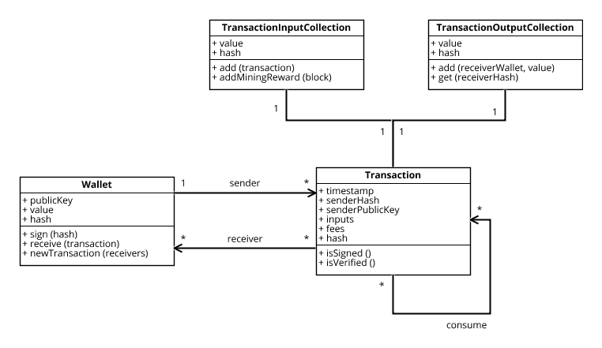

<!-- markdown-config presentation=true -->

<!-- begin styles -->
<link rel="stylesheet" type="text/css" href="doc/PX2018/style.css"  />
<link rel="stylesheet" type="text/css" href="src/client/lively.css"  />
<link rel="stylesheet" type="text/css" href="templates/livelystyle.css"  />
<link rel="stylesheet" type="text/css" href="doc/PX2018/project_1/endterm-presentation/assets/style.css"  />

<style>
  .lively-slide {
    border: 1px solid rgb(220,220,220)
    page-break-before: always;
  }
  p {
    font-size: 18pt
  }
  pre:not(#LOG) {
    background-color:  rgba(240,240,250,1);
    padding: 6px;
    width: 800px;
  }
</style>
<!-- end styles -->

<!-- begin script -->
<script>
import {hideHiddenElements, toggleLayer, showVariable, runExampleButton} from "src/client/essay.js";
</script>
<!-- end script -->

## Transaction Architecture



```javascript {.CreateInputCollection}
import TransactionInputCollection from 'src/blockchain/model/transaction/transactionInputCollection.js';

// Creates an inputCollection and defines input values
const inputCollection = new TransactionInputCollection(wallet);
// mining reward is used as source of income
inputCollection.addMiningReward({"minerHash": wallet.hash, "reward": 10});
inputCollection.finalize();
```

```javascript {.CreateOutputCollection}
import TransactionOutputCollection from 'src/blockchain/model/transaction/transactionOutputCollection.js';

// Creates an outputCollection and defines which wallet will receive money
const outputCollection = new TransactionOutputCollection();
outputCollection.add(wallet, 5);
outputCollection.finalize();
```

```javascript {.CreateTransaction}
import Transaction from 'src/blockchain/model/transaction/transaction.js';

// Creates an wallet with the predefined input and outputs.
// Wallet is used to sign the transaction
const transaction = new Transaction(wallet, inputCollection, outputCollection);
```

```javascript {.DisplayTransaction .Hidden}
lively.openComponentInWindow('blockchain-transaction').then(comp => {
  comp.transaction = transaction;
});
```

<script>runExampleButton("Run", this, ["InitializeWallet", "CreateInputCollection", "CreateOutputCollection", "CreateTransaction", "DisplayWallet", "DisplayTransaction"])</script>

<script>hideHiddenElements(this)</script>

---

