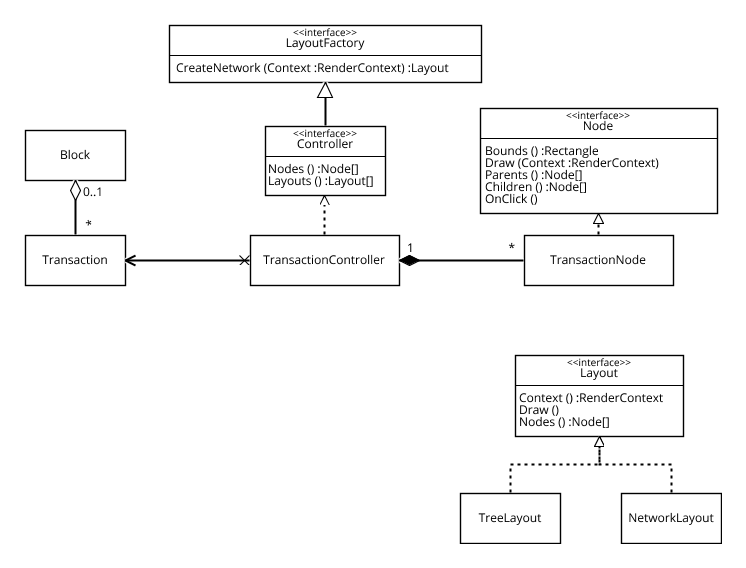

<link rel="stylesheet" href="node_modules/bootstrap-css-only/css/bootstrap.min.css"></link><link rel="stylesheet" href="doc/PX2018/project_1/midterm-presentation/style.css"></link><style> #content { width: 100%; } </style>  

# Midterm essay Blockchain{.container-fluid .text-center style="margin-bottom:15px"}

**Programming Experience Seminar 2018**  
  
Johannes Schneider, Julian Weise


## NPM packages

```javascript {id="importExample"}
import forge from 'node_modules/node-forge/dist/forge.min.js';
```


## Basic transaction implementation
<script>
(async () => { 
  const code = document.createElement('pre'); 
  code.textContent = await fetch(SystemJS.normalizeSync("src/blockchain/model/transaction/transaction.js")).then(r => r.text()); 
  return <div class="highlight">{code}</div>; 
})();
</script>


## Basic transaction usage
<!-- the "{}" syntax allows to add attributes, foo="bar" and .myclass -->

```javascript {id="transactionExample"}
import Wallet from 'src/blockchain/model/wallet/wallet.js';
import Transaction from 'src/blockchain/model/transaction/transaction.js';
import TransactionInputCollection from 'src/blockchain/model/transaction/transactionInputCollection.js';
import TransactionOutputCollection from 'src/blockchain/model/transaction/transactionOutputCollection.js';

const sender = new Wallet();
const inputCollection = new TransactionInputCollection(sender);
const outputCollection = new TransactionOutputCollection();

(async () => {
  return new Transaction(sender, inputCollection, outputCollection);
})();
```


## Inspecting transaction object
<script>
import boundEval from "src/client/bound-eval.js"; 
(async () => { 
  var src = lively.query(this,"#transactionExample").textContent; // reference to previous <code> element 
  var result = await boundEval(src); 
  if (result.value && result.value.then) {
    result = await result.value;
    var inspector = await (<lively-inspector></lively-inspector>);
    inspector.inspect(result);
    return <div style="border: 2px solid lightgray">{inspector}</div>;
  }
})();
</script>

<br/><br/>
## Webcomponent implementation
<script>
(async () => { 
  const code = document.createElement('pre'); 
  code.textContent = await fetch(SystemJS.normalizeSync("templates/blockchain-transaction.js")).then(r => r.text()); 
  return <div class="highlight">{code}</div>; 
})();
</script>


## Visualization
<script>
import Wallet from 'src/blockchain/model/wallet/wallet.js'; 
import Transaction from 'src/blockchain/model/transaction/transaction.js'; 
import TransactionInputCollection from 'src/blockchain/model/transaction/transactionInputCollection.js'; 
import TransactionOutputCollection from 'src/blockchain/model/transaction/transactionOutputCollection.js'; 
(() => { 
  const sender = new Wallet(); 
  const inputCollection = new TransactionInputCollection(sender); 
  const outputCollection = new TransactionOutputCollection(); 
  const transactionView = document.createElement("blockchain-transaction"); 
  transactionView.transaction = new Transaction(sender, inputCollection, outputCollection); 
  return transactionView; 
})();
</script>

## Architecture Diagram of Graph Visualization



## Custom Graph Visualization (canvas)
<script>
import Wallet from 'src/blockchain/model/wallet/wallet.js'; 
import Transaction from 'src/blockchain/model/transaction/transaction.js'; 
import TransactionInputCollection from 'src/blockchain/model/transaction/transactionInputCollection.js'; 
import TransactionOutputCollection from 'src/blockchain/model/transaction/transactionOutputCollection.js';
const sender = new Wallet(); 
const inputCollection = new TransactionInputCollection(sender); 
const outputCollection = new TransactionOutputCollection();
const transaction = new Transaction(sender, inputCollection, outputCollection);
const transaction2 = new Transaction(sender, inputCollection, outputCollection);
const transactionNetwork = document.createElement("blockchain-canvas");
transactionNetwork.initialize();
transactionNetwork.controller.addTransaction(transaction);
transactionNetwork.controller.addTransaction(transaction2);
// const transactionNetwork = document.createElement("blockchain-canvas").then(() => {
//   transactionNetwork.controller.addTransaction(transaction);
// });

(() => {
  return transactionNetwork;
})();
</script>

## Resources / Literature

- [Stuart HaberW. Scott Stornetta: How to time-stamp a digital document (1991)](http://www.foo.be/andria/docs/haber91how.ps "How to time-stamp a digital document (1991)")

- [Dave Bayer, Stuart Haber, W. Scott Stornetta: Improving the Efficiency and Reliability of Digital Time-Stamping (1992)](http://citeseerx.ist.psu.edu/viewdoc/download?doi=10.1.1.71.4891&rep=rep1&type=pdf "Improving the Efficiency and Reliability of Digital Time-Stamping (1992)")

- [Satoshi Nakamoto: Bitcoin: A Peer-to-Peer Electronic Cash System (2008)](https://bitcoin.org/bitcoin.pdf "Bitcoin: A Peer-to-Peer Electronic Cash System (2008)")

- [The Economist: Bitcoin: Blockchains: The great chain of being sure about things (2015)](https://www.economist.com/news/briefing/21677228-technology-behind-bitcoin-lets-people-who-do-not-know-or-trust-each-other-build-dependable "Blockchains: The great chain of being sure about things (2015)")
