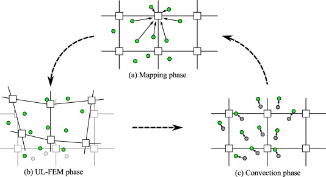

<!-- markdown-config presentation=true -->

<link rel="stylesheet" type="text/css" href="doc/PX2018/project_2/utils.css">
<link rel="stylesheet" type="text/css" href="doc/PX2018/project_2/presentation.css">

<link rel="stylesheet" type="text/css" href="doc/PX2018/style.css" />
<link rel="stylesheet" type="text/css" href="src/client/lively.css" />
<link rel="stylesheet" type="text/css" href="templates/livelystyle.css" />

  Programming Experience 2018: - Material Point Method -

  Sebastian Koall

  Software Architecture Group  Hasso Plattner Institute  University of Potsdam, Germany

--- 

Introduction

<ul class="notes notes-big">
<li>How can materials be simulate</li>
</ul>

---

Introduction

<ul class="notes notes-big">
<li>How can materials be simulate <i class="fa fa-arrow-right"></i>Material Point Method</li>
</ul>

---

Introduction

<ul class="notes notes-big">
<li>How can materials be simulate <i class="fa fa-arrow-right"></i>Material Point Method</li>
<li>Why is it of interest?</li>
</ul>

---

Introduction

<ul class="notes notes-big">
<li>How can materials be simulate <i class="fa fa-arrow-right"></i>Material Point Method</li>
<li>Why is it of interest?</li>
<li>Well take a look:</li>
</ul>
<iframe style="position: absolute; bottom: 50px; right: 50px;" width="50%" height="50%" src="https://www.youtube.com/embed/nXck0xs7oyw?start=150" frameborder="0" allow="autoplay; encrypted-media" allowfullscreen></iframe>

---

Related Work

<ul class="notes notes-big">
<li><a href="https://www.researchgate.net/profile/Vinh_Phu_Nguyen/publication/262415477_Material_point_method_basics_and_applications/links/00463537ab99f084f0000000/Material-point-method-basics-and-applications.pdf">Material point method: basics and applications</a></li>
<li><a href="https://www.math.ucla.edu/~jteran/student_thesis/jiang.pdf">The Material Point Method for the Physics-Based Simulation of Solids and Fluids</a></li> 
<li><a href="https://github.com/onsetsu/floom/">Stefan's Javascript implementation</a></li>
</ul>

---

Concept

<ul class="notes notes-big">
<li>Is a particle-in-cell method</li>
<li>Particles moving in a grid</li>
<li>Grid points influence the particle movement</li>
</ul>

---

Outlook

<ul class="notes notes-big">
<li>Explore the material point method with simple examples</li>
<li>Animations that show the influence of variables</li>
<ul>
<li>To simulate different materials</li>
<li>To simulate different behavior</li>
</ul>
<li>If manageable: Explain how to create material out of particles</li>
</ul>

---

# Close

