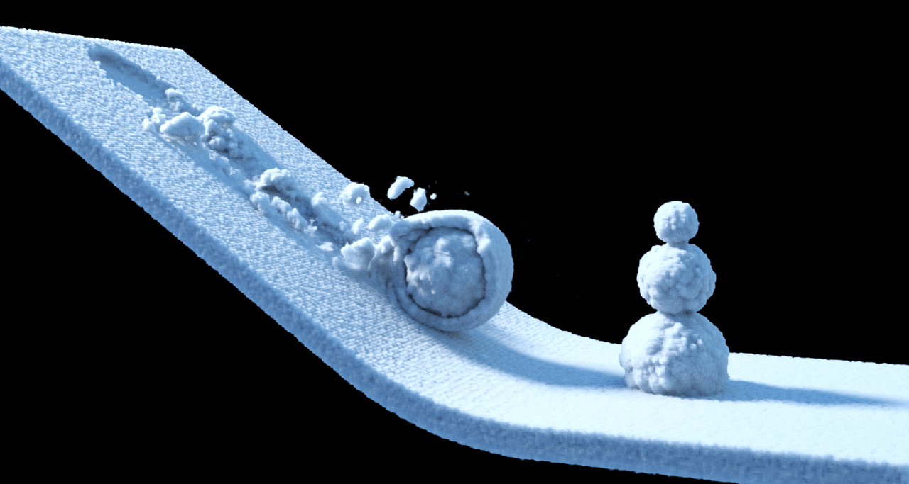
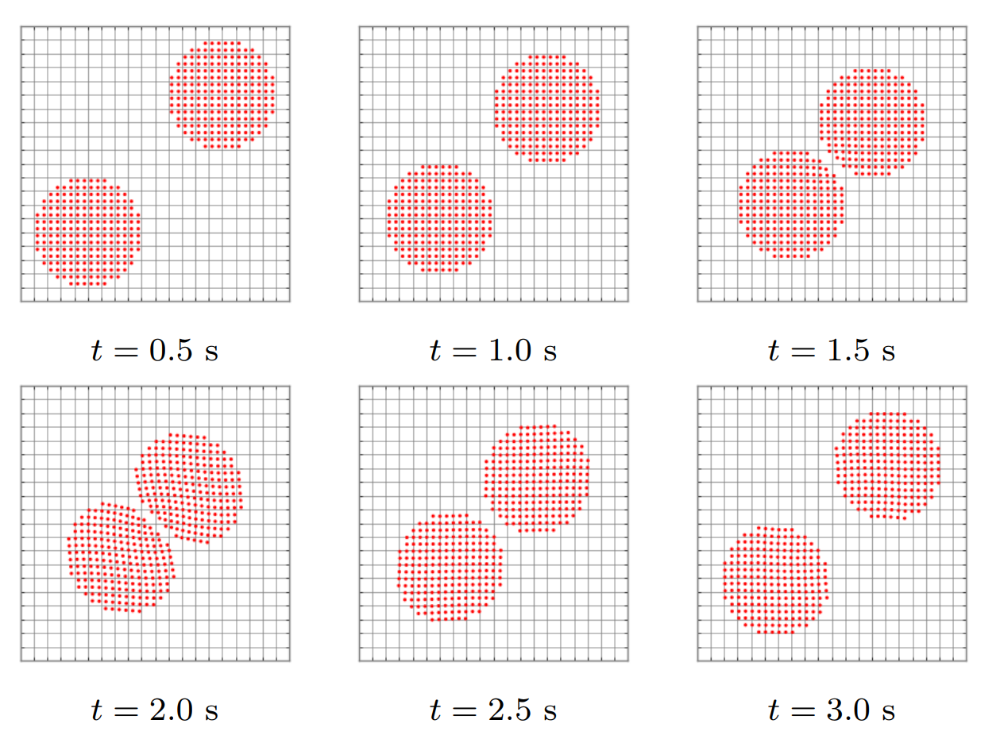

<!-- markdown-config presentation=true -->

<script>
import { openBrowser, openComponent } from "doc/PX2018/project_2/utils.js"
import { hideHiddenElements, toggleLayer, showVariable, runExampleButton } from "src/client/essay.js";
import livelyMpm from 'doc/PX2018/project_2/lively-mpm.js'

const showDetails = false;
let presentation = lively.query(this, "lively-presentation");
let slides = [];
let ratio = "16-9";

if (presentation) {
  slides = presentation.querySelectorAll('.lively-slide');
}
slides.forEach(slide => {
  slide.classList += " ratio-" + ratio;
  
  if (showDetails) {
    let detailsElements = slide.querySelectorAll('.details');
    
    for (let detailsElement of detailsElements) {
      detailsElement.classList.remove('hidden');
    }
  }
});

</script>
<link rel="stylesheet" type="text/css" href="doc/PX2018/project_2/utils.css">
<link rel="stylesheet" type="text/css" href="doc/PX2018/project_2/presentation.css">

<link rel="stylesheet" type="text/css" href="doc/PX2018/style.css" />
<link rel="stylesheet" type="text/css" href="src/client/lively.css" />
<link rel="stylesheet" type="text/css" href="templates/livelystyle.css" />

<style>
  .lively-slide {
    border: 1px solid rgb(220,220,220)
    page-break-before: always;
  }
  
  p {
    font-size: 18pt
  }
  @media print {
    .lively-slide {
      page-break-before: always;
      border: 0px solid white;
/*       border: 2px solid blue; */
    }      
  }
  
</style>

<script>
let presentButton = document.createElement('button');
presentButton.innerHTML = 'present';
presentButton.addEventListener("click", async () => {
  document.documentElement.webkitRequestFullScreen(Element.ALLOW_KEYBOARD_INPUT);
  // wait for fullscreen
  await lively.sleep(100);

  let width = Math.max(document.documentElement.clientWidth, window.innerWidth || 0);
  let height = Math.max(document.documentElement.clientHeight, window.innerHeight || 0);
  let scaling = width / slides[0].clientWidth;
  
  slides.forEach(slide => {
    slide.style.transform = 'scale(' + scaling + ')';
    slide.style.transformOrigin = 'top left';
    slide.style.position = 'fixed';
    slide.style.zIndex = '10001';
  })

  presentButton.style.display = 'none';
})

if (presentation && presentation.slides) {
  presentation.slides().forEach(ea => {
    var img = document.createElement("img")
    img.classList.add("logo")
    img.src="https://lively-kernel.org/lively4/lively4-jens/doc/PX2018/media/hpi_logo.png" 
    img.setAttribute("width", "50px")
    ea.appendChild(img)

    var div = document.createElement("div")
    div.classList.add("page-number")
    ea.appendChild(div)
  });
}

presentButton
</script>

<div class="title-frontpage">
  Programming Experience 2018<br />- Material Point Method -
</div>

<div class="authors">
  Sebastian Koall
</div>

<div class="credentials">
  Software Architecture Group <br>Hasso Plattner Institute<br> University of Potsdam, Germany
</div>

<script>
  var button = document.createElement("button")
  button.textContent = "print"
  button.onclick = async () => {
   var presentation = lively.query(this, "lively-presentation")
   presentation.print()
  }
  button.style = "position: absolute; bottom: 10px; left: 10px"
  button
</script>

---

<div class="title-1">Introduction</div>

<div class="h-1-2 notes-big">
<ul>
<li>Abbreviation: MPM</li>
<li>Simulating behavior of:<br>solids, fluids, gas</li>
<li>Based on<br>Particle-In-Cell Method &<br>Finite Element Method</li>
<li>Frozen: snow animation</li>
<li><i>Short: tons of formulas</i></li>
</ul>
</div>



---

<div class="title-1">MPM Overview</div>

<div class="notes h-1-2">
<ul class="notes-big">
<li><script>
import latexconv from "src/external/latex-to-unicode-converter.js";
"Continuum body <strong>" + latexconv.convertLaTeXToUnicode("\\Omega") + "</strong> discretized into material points <strong>p</strong>";
</script> 
</li>
<li>Located in Euclidean grid with <strong>e</strong> cells (Elements)</li>
<li>Grid has <strong>n</strong> nodes<br>(2D: n = (e + 1)²)</li>
</ul>
</div>

<div class="h-2-2">
<script>
import CircleMesh from 'doc/PX2018/project_2/circlemesh.js';
import boundEval from "src/client/bound-eval.js";
(async() => {
  let animation = await (<presentation-animation></presentation-animation>);
  animation.startStep = 0;
  let points = await CircleMesh.gmsh(100, 200, 200);
  let nodeSize = 8;
  let particleSize = 8;
  let nodes = [];
  for (var i = 0; i < 5; ++i) {
    for (var j = 0; j < 5; ++j) {
      let x = i > 0 ? 100 * i - nodeSize / 2 : 100 * i;
      let y = j > 0 ? 100 * j - nodeSize / 2 : 100 * j;
      nodes.push([x, y]);
    }
  }
  let overlay = <div style="display: table; "></div>;
  for (var i = 0; i < 16; ++i) {
    overlay.appendChild(<div style="display: table-cell; float: left; width: 100px; height: 100px; border: 1px solid #000; box-sizing: border-box; "></div>);
  }
  let steps = [];
  steps.push({ "body": { type: "circle", radius: 100, x: 200, y: 200, color: "rgba(255, 0, 0, 1)", filled: true } });
  steps.push({ "particles": { type: "points", value: points, color: "rgba(255, 0, 0, 1)", size: particleSize } });
  steps.push({ "particles": { type: "points", value: points, color: "rgba(255, 0, 0, 1)", size: particleSize },
              "grid": { type: "overlay", value: overlay } });
  steps.push({ "particles": { type: "points", value: points, color: "rgba(255, 0, 0, 1)", size: particleSize },
              "nodes": { type: "points", value: nodes, color: "#555", size: nodeSize },
              "grid": { type: "overlay", value: overlay } });
  animation.animationSteps = steps;  
  return <div><link rel="stylesheet" type="text/css" href="doc/PX2018/project_2/presentation.css" /><div class="animation">{animation}</div></div>;
})()
</script>
</div>

---

<div class="title-1">Demo 1</div>

<script>
import boundEval from "src/client/bound-eval.js";

(async() => {
  let mpm = await (<lively-mpm></lively-mpm>);
  mpm.reset(true);
  mpm.explanation = ["Particles created with:<br>mesh generator gmsh"];
  
  return <div><link rel="stylesheet" type="text/css" href="doc/PX2018/project_2/presentation.css" /><div class="mpm">{mpm}</div></div>;
})()
</script>

<div class="details hidden">

```javascript {.ShowCode .Hidden}
let url = lively4url + '/doc/PX2018/project_2/elasticbodies.js';
lively.openComponentInWindow("lively-container").then(comp => comp.editFile("" + url));
```
<script>runExampleButton("Show Code", this, ["ShowCode"])</script>
<script>hideHiddenElements(this)</script>
</div>

---

<div class="title-1">Demo 2</div>

<script>
import boundEval from "src/client/bound-eval.js";

(async() => {
  let mpm = await (<lively-mpm></lively-mpm>);
  mpm.explanation = ["Particles created with:<br>mesh generator gmsh"];
  
  return <div><link rel="stylesheet" type="text/css" href="doc/PX2018/project_2/presentation.css" /><div class="mpm">{mpm}</div></div>;
})()
</script>

<div class="details hidden">

```javascript {.ShowCode .Hidden}
let url = lively4url + '/doc/PX2018/project_2/elasticbodies.js';
lively.openComponentInWindow("lively-container").then(comp => comp.editFile("" + url));
```
<script>runExampleButton("Show Code", this, ["ShowCode"])</script>
<script>hideHiddenElements(this)</script>
</div>

---

<div class="title-1">Correct Result</div>



---

<div class="title-1">Related Work</div>

<ul class="notes notes-big">
<li>Original paper:<br><a href="http://prod.sandia.gov/techlib/access-control.cgi/1993/937044.pdf">A particle method for history-dependent materials</a></li>
<li>Basic examples:<br><a href="https://www.researchgate.net/publication/262415477_Material_point_method_basics_and_applications">Material point method: basics and applications</a></li>
<li>Snow simulation:<br><a href="https://www.math.ucla.edu/~jteran/papers/SSCTS13.pdf">A material point method for snow simulation</a></li>
<li>Interpolation:<br><a href="http://citeseerx.ist.psu.edu/viewdoc/download?doi=10.1.1.140.2649&rep=rep1&type=pdf">Analysis and reduction of quadrature errors in the<br>material point method (MPM)</a></li>
</ul>

---

<div class="title-1">Processing Loop</div>

<ul class="notes notes-big">
<li>Preparation:
<ul>
<li>Init particle mass, volume and force</li>
<li>Init grid</li>
</ul>
</li>
<li>Loop:
<ul>
<li>Particles to nodes</li>
<li>Apply force to momtentum</li>
<li>Nodes to particles</li>
<li>Reset grid</li>
</ul>
</li>
</ul>

---

<div class="title-1">Step: Particles To Nodes</div>

<div class="notes h-1-2">
<ul class="notes-big">
<li>Maps material points<br>to grid nodes</li>
<li>Calculate node values:</li>
<ul>
<li><script>
import latexconv from "src/external/latex-to-unicode-converter.js";
"Mass " + latexconv.convertLaTeXToUnicode("M\\sub{i}");
</script>
</li>
<li><script>
import latexconv from "src/external/latex-to-unicode-converter.js";
"Velocity " + latexconv.convertLaTeXToUnicode("V\\sub{i}");
</script>
</li>
<li><script>
import latexconv from "src/external/latex-to-unicode-converter.js";
"Force " + latexconv.convertLaTeXToUnicode("F\\sub{i}");
</script>
</li>
</ul>
<li>Create Lagrange grid</li>
</ul>
</div>

<div class="h-2-2">
<script>
import CircleMesh from 'doc/PX2018/project_2/circlemesh.js';
import boundEval from "src/client/bound-eval.js";
(async() => {
  let animation = await (<presentation-animation></presentation-animation>);
  animation.startStep = 0;
  let points2 = [[250, 300], [340, 285], [150, 100], [ 350, 80], [40, 280]];
  let nodeSize = 8;
  let particleSize = 8;
  let nodes2 = [];
  for (var i = 0; i < 3; ++i) {
    for (var j = 0; j < 3; ++j) {
      let x = i > 0 ? 200 * i - nodeSize / 2 : 200 * i;
      let y = j > 0 ? 200 * j - nodeSize / 2 : 200 * j;
      nodes2.push([x, y]);
    }
  }
  let overlay = <div style="display: table; "></div>;
  for (var i = 0; i < 4; ++i) {
    overlay.appendChild(<div style="display: table-cell; float: left; width: 200px; height: 200px; border: 1px solid #000; box-sizing: border-box; "></div>);
  }
  let steps = [];
  steps.push({ "particles": { type: "points", value: points2, color: "rgba(255, 0, 0, 1)", size: particleSize } });
  steps.push({ "particles": { type: "points", value: points2, color: "rgba(255, 0, 0, 1)", size: particleSize },
              "grid": { type: "overlay", value: overlay } });
  steps.push({ "particles": { type: "points", value: points2, color: "rgba(255, 0, 0, 1)", size: particleSize },
              "nodes": { type: "points", value: nodes2, color: "#555", size: nodeSize },
              "grid": { type: "overlay", value: overlay }, "arrow1": { type: "arrow", x1: 250, y1: 300, x2: 200, y2: 200 }, "arrow2": { type: "arrow", x1: 340, y1: 285, x2: 200, y2: 200 }, "arrow3": { type: "arrow", x1: 154, y1: 104, x2: 200, y2: 200 }, "arrow4": { type: "arrow", x1: 350, y1: 84, x2: 200, y2: 200 }, "arrow5": { type: "arrow", x1: 44, y1: 280, x2: 200, y2: 200 } });
  steps.push({ "particles": { type: "points", value: points2, color: "rgba(255, 0, 0, 1)", size: particleSize },
              "nodes": { type: "points", value: nodes2, color: "#555", size: nodeSize }, "moved-node": { type: "points", value: [[218, 178]], color: "#555", size: nodeSize },
              "grid": { type: "overlay", value: overlay }, "line1": { type: "dashed-line", x1: 200, y1: 0, x2: 220, y2: 180 }, "line2": { type: "dashed-line", x1: 0, y1: 200, x2: 220, y2: 180 }, "line3": { type: "dashed-line", x1: 400, y1: 200, x2: 220, y2: 180 }, "line4": { type: "dashed-line", x1: 200, y1: 400, x2: 220, y2: 180 } });
  animation.animationSteps = steps;  
  return <div><link rel="stylesheet" type="text/css" href="doc/PX2018/project_2/presentation.css" /><div class="animation">{animation}</div></div>;
})()
</script>
</div>

---

<div class="title-1">Step: Nodes To Particles</div>

<div class="notes h-1-2">
<ul class="notes-big">
<li>Map Lagrange grid to particles</li>
<li>Calculate particle values:
  <ul>
  <li>
  <script>
  import latexconv from "src/external/latex-to-unicode-converter.js";
  latexconv.convertLaTeXToUnicode("Velocity v\\sub{p}");
  </script>
  </li>
  <li>
  <script>
  import latexconv from "src/external/latex-to-unicode-converter.js";
  latexconv.convertLaTeXToUnicode("Position x\\sub{p}");
  </script>
  </li>
  <li>
  <script>
  import latexconv from "src/external/latex-to-unicode-converter.js";
  latexconv.convertLaTeXToUnicode("Deformation Gradient L\\sub{p}");
  </script>
  </li>
  </ul>
</li>
</ul>
</div>

<div class="h-2-2">
<script>
import CircleMesh from 'doc/PX2018/project_2/circlemesh.js';
import boundEval from "src/client/bound-eval.js";
(async() => {
  let animation = await (<presentation-animation></presentation-animation>);
  animation.startStep = 0;
  let points = [[250, 300], [340, 285], [150, 100], [ 350, 80], [40, 280]];
  let movedPoints = [[270, 280], [360, 265], [170, 80], [ 370, 60], [60, 260]];
  let nodeSize = 8;
  let particleSize = 8;
  let nodes = [];
  for (var i = 0; i < 3; ++i) {
    for (var j = 0; j < 3; ++j) {
      let x = i > 0 ? 200 * i - nodeSize / 2 : 200 * i;
      let y = j > 0 ? 200 * j - nodeSize / 2 : 200 * j;
      nodes.push([x, y]);
    }
  }
  let overlay = <div style="display: table; "></div>;
  for (var i = 0; i < 4; ++i) {
    overlay.appendChild(<div style="display: table-cell; float: left; width: 200px; height: 200px; border: 1px solid #000; box-sizing: border-box; "></div>);
  }
  let steps = [];
  steps.push({ "particles": { type: "points", value: points, color: "rgba(255, 0, 0, 1)", size: particleSize },
              "nodes": { type: "points", value: nodes, color: "#555", size: nodeSize }, "moved-node": { type: "points", value: [[218, 178]], color: "#555", size: nodeSize },
              "grid": { type: "overlay", value: overlay }, "line1": { type: "dashed-line", x1: 200, y1: 0, x2: 220, y2: 180 }, "line2": { type: "dashed-line", x1: 0, y1: 200, x2: 220, y2: 180 }, "line3": { type: "dashed-line", x1: 400, y1: 200, x2: 220, y2: 180 }, "line4": { type: "dashed-line", x1: 200, y1: 400, x2: 220, y2: 180 } });
  steps.push({ "particles": { type: "points", value: points, color: "rgba(255, 0, 0, 1)", size: particleSize },
              "nodes": { type: "points", value: nodes, color: "#555", size: nodeSize }, "moved-node": { type: "points", value: [[218, 178]], color: "#555", size: nodeSize },
              "grid": { type: "overlay", value: overlay }, "arrow1": { type: "arrow", x2: 250, y2: 300, x1: 220, y1: 180 }, "arrow2": { type: "arrow", x2: 344, y2: 289, x1: 220, y1: 180 }, "arrow3":  { type: "arrow", x2: 154, y2: 104, x1: 220, y1: 180 }, "arrow4": { type: "arrow", x2: 350, y2: 84, x1: 220, y1: 180 }, "arrow5": { type: "arrow", x2: 49, y2: 280, x1: 220, y1: 180 } });
  steps.push({ "particles": { type: "points", value: movedPoints, color: "rgba(255, 0, 0, 1)", size: particleSize },
  "nodes": { type: "points", value: nodes, color: "#555", size: nodeSize }, "grid": { type: "overlay", value: overlay } });
  animation.animationSteps = steps;
  return <div><link rel="stylesheet" type="text/css" href="doc/PX2018/project_2/presentation.css" /><div class="animation">{animation}</div></div>;
})()
</script>
</div>

---

<div class="title-1">Shape Function</div>

<div class="h-1-2">
<ul class="notes-big">
<li>Degree of influence of<br>nodes on particles<br>and vice versa</li>
<li>Simple approach:<br>linear interpolation</li>
<li>Transform into natural coordinates: 
<ul>
<li><script>
import latexconv from "src/external/latex-to-unicode-converter.js";
latexconv.convertLaTeXToUnicode("\\xi = (2 * x - (x\\sub{n1}+x\\sub{n2})) / \\Delta x");
</script>
</li>
<li><script>
import latexconv from "src/external/latex-to-unicode-converter.js";
latexconv.convertLaTeXToUnicode("\\eta = (2 * y - (y\\sub{n1}+y\\sub{n4})) / \\Delta y");
</script>
</li>
</ul>
</li>
</ul>
</div>

<div class="h-2-2">
<script>
import CircleMesh from 'doc/PX2018/project_2/circlemesh.js';
import boundEval from "src/client/bound-eval.js";
(async() => {
  let animation = await (<presentation-animation></presentation-animation>);
  animation.startStep = 0;
  let steps = [];
  let overlay1 = <div></div>;
  overlay1.appendChild(<div style="position: absolute; top: 252px; left: 152px;">(x,y)</div>);
  overlay1.appendChild(<div style="position: absolute; top: 0; left: 5px;">N1</div>);
  overlay1.appendChild(<div style="position: absolute; top: 380px; left: 5px;">N4</div>);
  overlay1.appendChild(<div style="position: absolute; top: 0; left: 370px;">N2</div>);
  overlay1.appendChild(<div style="position: absolute; top: 380px; left: 370px;">N3</div>);
  let overlay2 = <div></div>;
  let xi = latexconv.convertLaTeXToUnicode("\\xi");
  let eta = latexconv.convertLaTeXToUnicode("\\eta");
  overlay2.appendChild(<div style="position: absolute; top: 252px; left: 152px;">(x,y)</div>);
  overlay2.appendChild(<div style="position: absolute; top: 0; left: 5px;">(-{xi}, -{eta})</div>);
  overlay2.appendChild(<div style="position: absolute; top: 380px; left: 5px;">(-{xi}, {eta})</div>);
  overlay2.appendChild(<div style="position: absolute; top: 0; left: 350px;">({xi}, -{eta})</div>);
  overlay2.appendChild(<div style="position: absolute; top: 380px; left: 360px;">({xi}, {eta})</div>);
  steps.push({ "rect1": { type: "rect", x: 0, y: 0, width: 150, height: 250, filled: true, color: 'rgb(100, 255, 255, 0.6)' }, "rect2": { type: "rect", x: 0, y: 250, width: 150, height: 150, filled: true, color: 'rgb(100, 100, 255, 0.6)' }, rect3: { type: "rect", x: 150, y: 0, width: 250, height: 250, filled: true, color: 'rgb(55, 127, 55, 0.4)' }, rect4: { type: "rect", x: 150, y: 250, width: 250, height: 150, filled: true, color: 'rgb(127, 55, 55, 0.4)' }, "overlay": { type: "overlay", value: overlay1 }, "particle": { type: "points", value: [[147, 247]], size: 6, color: '#f00' }, "nodes": { type: "points", value: [[0, 0], [0, 394], [394, 0], [394, 394]], size: 6, color: '#555' }});
  steps.push({ "rect1": { type: "rect", x: 0, y: 0, width: 150, height: 250, filled: true, color: 'rgb(100, 255, 255, 0.6)' }, "rect2": { type: "rect", x: 0, y: 250, width: 150, height: 150, filled: true, color: 'rgb(100, 100, 255, 0.6)' }, rect3: { type: "rect", x: 150, y: 0, width: 250, height: 250, filled: true, color: 'rgb(55, 127, 55, 0.4)' }, rect4: { type: "rect", x: 150, y: 250, width: 250, height: 150, filled: true, color: 'rgb(127, 55, 55, 0.4)' }, "overlay": { type: "overlay", value: overlay2 }, "particle": { type: "points", value: [[147, 247]], size: 6, color: '#f00' }, "nodes": { type: "points", value: [[0, 0], [0, 394], [394, 0], [394, 394]], size: 6, color: '#555' } });
  animation.animationSteps = steps;  
  return <div><link rel="stylesheet" type="text/css" href="doc/PX2018/project_2/presentation.css" /><div class="animation">{animation}</div></div>;
})()
</script>
</div>

---

<div class="title-1">Shape Function (Linear Interpolation)</div>

<div class="h-1-2">
<ul class="notes-big">
<li>Shape Function: 
<ul>
<li>
<script>
import latexconv from "src/external/latex-to-unicode-converter.js";
latexconv.convertLaTeXToUnicode("N\\sub{1} = \\frac{1}{4} * (1 - \\xi) * (1 - \\eta)");
</script>
</li>
<li>
<script>
import latexconv from "src/external/latex-to-unicode-converter.js";
latexconv.convertLaTeXToUnicode("N\\sub{2} = \\frac{1}{4} * (1 + \\xi) * (1 - \\eta)");
</script>
</li>
<li>
<script>
import latexconv from "src/external/latex-to-unicode-converter.js";
latexconv.convertLaTeXToUnicode("N\\sub{3} = \\frac{1}{4} * (1 + \\xi) * (1 + \\eta)");
</script>
</li>
<li>
<script>
import latexconv from "src/external/latex-to-unicode-converter.js";
latexconv.convertLaTeXToUnicode("N\\sub{4} = \\frac{1}{4} * (1 - \\xi) * (1 + \\eta)");
</script>
</li>
</ul>
</li>
</ul>
</div>

<div class="h-2-2">
<ul class="notes-big">
<li>Gradient:
<ul>
<li>
<script>
import latexconv from "src/external/latex-to-unicode-converter.js";
latexconv.convertLaTeXToUnicode("Ndx\\sub{1} = \\frac{1}{4} * (\\eta - 1)");
</script>
</li>
<li>
<script>
import latexconv from "src/external/latex-to-unicode-converter.js";
latexconv.convertLaTeXToUnicode("Ndx\\sub{2} = \\frac{1}{4} * -(\\eta - 1)");
</script>
</li>
<li>
<script>
import latexconv from "src/external/latex-to-unicode-converter.js";
latexconv.convertLaTeXToUnicode("Ndx\\sub{3} = \\frac{1}{4} * (\\eta + 1)");
</script>
</li>
<li>
<script>
import latexconv from "src/external/latex-to-unicode-converter.js";
latexconv.convertLaTeXToUnicode("Ndx\\sub{4} = \\frac{1}{4} * -(\\eta + 1)");
</script>
</li>
<li>
<script>
import latexconv from "src/external/latex-to-unicode-converter.js";
latexconv.convertLaTeXToUnicode("Ndy\\sub{1} = \\frac{1}{4} * (\\xi - 1)");
</script>
</li>
<li>
<script>
import latexconv from "src/external/latex-to-unicode-converter.js";
latexconv.convertLaTeXToUnicode("Ndy\\sub{2} = \\frac{1}{4} * -(\\xi + 1)");
</script>
</li>
<li>
<script>
import latexconv from "src/external/latex-to-unicode-converter.js";
latexconv.convertLaTeXToUnicode("Ndy\\sub{3} = \\frac{1}{4} * (\\xi + 1)");
</script>
</li>
<li>
<script>
import latexconv from "src/external/latex-to-unicode-converter.js";
latexconv.convertLaTeXToUnicode("Ndy\\sub{4} = \\frac{1}{4} * -(\\xi - 1)");
</script>
</li>
</ul>
</li>
</ul>
</div>

---

<div class="title-1">Step: Particles To Nodes - Details</div>

<div class="notes">
<ul class="notes-big">
<li>For each node of every element:</li>
<ul>
<li>
<script>
import latexconv from "src/external/latex-to-unicode-converter.js";
"Mass: " + latexconv.convertLaTeXToUnicode("M\\sub{i} += m\\sub{p} * N\\sub{i}");
</script>
</li>
<li>
<script>
import latexconv from "src/external/latex-to-unicode-converter.js";
"Node Momentum: " + latexconv.convertLaTeXToUnicode("MV\\sub{i} += N\\sub{i} * m\\sub{p} * v\\sub{p}");
</script>
</li>
<li>
<script>
import latexconv from "src/external/latex-to-unicode-converter.js";
"Force: " + latexconv.convertLaTeXToUnicode("F\\sub{i} = N\\sub{i} * f\\sub{p} - Nd\\sub{i} * \\sigma \\sub{p} *  v\\sub{p}");
</script>
</li>
</ul>
</ul>
</div>

---

<div class="title-1">Step: Nodes To Particles - Details</div>

<div class="notes notes-big">
<ul>
<li>For each node of every element:</li>
<ul>
<li>
<script>
import latexconv from "src/external/latex-to-unicode-converter.js";
latexconv.convertLaTeXToUnicode("v\\sub{p} = N\\sub{i} * F\\sub{i} / M\\sub{i} * dT");
</script> 
</li>
<li>
<script>
import latexconv from "src/external/latex-to-unicode-converter.js";
latexconv.convertLaTeXToUnicode("pos\\sub{p} += N\\sub{i} * MV\\sub{i} / M\\sub{i} * dT");
</script> 
</li>
<li>
<script>
import latexconv from "src/external/latex-to-unicode-converter.js";
latexconv.convertLaTeXToUnicode("\\Delta L += v\\sub{i} * Nd' * dT");
</script> 
</li>
</ul>
<li>For every element:</li>
<ul>
<li>
<script>
import latexconv from "src/external/latex-to-unicode-converter.js";
latexconv.convertLaTeXToUnicode("L\\sub{p} = L\\sub{p} * \\Delta L");
</script> 
</li>
<li>
<script>
import latexconv from "src/external/latex-to-unicode-converter.js";
latexconv.convertLaTeXToUnicode("V\\sub{p} = det(L\\sub{p}) * V\\sub{0_p}");
</script> 
</li>
</ul>
</ul>
</div>

---

<div class="title-1">Outcomes & Learnings</div>

<ul class="notes notes-big">
<li>MPM is cool (when it works)</li>
<li>Large number of MPM variables complicates the understanding</li>
<li>Many MPM papers contain incomplete explanations</li>
<li>Few code examples only complex systems</li>
<li>Utilize proper language function when possible (requestAnimationFrame)</li>
<li>Math.js has an inconvenient syntax</li>
</ul>

---

<div class="title-1">Close Presentation</div>

<script>
let closeButton = document.createElement('button')
closeButton.innerHTML = 'close';
closeButton.addEventListener("click", closeFullscreen);

function closeFullscreen() {
  document.webkitCancelFullScreen();
  let slides = presentation.querySelectorAll('.lively-slide');
  slides.forEach(slide => {
    slide.style.transform = 'none';
    slide.style.position = 'relative';
    slide.style.zIndex = '1';
  })
  
  presentButton.style.display = 'inline';
}

closeButton
</script>

---

# TODOs

- Alter speed
- Show parts of the animation canvas zoomed

<script>
import latexconv from "src/external/latex-to-unicode-converter.js"
latexconv.convertLaTeXToUnicode("\\sigma + \\alpha + \\Omega + n\\sub{p} = 5")
</script>
