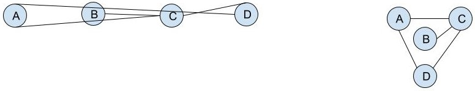

<!-- markdown-config presentation=true -->

<!-- #TODO make style links in container content relative to url -->
<!-- <link rel="stylesheet" type="text/css" href="style.css" /> -->
<link rel="stylesheet" type="text/css" href="doc/PX2018/style.css"  />
<link rel="stylesheet" type="text/css" href="src/client/lively.css"  />
<link rel="stylesheet" type="text/css" href="templates/livelystyle.css"  />

  PX 2018: Graph Drawing

  Theresa Zobel, Siegfried Horschig

  Software Architecture Group  Hasso Plattner Institute  University of Potsdam, Germany

--- 

# Problem

--- 

# Graph Drawing - Key Challenges

* Low number of crossings

* Small area

* Short edges

--- 

# Layout Methods

* Arc Layout

* Circle Layout

* Force-directed Layouts

* Energy-minimizing simulations (Simulated Annealing)

 source: commons.wikimedia.org

--- 

# Force-directed Layouts - Demo

<svg width="900" height="500" id="svgContainer" style="border-style: solid"></svg>

<button id="addNode">Add Node</button>
<button id="removeNode">Remove Node</button>

--- 

# Force-directed Layouts - Evaluation

### Advantages:

* Good quality

* Flexible

* Interactive

### Disadvantages:

* Can lead to jittering

* Poor local minima

---

# Simulated Annealing

* Attempts to find global optimum

* Energy function to determine fitness of solutions

* "Annealing" Principle:
  * Initial high "Temperature" value, decreasing with time
  * Alters solution (switches to neighbouring solution) if:
    * Neighbouring solution has a lower energy or
    * Neighbouring solution has a higher energy and the temperature is high
    

---

# TODOs

* Demo for simulated annealing

* Extend force-directed approach from d3.js with simulated annealing

<!-- #TODO pull this up into presentation? -->
