<!-- markdown-config presentation=true -->

<!-- #TODO make style links in container content relative to url -->
<!-- <link rel="stylesheet" type="text/css" href="style.css" /> -->
<link rel="stylesheet" type="text/css" href="doc/PX2018/style.css"  />
<link rel="stylesheet" type="text/css" href="src/client/lively.css"  />
<link rel="stylesheet" type="text/css" href="templates/livelystyle.css"  />

  PX 2018: Graph Drawing

  Siegfried Horschig, Theresa Zobel

  Software Architecture Group  Hasso Plattner Institute  University of Potsdam, Germany

--- 

# Motivation

<ul>
  <li>
    Traditional and powerful tools that visually represent sets of data and the relations
among them
  </li>
  <li>
    Concept of graphs can be traced back to Ancient Egypt - Game Morris
  </li>
  <li>
    First scientific purposes 1736: Euler published his famous Königsberg paper ("drawing") 
  </li>
  <li>
  Very first abstract graph drawing appeared in Ball’s book on mathematical recreations 1892
  </li>
</ul>
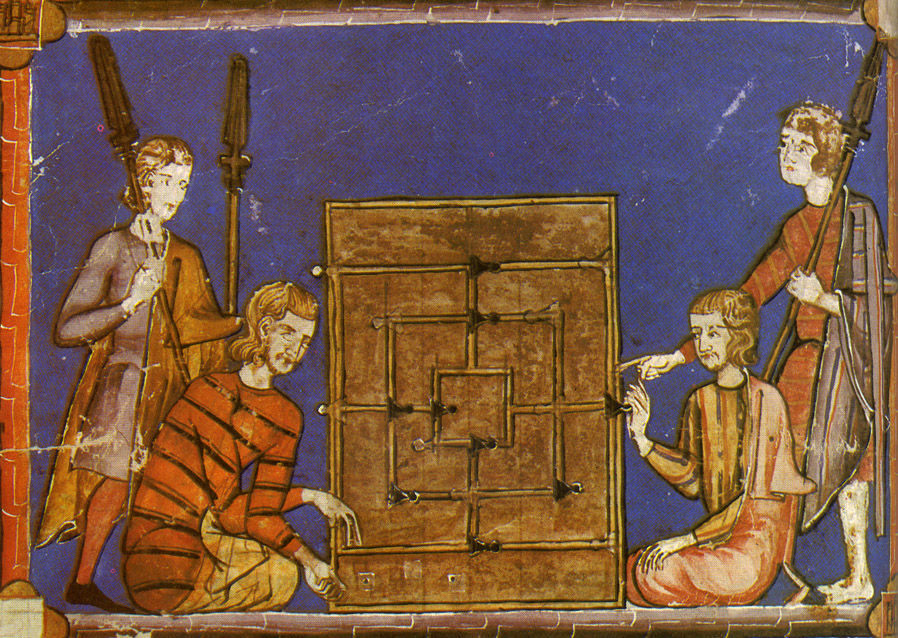
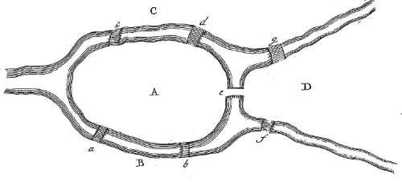
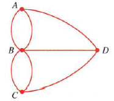

<li class="source">sources:</li>
<li class="source"> http://stewartmath.com/dp_fops_samples/fops6.html</li>
<li class="source">https://www.researchgate.net/figure/The-Seven-Bridges-of-Koenigsberg-problem-a-Eulers-drawing-31-b-Balls-abstract_fig1_325794369</li>
<li class="source">http://www.instructables.com/id/Nine-Mens-Morris/</li>

--- 

# Key Challenges

<ul>
  <li>
  <b>Algorithm complexity: </b> graph size is crucial to algorithms
  </li>
  <li>
    <b>Display clutter: </b> when size of data grows, the corresponding graph becomes cluttered and visually confusing
  </li>
  <li>
    <b>Navigation: </b> navigating large information spaces on small displays
  </li>
  <li>
  <b>&rarr; Readability</b>
  </li>
</ul>
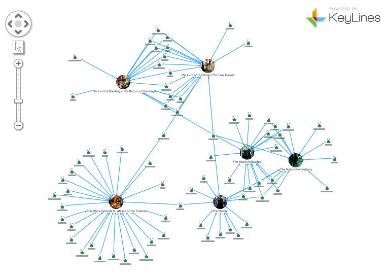

--- 

# Key Requirements

Improving readability through:

<ul>
  <li>Low number of crossing</li>
  <li>Small bounding box of graph</li>
  <li>Short edges</li>
</ul>

  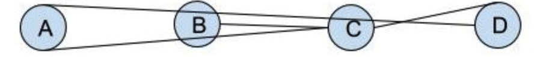
  
&rarr;

  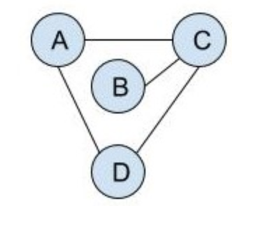

--- 

# Layout Methods

<ul>
  <li>Arc Layout: vertices of a graph are placed along a line & minimizes the number of crossings.</li>
  <li>Circle Layout: places the vertices of a graph on a circle (network topologies)</li>
  <li><b>Force-directed Layout</b></li>
  <li><b>Energy-minimizing simulations (Simulated Annealing)</b></li>
</ul>
 
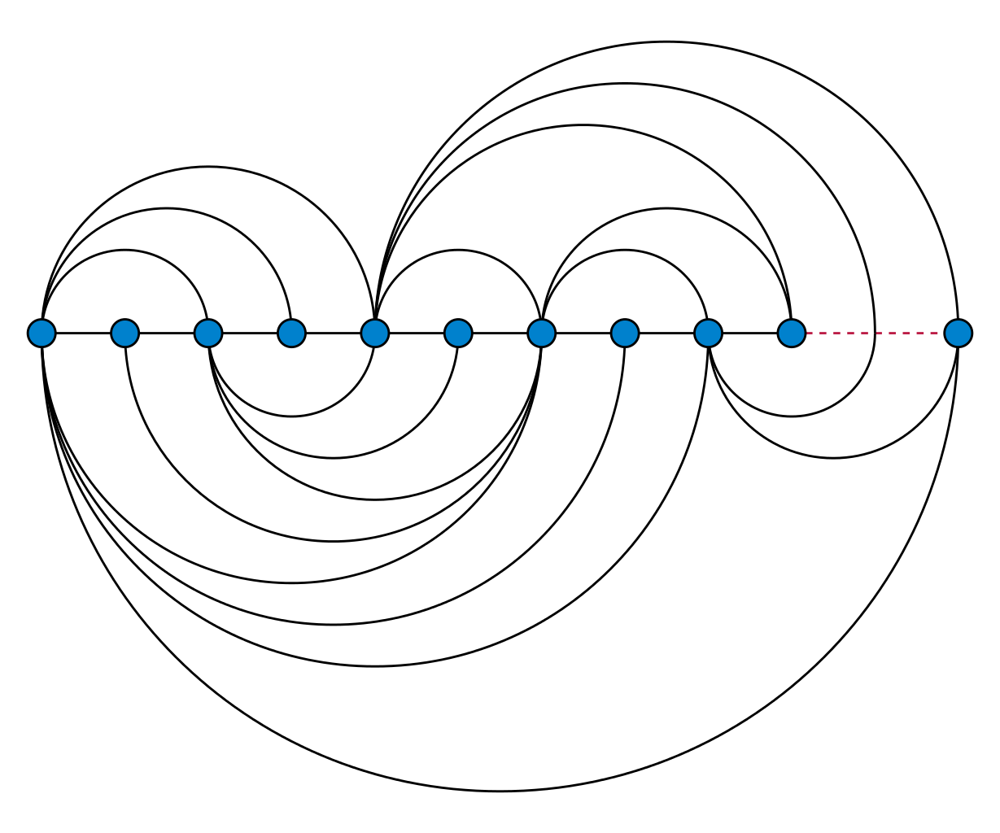
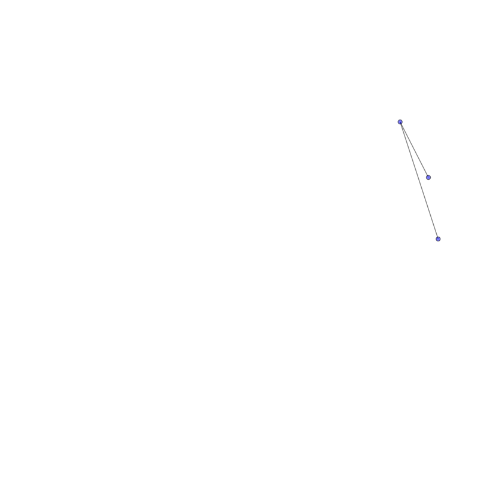
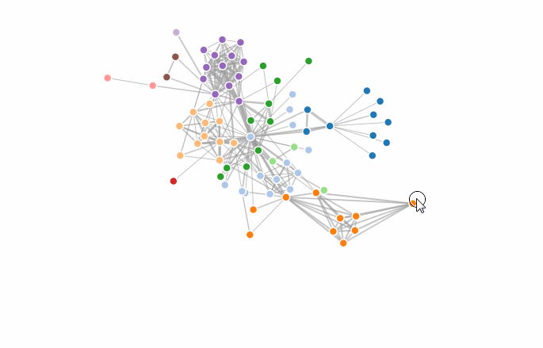

<ul>

</ul>
 

 
<li class="source">source</li>
<li class="source">commons.wikimedia.org </li>

--- 

<h1 class="centralized">Force-directed Graphs</h1>

--- 

# General

  

  Position the nodes of a graph in two-dimensional so that:
  

  <ul>
    <li>
    all the edges are of more or less equal length
    </li>
    <li>
    few crossing edges
    </li>
    <li>
    by assigning forces among the set of edges and the set of nodes and using these forces to simulate the motion of the edges and nodes
    </li>
  </ul>

 

First Pioneers:

  <ul>
    <li>
       Eades 1984: Combination of attractive forces on adjacent vertices, and repulsive forces on all vertices
    </li>
    <li>
    Fruchterman & Reingold 1991
    </li>
  </ul>

 

--- 

# Algorithm

<b>Dwyer's Implementation: </b>

<ul>
  <li>
   Much faster and scalable to much larger force-directed graphs: O(nlogn+m+c) </li>
   <li> Providing users with interactive control
over the layout
  </li>
  <li>
  Allowing users to achieve layout customized for their specific
  application or diagram.
  </li>
  <li>Implements three primary forces upon the nodes</li>
</ul>

<li class="source">source:</li>
<li class="source">http://vis.stanford.edu/files/2011-D3-InfoVis.pdf</li>
<li class="source">http://users.monash.edu/~tdwyer/Dwyer2009FastConstraints.pdf</li>

--- 

# Demo

<lively-px18-force-layout ></lively-px18-force-layout>

--- 

# Evaluation

<h2>
Advantages:
</h2>
<ul>
<li>Good quality</li>
<li>Readability</li>
<li>Interactivity</li>
<li>Simplicity</li>
<li>Bounding Boxed</li>
</ul>

<h2>
Disadvantages:
</h2>
<ul>
<li>Can lead to jittering</li>
<li>Possible high running time </li>
<li>Not very stable</li>
</ul>

---

<h1 class="centralized">Simulated Annealing</h1>

---

# Simulated Annealing

 Source: homesteading.com

---

# General

* Attempts to find global optimum

* Energy function to determine fitness of solutions

* "Annealing" Principle:
  * Initial high "Temperature" value, decreasing with time
  * Alters solution (switches to neighbouring solution) if:
    * Neighbouring solution has a lower energy or
    * Neighbouring solution has a higher energy and the temperature is high
    

---

# Implementation

* Inspired by d3-labeler

* Definition of "neighbouring solution" per iteration:
  * Movement of all nodes?
    * Takes longer, but may lead to faster convergence
  * Movement of one node?
    * May need more iterations for good result
    * Better for demonstration purposes

---

#  Implementation

  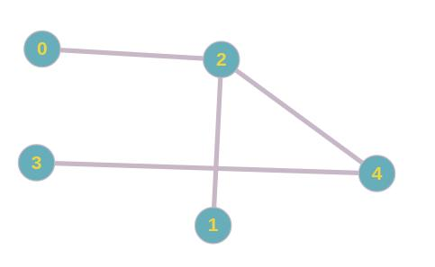 
  
&rarr;

  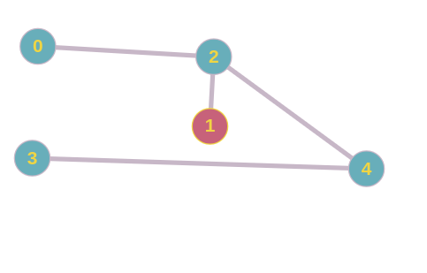

### Accept if:

Energy(new) < Energy(old) 
 
 
<b>or</b>
 
 
Math.random() >= Math.exp(-delta_energy / currentTemperature)

---

#  Energy Function (Example)

  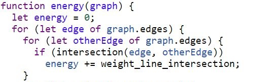 

---

#  Energy Function (Example)

  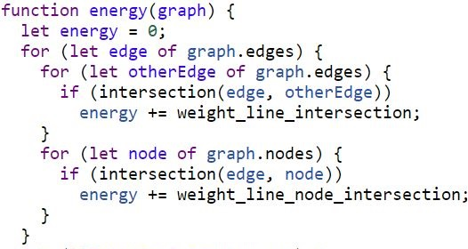 

---

#  Energy Function (Example)

  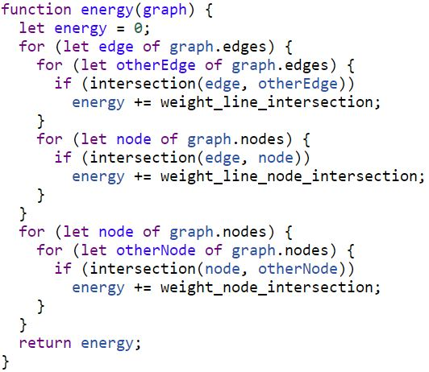 

---

# Demo

  <lively-px18-simulated-annealing ></lively-px18-simulated-annealing>

--- 

# Evaluation

### Advantages:

+ Can stop after any amount of iterations 
+ Custom criteria are easy to implement and extend

### Disadvantages:

- High runtime (O(n4))
- Less applicable for larger graphs

--- 

<h1 class="centralized">Force-Layout Graph vs Simulated Annealing</h1>

---

# Demo

  <lively-px18-graph-drawing ></lively-px18-graph-drawing>

--- 

# Conclusion

* Simulated Annealing easily customizable, but less applicable for large graphs

* Force layout provides widely applicable, reasonably fast and interactive solution

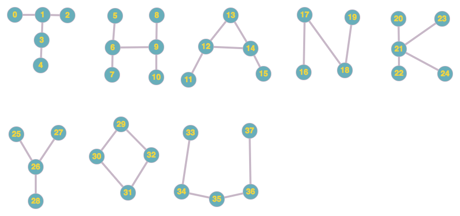

---

# References

* Cui, Weiwei, and Huamin Qu. "A survey on graph visualization." PhD Qualifying Exam (PQE) Report, Computer Science Department, Hong Kong University of Science and Technology, Kowloon, Hong Kong (2007).
* Bostock, Michael, Vadim Ogievetsky, and Jeffrey Heer. "D³ data-driven documents." IEEE Transactions on Visualization & Computer Graphics 12 (2011): 2301-2309.
* Dwyer, Tim. "Scalable, versatile and simple constrained graph layout." Computer Graphics Forum. Vol. 28. No. 3. Oxford, UK: Blackwell Publishing Ltd, 2009.
* Gibson, Helen, Joe Faith, and Paul Vickers. "A survey of two-dimensional graph layout techniques for information visualisation." Information visualization 12.3-4 (2013): 324-357.
* Hadany, Ronny, and David Harel. "A multi-scale algorithm for drawing graphs nicely." International Workshop on Graph-Theoretic Concepts in Computer Science. Springer, Berlin, Heidelberg, 1999.

<!-- #TODO pull this up into presentation? -->
