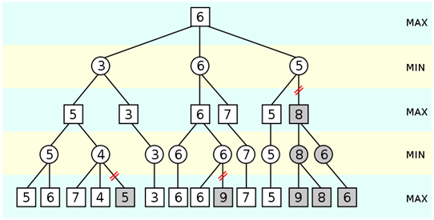
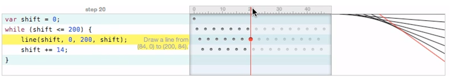

<!-- #TODO make style links in container content relative to url -->
<link rel="stylesheet" type="text/css" href="style.css" />
<link rel="stylesheet" type="text/css" href="doc/PX2018/style.css"  />
<link rel="stylesheet" type="text/css" href="../../src/client/lively.css"  />
<link rel="stylesheet" type="text/css" href="../../templates/livelystyle.css"  />

  PX 2018: Seminar on Programming Experience

  Jens Lincke, Stefan Ramson, Patrick Rein, Marcel Taeumel, Robert Hirschfeld

  Software Architecture Group  Hasso Plattner Institute  University of Potsdam, Germany

--- 

# Abstract

Active Essays and Explorable Explanations is a form of interactive media that can help understand complex systems for many relevant domains.
In particular, the domain of software design is filled with challenging algorithms, patterns, and systems that are hard to understand and master. 
In this seminar, the participants will create demos, tools, and applications based on the idea of Explorable Explanations to improve the programming experience when developing such systems.
By using our live collaborative development environment, Lively4, they will share, explore, and adapt the created tools and explanations --- even in unanticipated ways.

---
# Topics

---
## Topic: Entity Component System

- links/resources
- [Anatomy of a Knockout](http://www.chris-granger.com/2012/12/11/anatomy-of-a-knockout/)

---
## Topic: Material Point Method

---
## Topic:  Parser Combinators

---
## Topic: Conflict-free replicated data type

- Domain: Distributed Computing
- [Conflict-free replicated data type](https://en.wikipedia.org/wiki/Conflict-free_replicated_data_type)

---

## Topic: Neuronal Networks

- Domain: AI
- Deep Learning

---
## Topic: Support Vector Machine

- Domain: AI

---
## Topic: Monte Carlo Tree Search

- Domain: AI
- Example Application: Alpha Go KI 
  - [Silver, David, et al. "Mastering the game of Go with deep neural networks and tree search" ](https://pdfs.semanticscholar.org/1740/eb993cc8ca81f1e46ddaadce1f917e8000b5.pdf)

---
## Topic: Z3 (Complex Constraint Solver, SMT) 

- Domain: Constraints Solving

---
## Topic: Constraint Solver (Vergleich)
  - Cassowary
  - Gradient Descent
  - Backtracking/Backtalk

---
## Topic: Prolog

---
## Topic: Path finding Algorithm (Comparison, Dijstra, A*)

---
## Topic: Regular Expressions
  - NFA- and DFA vs. Backtracking

---
## Topic: Alpha-beta pruning (AI, Treesearch)

</img>

---
## Topic: Learnable Programming 1. Follow the flow

</img>

---
## Topic: Learnable Programming 2. See the state

</img>

---
## Topic: Learnable Programming 3. Create by reacting

</img>

---
## Topic: Learnable Programming 4. Create by abstracting

</img>

---
## Topic: Stable Treemaps

- Domain: Visualization Algorithms
- Voronoi tree maps, see [Sebastian Hahn @ hpi](https://hpi.de/doellner/people/current/schmechel.html)

---
## Topic: Graph Layouting 

- Domain: Visualization algorithms
- Compare:
  - Simulated Annealing
  - Force Layout
  - ...

---
## Topic: Blockchain
  - ...

---
## Topic:  GPU Graph Base Search

- @Stefan?

---
## Topic: Your Topic!

---

