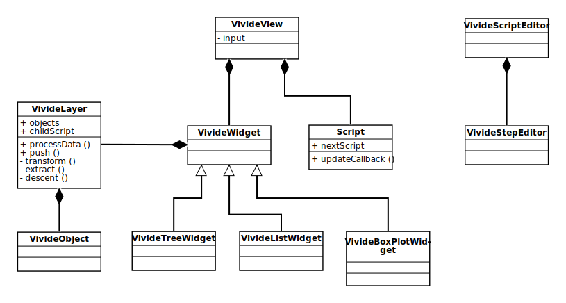

# Implementation
<strong>[VivideJS](browse://src/client/vivide/)</strong> is an adaptation of the [Vivide](http://www.hpi.uni-potsdam.de/hirschfeld/publications/media/TaeumelSteinertHirschfeld_2012_TheVivideProgrammingEnvironment_AcmDL.pdf) developed in Smalltalk, which is an object-oriented UI. It aims to provide insights into processed data in a task-oriented way. Therefore, the UI provides tools to manipulate data and the corresponding dataflow. The major difference between the two implementation is, that VivideJS is part of a live programming environment in the web. It can access data from all different kinds of online resources ranging from project management tools like [Trello](https://trello.com/), over data storage solutions like [Dropbox](https://www.dropbox.com/de/), to version control hosting service like [GitHub](https://github.com/). Most of these tools can only be accessed via asynchronous requests, thus VivideJS needs to provide the functionality to request and process resources asynchronously.

The existing implementation was limited to processing data lists without handling any hierarchy information, further more no asynchronous data processing was implemented. The proposed architecture and its corresponding implementation allow the user to explore hierarchies of asynchronous web-requests and data. The scripts steps now utilize the async/await feature of Javascript. A function declared async returns a Promise object and can contain await statements. The await statement "pauses" the execution of a given program till the awaited Promise is resolved. Script steps can be declared async and use the await keyword inside. The return value is awaited by VivideJS and added to the connected widget afterwards. 

The Script objects contain one of the following types: transform, extract or descent. Transform scripts generate a VivideObject for every given data input, extract scripts compute widget properties based on given item values and descent scripts define the item hierarchy. The VivideJS UI was extended to provide an interface for the user to add and delete script steps. VivideJS advances in hierarchy levels either by setting a loop from a descent step to a chosen start script or by adding further descent steps. Each time it encounters a descent step the following scripts are applied to the next hierarchy level generated by the descent step.

## Architecture
The proposed architecture shown in Figure 1, in most parts, extends the existing one. The existing view and widget architecture is retained and extend by a VivideTreeWidget. Previously, the scripts were stored as URLs pointing towards a script file and bare data were handled by all classes. Both are encapsulated into suitable classes in the proposed architecture. 

<b>Figure 1</b>: The existing implementation lacked a suitable data abstraction, therefore the proposed architecture introduces the classes VivideLayer and VivideObject to encapsulate hierarchy levels and data into objects. Additionally, the VivideTreeWidget class was added to the selectable widgets in order to provide a tool for data hierarchy exploration.

The Script class represents a single script and contains additional information about the script type and the following script which were previously stored in the classes executing the scripts. Data are encapsulated into two classes in order to abstract data and data hierarchies. The VivideObject contains data and corresponding properties as well as an optional VivideLayer object, which represents a hierarchy level. Each widget contains at least one VivideLayer, that serves as the entry point for a first hierarchy level. The VivideLayer maintains a list of VivideObjects, that are generated by scripts based on given input data.

## Scripts As List Vs Array Or Object 
In the following, the structure of the Script class is explained and discussed. Internally, Script objects are stored as list to simplify script insertion and deletion as well as the script loop handling. Alternatively, the scripts could be stored as Array or Object. Arrays lack an efficient mapping from script id to script source and are therefore excluded in the following discussion. Objects map keys to values and could store the ids as key and script sources as values and are therefore suitable for storing Script objects. The main advantage of this data structure is an improved debugging tool support and the resulting, easier maintainability, because while objects are a core feature of Javascript, a list of Script objects is difficult to trace in the debugger. Nevertheless, lists are considered to be more suitable, because the script order can be maintained more easily within a list than within an object.

# Limitations
Even though the proposed implementation adds multiple features and  provides asynchronous data processing tools, the architecture could be improved and some features are still missing or incomplete. The number of selectable widgets still needs to be increased to solve further tasks. Additional widgets are, e.g., a text widget (to display the text content of a request), a class widget (to explore the class hierarchy of Lively4) and an html widget (in order to enable the user to add custom HTML elements for an item). Furthermore, corresponding properties need to be added with these widgets.

Currently, the structure of the results of a transform step must be known by the user, because there is no way of exploring it. Especially, for data structures like a Response object, which is returned by a fetch request, it can be quite difficult to always remember the object's internal structure. Therefore, UI support for an in-place object exploration in the script editor needs to be implemented.

The presented async/await support of step scripts enables the user to process asynchronously requested data, but it is not possible to asynchronously process these data. Especially, large amounts of data, which might be available via data streams, block the data processing until every item is read. To provide an improved user-experience the UI should display already processed items and indicate which results are still pending. The major challenge is, to define in which order the transform step should return the items, because this order might depend on some value stored inside the request item.