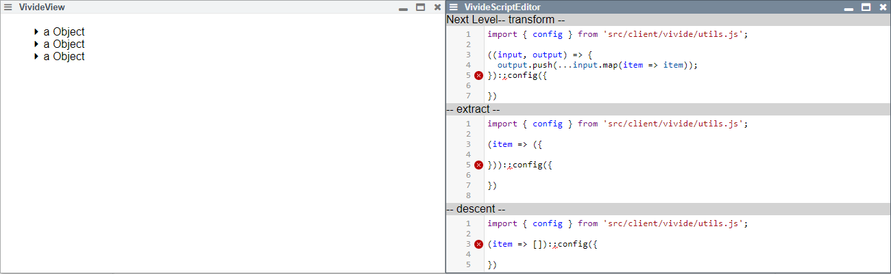

<!-- markdown-config presentation=true -->

<link rel="stylesheet" type="text/css" href="doc/PX2018/project_2/utils.css">
<link rel="stylesheet" type="text/css" href="doc/PX2018/project_2/presentation.css">

<link rel="stylesheet" type="text/css" href="doc/PX2018/style.css" />
<link rel="stylesheet" type="text/css" href="src/client/lively.css" />
<link rel="stylesheet" type="text/css" href="templates/livelystyle.css" />

  RP 2018: Seminar on Reactive Programming - Hierarchical Data and Asynchronicity for VivideJS -

  Sebastian Koall

  Software Architecture Group  Hasso Plattner Institute  University of Potsdam, Germany

--- 

Context/Motivation

<ul class="notes notes-big">
<li>System: VivideJS</li>
<li>Provide data in a task-oriented form</li>
<li>Live programming environment in the internet <i class="fa fa-arrow-right"></i> Provide insights into the processed data</li>
<li>Explore data by utilizing different views</li>
<li>Adapt the views while exploring the data</li>
</ul>

---

Design Space

<ul class="notes notes-big">
<li>Advanced properties</li>
<ul>
<li>Width, height</li>
<li>Color, background color</li>
</ul>
<li>Improved view connection management</li>
<li>Processing asynchronous data</li>
<li>Merging data from two sources</li>
</ul>

---

Done

<ul class="notes notes-big">
<li>Scripts are saved in the corresponding view</li>
<li>First level of descents + tree view: 

</li>
</ul>

---

Next Steps

<ul class="notes notes-big">
<li>Improve scripting</li>
  <ul>
  <li>Unique scripts ids</li>
  <li>Provide further properties</li>
  </ul>
<li>Multi-level hierarchies</li>
  <ul>
  <li>Scripts for each level</li>
  <li>Children are processed on demand</li>
  </ul>
</ul>

---

# Close

