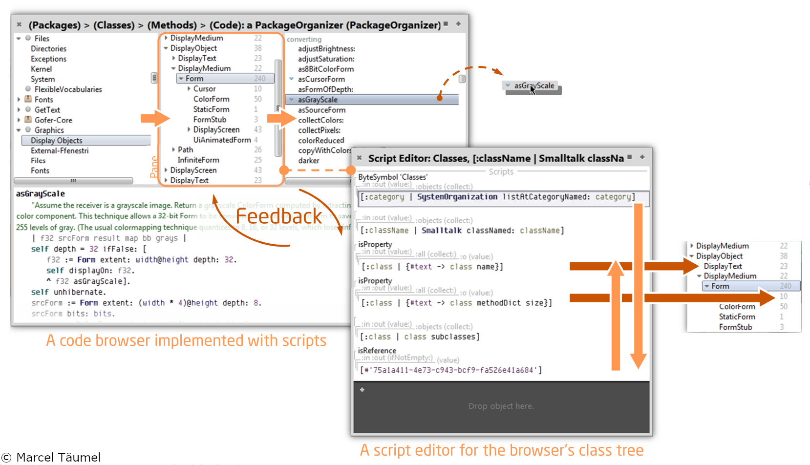
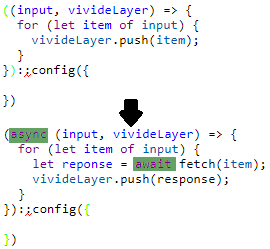
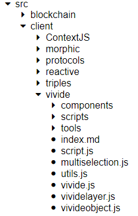
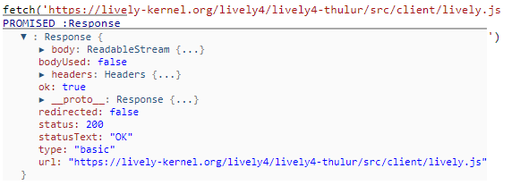
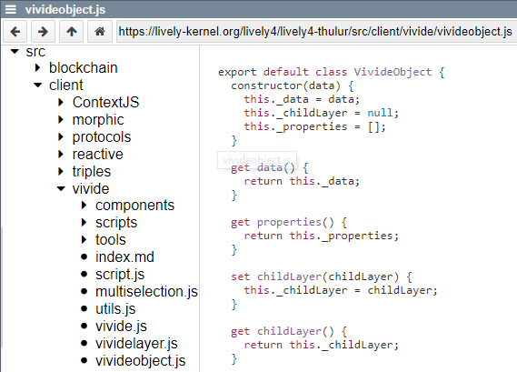

<!-- markdown-config presentation=true -->

<script>
import { openBrowser, openComponent } from "doc/PX2018/project_2/utils.js"
import { hideHiddenElements, toggleLayer, showVariable, runExampleButton, runVivideButton } from "src/client/essay.js"

let presentation = lively.query(this, "lively-presentation");

let slides = [];

if (presentation) {
  slides = presentation.querySelectorAll('.lively-slide');
}

let ratio = "16-9";
slides.forEach(slide => {
  slide.classList += " ratio-" + ratio;
})
</script>
<link rel="stylesheet" type="text/css" href="doc/PX2018/project_2/utils.css">
<link rel="stylesheet" type="text/css" href="doc/PX2018/project_2/presentation.css">

<link rel="stylesheet" type="text/css" href="doc/PX2018/style.css" />
<link rel="stylesheet" type="text/css" href="src/client/lively.css" />
<link rel="stylesheet" type="text/css" href="templates/livelystyle.css" />

<style>
  .lively-slide {
    border: 1px solid rgb(220,220,220)
    page-break-before: always;
  }
  
  p {
    font-size: 18pt
  }
  @media print {
    .lively-slide {
      page-break-before: always;
      border: 0px solid white;
/*       border: 2px solid blue; */
    }      
  }
  
</style>

<script>
let presentButton = document.createElement('button');
presentButton.innerHTML = 'present';
presentButton.addEventListener("click", async () => {
  document.documentElement.webkitRequestFullScreen(Element.ALLOW_KEYBOARD_INPUT);
  // wait for fullscreen
  await lively.sleep(100);

  let width = Math.max(document.documentElement.clientWidth, window.innerWidth || 0);
  let height = Math.max(document.documentElement.clientHeight, window.innerHeight || 0);
  let scaling = width / slides[0].clientWidth;
  
  slides.forEach(slide => {
    slide.style.transform = 'scale(' + scaling + ')';
    slide.style.transformOrigin = 'top left';
    slide.style.position = 'fixed';
    slide.style.zIndex = '10001';
  })

  presentButton.style.display = 'none';
})

if (presentation && presentation.slides) {
  presentation.slides().forEach(ea => {
    var img = document.createElement("img")
    img.classList.add("logo")
    img.src="https://lively-kernel.org/lively4/lively4-jens/doc/PX2018/media/hpi_logo.png" 
    img.setAttribute("width", "50px")
    ea.appendChild(img)

    var div = document.createElement("div")
    div.classList.add("page-number")
    ea.appendChild(div)
  });
}

presentButton
</script>

<div class="title-frontpage">
  RP 2018: Seminar on Reactive Programming<br />- Hierarchical Data and Asynchronicity for VivideJS -
</div>

<div class="authors">
  Sebastian Koall
</div>

<div class="credentials">
  Software Architecture Group <br />Hasso Plattner Institute<br /> University of Potsdam, Germany
</div>

<script>
  var button = document.createElement("button")
  button.textContent = "print"
  button.onclick = async () => {
   var presentation = lively.query(this, "lively-presentation")
   presentation.print()
  }
  button.style = "position: absolute; bottom: 10px; left: 10px"
  button
</script>

---
<div class="title-1">Context - Background</div>

<div class="h-1-2">
<ul class="notes-big">
<li>Adapted System: Vivide</li>
<li>Work with an OO UI<br><i class="fa fa-arrow-right"></i> Directly working on objects</li>
<li>Direct data and dataflow manipulation</li>
<li>Adapt the views while exploring the data</li>
</ul>
</div>



---
<div class="title-1">Context - Motivation</div>

<div class="v-1-2">
<ul class="notes-big">
<li>Provide data in a task-oriented form</li>
<li>Lively4: Web-based live programming environment<br><i class="fa fa-arrow-right"></i> Provide insights into the processed data</li>
<li>VivideJS: Asynchronous online data processing</li>
</ul>
</div>

```javascript {.v-2-2 .example1}
[
  {name: "object", subclasses:[{name: "morph"},]},
  {name: "list", subclasses:[{name: "linkedlist", subclasses:[{name: "stack"}]}, {name: "arraylist"}]},
  {name: "usercontrol", subclasses:[{name: "textbox"}, {name: "button"}, {name: "label"}]},
]
```
<script>
this.classList.add("example-run");
runVivideButton("run", this, "example1");
</script>

---
<div class="title-1">Features - Async Scripts</div>

<div class="h-1-4">
<ul class="notes-big">
<li>Most online resources are asynchronously accessed</li>
<li>VivideJS needs to support async/await scripts</li>
</ul>
</div>

<div class="h-2-4" style="padding-top: 20px; text-align: center;">

</div>

```javascript {.v-2-2 .example2}
lively.findDependedModules('https://lively-kernel.org/lively4/lively4-thulur/src/client/lively.js')
```
<script>
this.classList.add("example-run");
runVivideButton("run", this, "example2");
</script>

---

<div class="title-1">Features - Multilevel Hierarchies</div>

<div class="h-1-4">
<ul class="notes-big">
<li>Explore hierarchical data relations</li>
<li>Different scripts hierarchy levels</li>
<li>Define arbitrary children of objects</li>
</ul>
</div>

<div class="h-2-4" style="padding-top: 20px; text-align: center;">

</div>

```javascript {.v-2-2 .example3}
fetch('https://lively-kernel.org/lively4/lively4-thulur/', {method: 'OPTIONS'})
  .then(r => r.json())
  .then(j => j.contents);
```
<script>
this.classList.add("example-run");
runVivideButton("run", this, "example3");
</script>

---
<div class="title-1">Insights</div>

<div class="v-1-2">
<ul class="notes-big">
<li>OO UIs are great for data exploration</li>
<li>Deferred architecture changes are possibly harmful</li>
<li>Javascript asynchronity is not easy to hide</li>
<li>Resource pointers do not point to the actual object</li>
</ul>
</div>

<div class="v-2-2" style="padding-left: 100px">

</div>

---
<div class="title-1">Shortcomings</div>

<ul class="notes">
<li>Limited number of widgets</li>
  <ul>
  <li>List widget</li>
  <li>Tree widget</li>
  <li>Box plot widget</li>
  </ul>
<li>Views await whole amount of data<br><i class="fa fa-arrow-right"></i> No streaming</li>
<li>Connection management</li>
<li>Difficult to explore data structures</li>
<li>Merging source views</li>
<li>Some remaining UI bugs (e.g. loop marker length)</li>
</ul>

---
<div class="title-1">Next Steps And Future Work</div>

<div class="h-1-2">
<ul class="notes-big">
<li>Bug fixing</li>
<li>Source widget merging strategies</li>
<li>Further widgets</li>
<li>Connection management between views</li>
<li>Long-term: Integrate Vivide into Lively<br><i class="fa fa-arrow-right"></i>E.g.: Replace file browser with Vivide view</li>
</ul>
</div>

<div class="h-2-2" style="padding-top: 20px;">

</div>

---

# Close

<script>
let closeButton = document.createElement('button')
closeButton.innerHTML = 'close';
closeButton.addEventListener("click", closeFullscreen);

function closeFullscreen() {
  document.webkitCancelFullScreen();
  let slides = presentation.querySelectorAll('.lively-slide');
  slides.forEach(slide => {
    slide.style.transform = 'none';
    slide.style.position = 'relative';
    slide.style.zIndex = '1';
  })
  
  presentButton.style.display = 'inline';
}

closeButton
</script>

---

<div class="title-1">Implementation</div>


