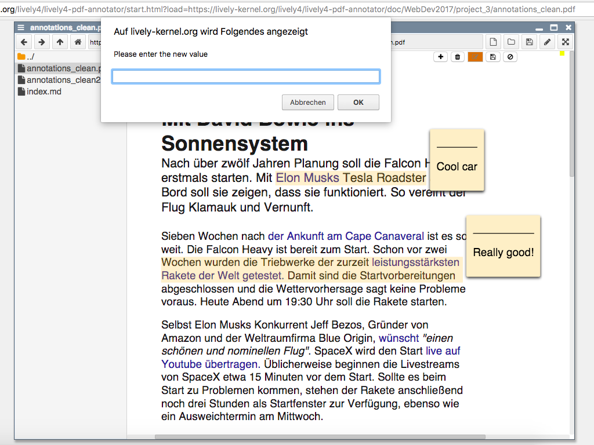

# PDF Annotator
## Gruppe 3: Henriette Dinger, Sebastian Kliem

Web component [lively-pdf](https://lively-kernel.org/lively4/lively4-core/templates/lively-pdf.html) already uses [pdf.js](https://lively-kernel.org/lively4/lively4-core/src/external/pdf.js) to read annotations.
- try it out
- understand API
- edit pdf with anntotation by hand, look at the result

## Related work:
- [Hypothes.is](https://via.hypothes.is/http://lively-kernel.org/publications/media/KrahnIngallsHirschfeldLinckePalacz_2009_LivelyWikiADevelopmentEnvironmentForCreatingAndSharingActiveWebContent_AcmDL.pdf) with the respective [github project](https://github.com/hypothesis/via).

## Tasks:
- extract annotations
- display extern and intern annotations
- save annotation internally

## Info

- see [doc/annotations](../../notes/annotations.md)

## Abstract
Lively uses PDF.js for displaying PDF files and the annotations within them. However, changes in the annotations, like editions, additions or deletions, are currently not supported. There are external approaches such as Hypothes.is and pdf-annotate.js which allow to annotate PDFs in a web browser. Unfortunately, these tools do not store the information directly in the file but on a external storage. Thus, when downloading the PDF, it does not contain any changes regarding the annotations.  
To achieve this goal, we implemented a possibility to add, edit and delete annotations within the PDF file. This includes those annotations which have been stored in the PDF before it was added to Lively. Every change is written back to the file so that it is available after download. 

## Screenshot

