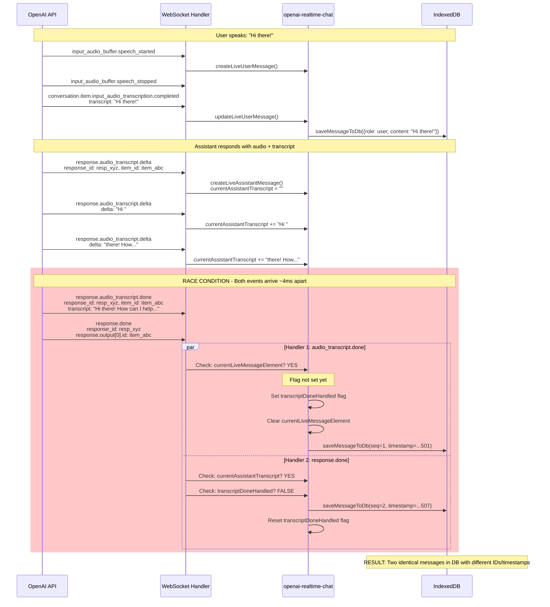
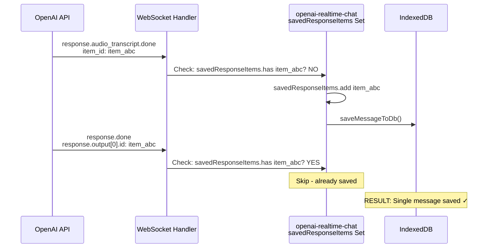

# OpenAI Realtime API - Duplicate Message Problem

## Event Flow Sequence Diagram




## Root Cause

The race condition occurs because:
- Both event handlers check local state before either handler modifies it
- JavaScript async execution allows both handlers to pass their checks simultaneously
- Both handlers proceed to save the message independently

## Solution: Use OpenAI API IDs

Track saved messages using OpenAI's own identifiers instead of local state:



## Implementation

```javascript
// In initialize():
this.savedResponseItems = this.savedResponseItems || new Set();

// In response.audio_transcript.done handler:
if (message.item_id && this.savedResponseItems.has(message.item_id)) {
  console.log(`Skipping duplicate save for item ${message.item_id}`);
  break;
}
if (message.item_id) {
  this.savedResponseItems.add(message.item_id);
}
// ... save message

// In response.done handler:
for (const item of message.response.output) {
  if (item.id && this.savedResponseItems.has(item.id)) {
    console.log(`Skipping duplicate save for item ${item.id}`);
    continue;
  }
  // ... save message if needed
}

// Cleanup old IDs (keep last 100):
if (this.savedResponseItems.size > 100) {
  const arr = Array.from(this.savedResponseItems);
  this.savedResponseItems = new Set(arr.slice(-100));
}
```
