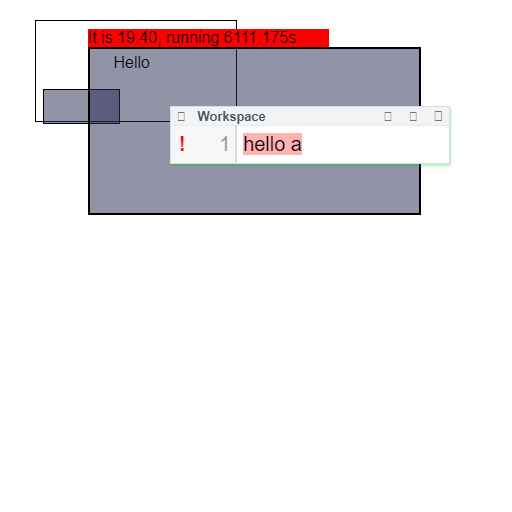

## 2017-10-13 Yet another attemempt at generating thumbnails


```javascript
import rasterizeHTML from "src/external/rasterizeHTML.js"

class Rasterize {
   static async elementToCanvas(element, width=512, height=512) {
    var canvas = document.createElement("canvas")
    canvas.height = height
    canvas.width = width
    await rasterizeHTML.drawHTML(element.outerHTML, canvas)
    return canvas
  } 

  static async elementToDataURL(element) {
    var canvas = await this.elementToCanvas(element)
    return canvas.toDataURL("image/png")
  } 

  
  static async elementToURL(element, url) {
    var dataURL = await this.elementToDataURL(element)
    return lively.files.copyURLtoURL(dataURL, url)
  } 
  
  static async openAsImage(element) {
    var dataURL = await this.elementToDataURL(element)
    var img = document.createElement("img")
    img.src = dataURL
    document.body.appendChild(img)
    return img
  } 
}

Rasterize.openAsImage(that)
```

## The good, the bad, and the ugly

- the good: we can get pixel pictures of html elements
- the bad: this approach does only allow for simple static html
- the ugly: we can produces this kind of html via deep cloning and getComputedStyle

```javascript
export class CloneDeepHTML {

  static shallowClone(obj) {
    if (!obj) return;
    console.log("shallow...")
    var node
    if (obj.constructor.name == "Text") {
      node = document.createTextNode(obj.textContent)
    } else if (obj.tagName == "CONTENT"){
      node = document.createElement("div")
      node.id = "CONTENTNODE"
    } else if ( obj.shadowRoot){
      node = document.createElement("div")
    } else {
      node = document.createElement(obj.tagName);
    }    
    if (obj.attributes) {
      Array.from(obj.attributes).forEach(ea => {
        node[ea.name] = "" + ea.value
      })
      node.style = getComputedStyle(obj).cssText
      
      var beforeElementStyle = getComputedStyle(obj, ':before')
      var beforeContent = beforeElementStyle.content
      if (beforeContent && beforeContent.length > 0) {
        var text = document.createElement("span")
        text.textContent = JSON.parse(beforeContent)
        text.style  = beforeContent.cssText
        node.appendChild(text)
      }
      
    }
    return node
  }

  static deepCopyAsHTML(obj) {
    var to = this.shallowClone(obj)
    this.deepCopyAsHTMLFromTo(obj, to)
    return to
  }

  static deepCopyAsHTMLFromTo(from, to) {
    if (from.shadowRoot) {
      this.deepCopyAsHTMLFromTo(from.shadowRoot, to)
      var contentNode  = to.querySelector("#CONTENTNODE")
      if (contentNode) to = contentNode;
    }
    
    from.childNodes.forEach( fromChild => {
      var toChild = this.shallowClone(fromChild);
      to.appendChild(toChild);
      this.deepCopyAsHTMLFromTo(fromChild, toChild);
    })
  }
}

// var clone = CloneDeepHTML.deepCopyAsHTML(that)
// $morph("result").innerHTML = ""
// $morph("result").appendChild(clone)
// $morph("showResult").inspect(clone)
```

That way we finally can produce real images!


```javascript
import raster from "src/client/rasterize.js"
raster.elementToURL(that, lively4url + "/doc/journal/2017-10-13_test.png")
```




