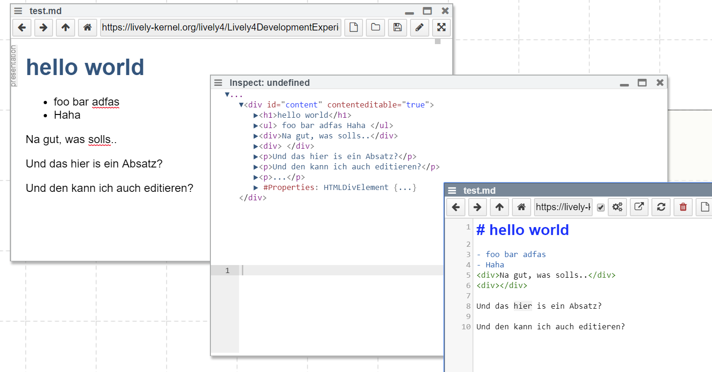

## 2017-11-06 Markdown UpNDown

After running into the similar need of having to edit the HTML elements of a rendered markdown file and converting them back into markdown, I revisited upndown.js


### Original:

```markdown
 # PX17.2 Fly on the Wall Notes

<script>"hello "+ "world" </script>

<!-- this is a comment -->

- HTML was quite life, but newer technologies / frameworks aren't
- Abstractions mess things up
- Student + PL researcher -> "desperate audience"
- Main audience: ground who builds this
- Work impact: -> become of interest to a different group
- Lessons: livelyness is a responisibility of the programmer
- Technical ingredients
    - Schema evolution
    - Morphic interaction style
    - Migrations
```    

### Generated HTML

```html
 <h1>PX17.2 Fly on the Wall Notes</h1>
<lively-script ><script >"hello "+ "world" </script ></lively-script >
<!-- this is a comment -->
<ul>
<li>HTML was quite life, but newer technologies / frameworks aren't</li>
<li>Abstractions mess things up</li>
<li>Student + PL researcher -&gt; "desperate audience"</li>
<li>Main audience: ground who builds this</li>
<li>Work impact: -&gt; become of interest to a different group</li>
<li>Lessons: livelyness is a responisibility of the programmer</li>
<li>Technical ingredients
<ul>
<li>Schema evolution</li>
<li>Morphic interaction style</li>
<li>Migrations</li>
</ul>
```


### Native Result:

The default upndown implementation uses `*` as bullet point, ignored comments and did not keeep html elements. 

```markdown
# PX17.2 Fly on the Wall Notes
"hello "+ "world"
* HTML was quite life, but newer technologies / frameworks aren't
* Abstractions mess things up
* Student + PL researcher -> "desperate audience"
* Main audience: ground who builds this
* Work impact: -> become of interest to a different group
* Lessons: livelyness is a responisibility of the programmer
* Technical ingredients
    * Schema evolution
    * Morphic interaction style
```

### Generated Markdown

By adapting the module a bit, I got the following result:

```
# PX17.2 Fly on the Wall Notes
<lively-script ><script >"hello "+ "world"</script > </lively-script >
<!--  this is a comment  -->
- HTML was quite life, but newer technologies / frameworks aren't
- Abstractions mess things up
- Student + PL researcher -> "desperate audience"
- Main audience: ground who builds this
- Work impact: -> become of interest to a different group
- Lessons: livelyness is a responisibility of the programmer
- Technical ingredients
    - Schema evolution
    - Morphic interaction style

...
```

with the following script:

```javascript
SystemJS.config({
  map: {
    htmlparser2: "https://lively-kernel.org/lively4/upndown/lib/htmlparser2.bundle.js"     
  }
})


import upndown from "https://lively-kernel.org/lively4/upndown/src/upndown.js"
var und = new upndown()
new Promise(r => und.convert(that.innerHTML, 
  (err, md) => {r(md || err)}, 
  {
    keepHtml: true  
  }))
```



