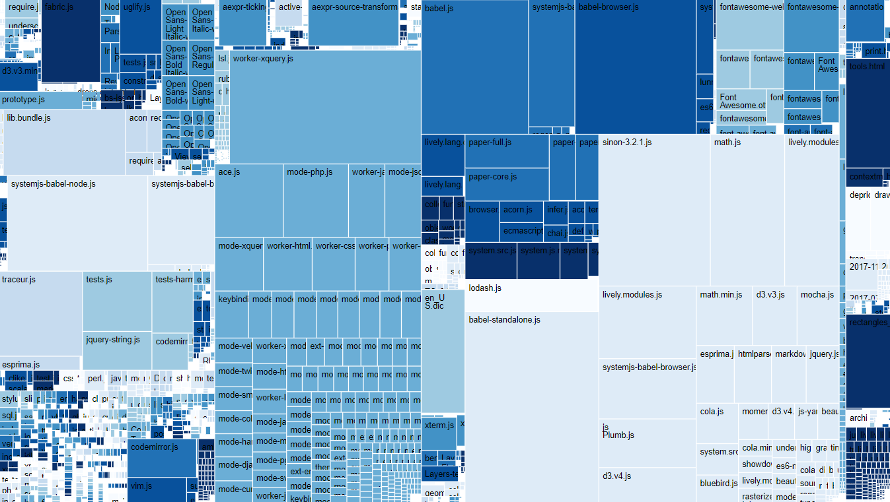

## 2018-04-17 Yoshiki Demo Session

- object composition
  - drag out rectangle
  - open object editor
  - add method
  - run method
  - clone object
- content creation
  - context menu
  - direct (graffle-like) way shape, rectangle, freehand
- run snippet from journal (treemap)
- modify treemap (change color scheme)
  - explain lively-migrate -> updateViz
  - explain attribures and children of HTML Elements 
  - explain shadow root
  - show web-component in inspector and chrome tools
- create new web component 
  - explain template hooks
- workspace
  - async fetch
  - do it, print it, inspect it
- lively-server
  - GET PUT OPTIONS ...
  - how to develop lively4-server through lively4S2
- lively-service worker
  - dropbox / googledrive fs
  - offline first caching
- polymorphic identifier
  - drag from desktop to body 
  - modify livelyfile (container on livelyfile://foo.txt)

----


- BUGS
  - uploading (PUT) a file with fetch got error 400
  - insert rectangle fresh after booting

## #TreeMap #Visualizations

```javascript
lively.files.visualizeFileTreeMap(lively4url)

```
<!--
<div style="position:relative;width:300px;height:300px">
  <lively-d3-treemap style="position: absolute; top: 0px; left: 0px; width: 100%; height: 100%"></lively-d3-treemap>
</div>
-->

### FileTree Visualization

<script>
(async () => {
  var tree = await lively.files.fileTree(lively4url + "/doc/")
  var src = tree.children.find(ea => ea.name == "src")
  // src.children = src.children.filter(ea => ea.name != "external")
  var div = await lively.create("div")
  div.style = "background-color: gray; width: 800px; height:600px; position: relative"
  var tm = await lively.create("lively-d3-treemap")
  tm.style = "position: absolute; top: 0px; left: 0px; width: 100%; height: 100%"
  div.appendChild(tm)
  tm.setTreeData(tree)
  return div
})()
</script>

Screenshot:




