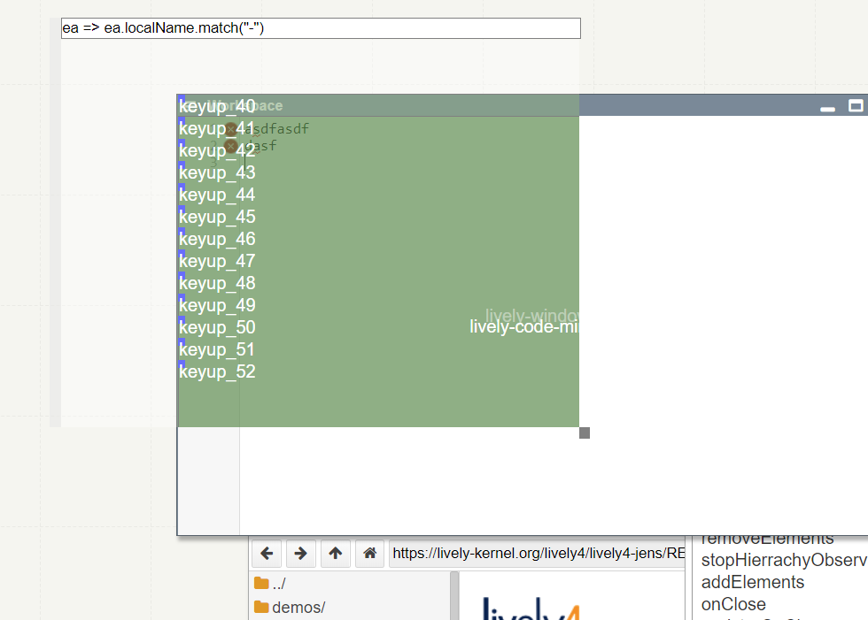

## 2018-08-31 #XRay

Observing Events... with #ContextJS, just like in the old days.. :-)

```javascript

function enableEventXRay() {
  this.eventXRay = true
  this.eventElementCounter = new WeakMap()
  this.eventTypeCounter= new Map()
  
  if (this.xRayLayer) {
    this.xRayLayer.beNotGlobal()
  }
  
  var cop = this.cop
  var self = this
  var map = this.elementMap || new Map() 
  
  if (!this.cbMap) {
    this.cbMap = new WeakMap()
  }
  var cbMap = this.cbMap
  
  var layer = cop.layer("EventListener")
  layer.refineClass(HTMLElement, {
    removeEventListener(type, cb, ...rest) {
      var wrappedCB = cbMap.get(cb) // we have to keep the illusion
      return cop.proceed(type, wrappedCB || cb, ...rest)
    },
    
    addEventListener(type, cb, ...rest) {
      // console.log("addEventListener " + type)
      // we cannot just wrapp a callback cb, because callbacks are also used in removeEventListener...
      var counter = 0
      var func = cbMap.get(cb) || (function(...args) {
        // console.log('func ' + type)
        
        cop.withoutLayers([layer], () => {
          if (this.isMetaNode) return;
          self.eventTypeCounter.set(type, (self.eventTypeCounter.get(type) || 0) + 1)
          self.eventElementCounter.set(this, (self.eventElementCounter.get(this) || 0) + 1)
          if (self.elementMap) {
            var mirrorElement = self.elementMap.get(this)
            var evt = args[0]
            if (mirrorElement && evt) {
              var div = lively.showEvent(evt)
              div.style.fontSize = "8px"
              div.style.color = "blue"
              div.innerHTML = type + "_" + counter
              div.isMetaNode = true
              var pos = lively.getClientPosition(div)
              mirrorElement.appendChild(div)
              console.log("evt", evt, "pos", pos)
              if (pos.x == 0 && pos.y == 0){ // keyboard events... etc.
                lively.setPosition(div, lively.pt(0, 20 * (counter++ % 40)))
              } else {
                lively.setClientPosition(div, pos)
              }
            }
          }    
        })
        return cb.apply(this, args)
      }) 
      cbMap.set(cb, func)
      cop.proceed(type, func, ...rest) 
    }
  })
  this.xRayLayer = layer
  window.xRayLayer =  this.xRayLayer
  this.xRayLayer.beGlobal()
}

```


