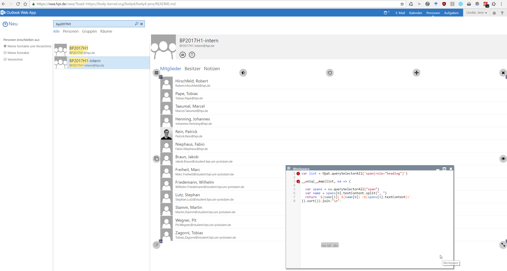

## 2018-11-20 #Lively4Chrome #OWA #HPI


The #Lively4 extension proved very usable at preparing our Christmas invitation list, because #OWA has not means of getting at the actual email addresses of a mailing list....




```javascript
var list = that.querySelectorAll('span[role="heading"]')

_.uniq(_.map(list, ea => {
  
  var spans = ea.querySelectorAll("span")
  var name = spans[0].textContent.split(", ")
  return `${name[1]} ${name[0]} <${spans[1].textContent}>`
}).sort()).join("\n")
```

and ... sorting the emails. Could I have used #Vivide here?
```
_.uniq(that.value.split("\n").sort()).join("\n")

```

- But it seems that Lively breaks the site, because it load jQuery into "$" ...  #TODO
- and it opens a fixed browser.... which schould not happen #Done

Error message:

```
Browser language = en-US
Cookie enabled = true
User agent = Mozilla/5.0 (Windows NT 10.0; Win64; x64) AppleWebKit/537.36 (KHTML, like Gecko) Chrome/70.0.3538.102 Safari/537.36
Document.Cookie = PrivateComputer=true; PBack=0; AppcacheVer=15.0.1395.8:de-debase; X-OWA-CANARY=OtQetfHGNEGhljHZLrhXVPtfyoHQTtYISvhDcbRC5E0y1e-oQc_l2j5E5044JSsEOhR1Zw3Gm-U.


Exception Details
----------
Date: Dienstag, 20. November 2018 10:12:18
Message: Uncaught TypeError: $.cookie is not a function
Url: https://owa.hpi.de/owa/prem/15.0.1395.8/scripts/boot.0.mouse.js
Line: https://owa.hpi.de/owa/prem/15.0.1395.8/scripts/boot.0.mouse.js::82

Call Stack:
----------
TypeError: $.cookie is not a function
    at Function._a.$2D.$224 (https://owa.hpi.de/owa/prem/15.0.1395.8/scripts/boot.0.mouse.js:82:585800)
    at _g.$4T.$C8D (https://owa.hpi.de/owa/prem/15.0.1395.8/scripts/boot.0.mouse.js:82:758674)
    at _g.$4T.$99Q (https://owa.hpi.de/owa/prem/15.0.1395.8/scripts/boot.0.mouse.js:82:752517)
    at _g.$4T.$6OV (https://owa.hpi.de/owa/prem/15.0.1395.8/scripts/boot.0.mouse.js:82:751958)
    at _g.$4T.$2G (https://owa.hpi.de/owa/prem/15.0.1395.8/scripts/boot.0.mouse.js:82:751317)
    at _g.$4T.$1zg (https://owa.hpi.de/owa/prem/15.0.1395.8/scripts/boot.0.mouse.js:82:847505)
    at _h.$u5.$6OX (https://owa.hpi.de/owa/prem/15.0.1395.8/scripts/boot.0.mouse.js:82:1716856)
    at _h.$u5.$DSS (https://owa.hpi.de/owa/prem/15.0.1395.8/scripts/boot.0.mouse.js:82:1622507)
    at https://owa.hpi.de/owa/prem/15.0.1395.8/scripts/preboot.js:35:39134
    at Function._g.$1H.$4p2 (https://owa.hpi.de/owa/prem/15.0.1395.8/scripts/boot.0.mouse.js:82:732011)
    at _h.$u5.$98C (https://owa.hpi.de/owa/prem/15.0.1395.8/scripts/boot.0.mouse.js:82:1622298)
    at _h.$u5.$6O8 (https://owa.hpi.de/owa/prem/15.0.1395.8/scripts/boot.0.mouse.js:82:383121)
    at _a.$H8.$390 (https://owa.hpi.de/owa/prem/15.0.1395.8/scripts/boot.0.mouse.js:82:385414)
    at _a.$H8.$1V (https://owa.hpi.de/owa/prem/15.0.1395.8/scripts/boot.0.mouse.js:82:385196)
    at _lv.$sH.$7HM (https://owa.hpi.de/owa/prem/15.0.1395.8/scripts/boot.0.mouse.js:82:1761607)
    at _lv.$sH.$13g (https://owa.hpi.de/owa/prem/15.0.1395.8/scripts/boot.0.mouse.js:82:1761520)
    at _lv.$sH.$aI (https://owa.hpi.de/owa/prem/15.0.1395.8/scripts/boot.0.mouse.js:82:1758783)
    at _lv.$sH.$6t5 (https://owa.hpi.de/owa/prem/15.0.1395.8/scripts/boot.1.mouse.js:2:1019850)
    at _lv.$sH.$aI (https://owa.hpi.de/owa/prem/15.0.1395.8/scripts/boot.1.mouse.js:2:1011328)
    at _lv.$9p.$3st (https://owa.hpi.de/owa/prem/15.0.1395.8/scripts/boot.1.mouse.js:2:1041138)
    at _lv.$9p.$F9 (https://owa.hpi.de/owa/prem/15.0.1395.8/scripts/boot.1.mouse.js:2:1073659)
    at _y.$1O.$2Tk (https://owa.hpi.de/owa/prem/15.0.1395.8/scripts/boot.1.mouse.js:2:292446)
    at _y.$1O.$5Eb (https://owa.hpi.de/owa/prem/15.0.1395.8/scripts/boot.1.mouse.js:2:292207)
    at _C.$em_2 (https://owa.hpi.de/owa/prem/15.0.1395.8/scripts/preboot.js:35:39134)
    at _C.$11 (https://owa.hpi.de/owa/prem/15.0.1395.8/scripts/boot.0.mouse.js:82:53290)
    at _b.$AK.$9C6 (https://owa.hpi.de/owa/prem/15.0.1395.8/scripts/boot.1.mouse.js:2:456533)
    at _b.$AK.$5EZ (https://owa.hpi.de/owa/prem/15.0.1395.8/scripts/boot.1.mouse.js:2:456218)
    at _C.$em_2 (https://owa.hpi.de/owa/prem/15.0.1395.8/scripts/preboot.js:35:39134)
    at _C.$11 (https://owa.hpi.de/owa/prem/15.0.1395.8/scripts/boot.0.mouse.js:82:53290)
    at _b.$DL.$1WC (https://owa.hpi.de/owa/prem/15.0.1395.8/scripts/boot.0.mouse.js:82:156313)
    at _b.$DL.$1WC (https://owa.hpi.de/owa/prem/15.0.1395.8/scripts/boot.1.mouse.js:2:374879)
    at https://owa.hpi.de/owa/prem/15.0.1395.8/scripts/preboot.js:35:39134
    at HTMLInputElement.f (https://owa.hpi.de/owa/prem/15.0.1395.8/scripts/boot.1.mouse.js:2:350598)
    at HTMLInputElement.dispatch (https://owa.hpi.de/owa/prem/15.0.1395.8/scripts/preboot.js:34:4816)
    at Object._a.$2U.$ByV [as handleError] (https://owa.hpi.de/owa/prem/15.0.1395.8/scripts/boot.0.mouse.js:82:603720)
    at HTMLInputElement.jQuery.event.dispatch (https://owa.hpi.de/owa/prem/15.0.1395.8/scripts/preboot.js:35:29985)
    at HTMLInputElement.i (https://owa.hpi.de/owa/prem/15.0.1395.8/scripts/preboot.js:34:709)
----------
Event details:
----------
	isTrusted = true
	message = Uncaught TypeError: $.cookie is not a function
	filename = https://owa.hpi.de/owa/prem/15.0.1395.8/scripts/boot.0.mouse.js
	lineno = 82
	colno = 603932
	error = TypeError: $.cookie is not a function
	NONE = 0
	CAPTURING_PHASE = 1
	AT_TARGET = 2
	BUBBLING_PHASE = 3
	type = error
	target = [object Window]
	currentTarget = [object Window]
	eventPhase = 2
	bubbles = false
	cancelable = true
	defaultPrevented = false
	composed = false
	timeStamp = 145029.99999996973
	srcElement = [object Window]
	returnValue = true
	cancelBubble = false
	path = [object Window]
	composedPath = function composedPath() { [native code] }
	stopPropagation = function stopPropagation() { [native code] }
	stopImmediatePropagation = function stopImmediatePropagation() { [native code] }
	preventDefault = function preventDefault() { [native code] }
	initEvent = function initEvent() { [native code] }

$Eg3 @ boot.1.mouse.js:2

```
