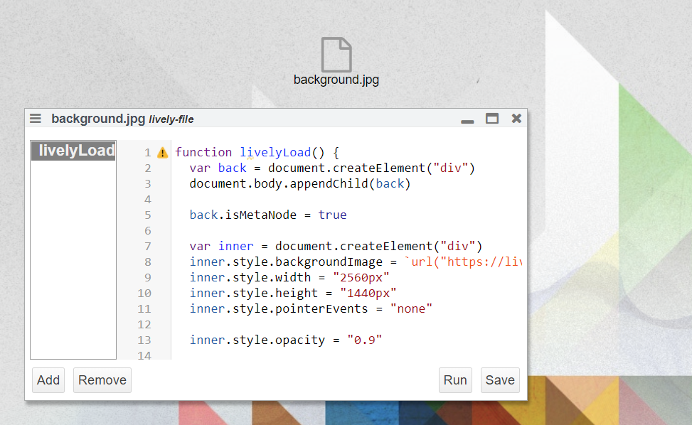

## 2018-11-21 #BackgroundImage

I want custome background images.... that I don't want to share with the internet. So I use a lively file.

```javascript
function livelyLoad() {
  document.querySelectorAll("#custombackground").forEach(ea => ea.remove())

  var back = document.createElement("div")
  back.id = "custombackground"
  document.body.appendChild(back)

  back.isMetaNode = true
  
  var inner = document.createElement("div")
  inner.style.backgroundImage = `url("https://lively4/scheme/livelyfile//${this.name }")`
  // inner.style.backgroundPosition = "50px 50px"
  var width = 2560
  var height = 1440
  lively.setPosition(inner, lively.pt(-1 * width, -1 * height))
  inner.style.width = 3 * width + "px"
  inner.style.height = 3 * height + "px"
  inner.style.pointerEvents = "none"

  inner.style.opacity = "0.9"
  inner.style.zIndex = -10000000

  back.appendChild(inner)

  back.style.width = "1px"
  back.style.height = "1px"
  back.style.overflow = "visible"
  back.style.zIndex = -10000000

}
```


