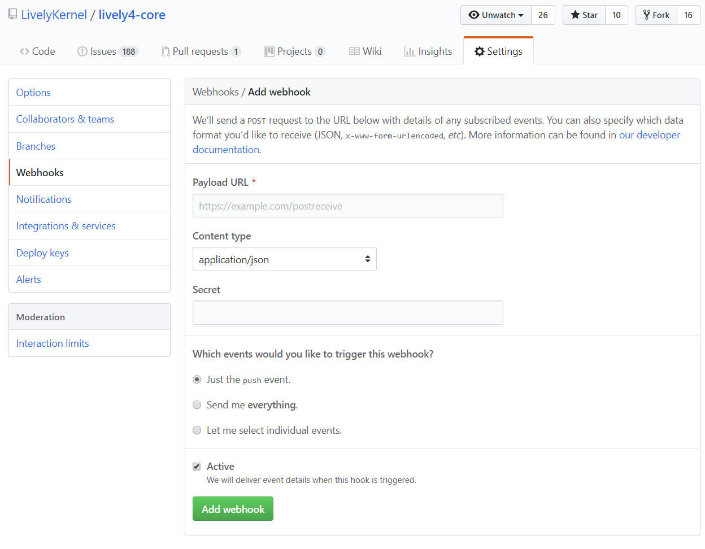

## 2019-01-30 #WebHook

### Idea: We should forward push and other events to lively-kernel.org

... and allow our clients to subscribe there. This would make it possible to update content in a running lively4 instance based on a remote commit.

- <https://github.com/LivelyKernel/lively4-core/settings/hooks/new> 
 