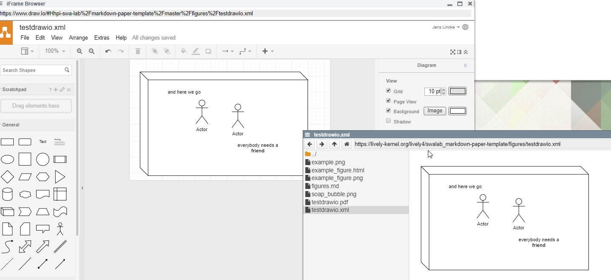

## 2019-01-31

Yeah it works.... principly

```javascript
import Files from "src/client/files.js"


fetch("https://lively-kernel.org/lively4/_webhook/register", {
  method: "GET",
  headers: {
    repositoryname: "hpi-swa-lab/markdown-paper-template"
  }
}).then(r => r.text()).then( async () => {
  

  await Files.checkoutGithubFile("https://lively-kernel.org/lively4/swalab_markdown-paper-template/figures/testdrawio.xml")  
  
  that.update()
})
```

{width=800}