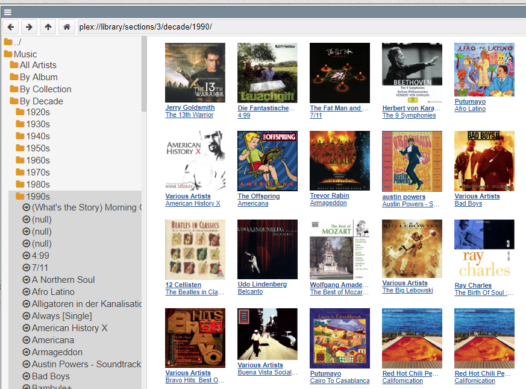

## 2019-03-21 #FileIndex

Found the FileIndex bug, not as expected in the client database update code but in the [server](https://lively-kernel.org/lively4/lively4-server/src/httpServer.js) providing the listing.
```javascript
(async() => {
var json = await fetch("https://lively-kernel.org/lively4S2/lively4-jens" + "/", {
      method: "OPTIONS",
      headers: {
        filelist  : true
      }
    }).then(r => r.json())
  

  return json.contents.filter(ea => ea.name.match('test')).sort()
})()
```

It turned out there was a max buffer size error, which could be fixed by increasing the buffer size in our [nodejs utils](https://lively-kernel.org/lively4/lively4-server/src/utils.js)... 

```javascript
export async function run(cmd) {
  return  new Promise((resolve) => {
    exec(cmd, {maxBuffer: 1024 * 2000}, (error, stdout, stderr) => {
      resolve({stdout, stderr, error});      
    });
  })
}
```


## #TODO: Install Attribute change observer
... should be somewhere

- ComponentLoader
- **utility function**

```javascript
this._attrObserver = new MutationObserver(mutations => {
  mutations.forEach(mutation => {
    if(mutation.type == "attributes") {
      // console.log("observation", mutation.attributeName,mutation.target.getAttribute(mutation.attributeName));
      this.attributeChangedCallback(
        mutation.attributeName,
        mutation.oldValue,
        mutation.target.getAttribute(mutation.attributeName)
      )
    }
  });
});
this._attrObserver.observe(this, { attributes: true });
```

## Implemented a [CacheScheme](browse:/src/client/poid.js) for #PolymorphicIdentifiers 

- https://dl.acm.org/citation.cfm?id=2508168.2508169

[Plex cover art](plex://library/sections/3/decade/1990/) is now fast!


