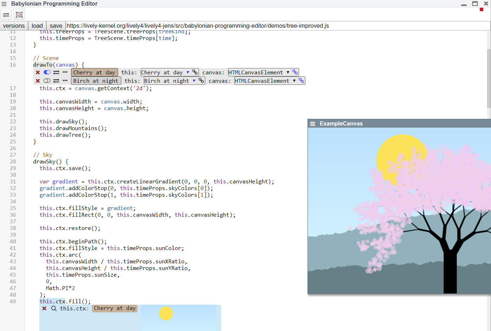
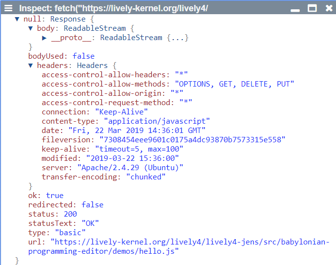
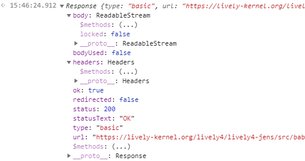

## 2019-03-22

- <open://babylonian-programming-editor>
- [] Task: get rid if lively-code-editor, before others... #CodeDuplication

### Babylonian Programming Editor works again!

### Custom vs Default Inspector

