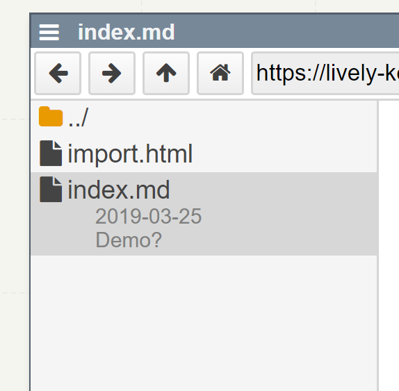

## 2019-03-25

- #Bug #Fixed lively-import cannot handle relative path in images tags in their content properly
  - #Idea is fixLinks used properly? #Done
  
{width=100}

<lively-import src="./import.html"></lively-import>

Does it work with imports from a different url? #Done

<lively-import src="./sub/subimport.html"></lively-import>
  
## Demo?

- [shonan](browse://demos/shonan/index.md)
- [overview](browse://demos/tools-and-workflows/index.md)

