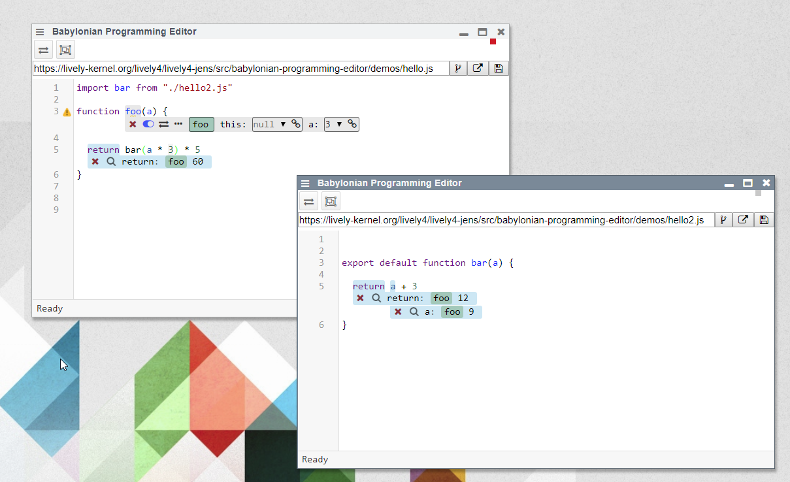

## 2019-03-26 #BabylonianProgramming


I fixed it... damn!


In <browse://src/external/babel-plugin-doit-this-ref.js> we encoded the path in our codeId like this: `somebath/theid`. But babylonian programming also used our workspace code but put whole urls in their codeId... when we tried to split them up. The `this` reference got missing. 


```javascript
  codeId = codeId.replace(/\/.*/,"/") // strip encoded path

```


