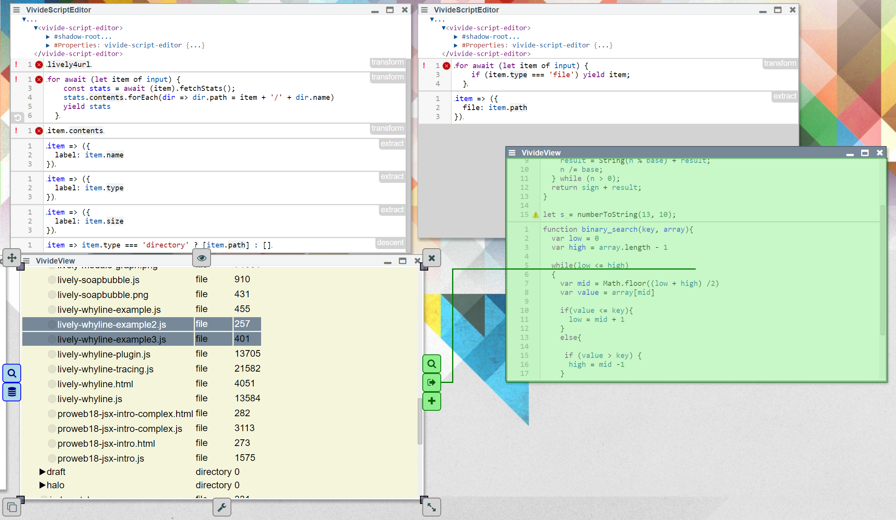

## 2019-04-04 Slow and steady: Vivide is getting there

Simple file browser and editor in vivide:

{width=750px}

## Scripts for file browser

#### transform

```javascript
 [async function* transform(input) {
  yield lively4url
}, {
  widget: 'table'
}]
```

#### transform

```javascript
[async function* transform(input) {
  for await (let item of input) {
    const stats = await (item).fetchStats();
    stats.contents.forEach(dir => dir.path = item + '/' + dir.name)
    yield stats
  }
}, {
  
}]
```

#### transform

```javascript
[async function* transform(input) {
  for await (let item of input) {
    yield item.contents;
  }
}, {
  
}]
```

#### extract

```javascript
[item => ({
  label: item.name
}), {
  header: 'filename'
}]
```

#### extract

```javascript
[item => ({
  label: item.type
}), {
  header: 'type'
}]
```

#### extract

```javascript
[item => ({
  label: item.size
}), {
  header: 'size'
}]
```

#### descent

```javascript
[item => item.type === 'directory' ? [item.path] : [], {
  
}]
```

## Scripts for file editor

#### transform

```javascript
[async function* transform(input) {
  for await (let item of input) {
    if (item.type === 'file') yield item;
  }
}, {
  widget: 'text'
}]
```

#### extract

```javascript
[item => ({
  file: item.path
}), {
  
}]
```