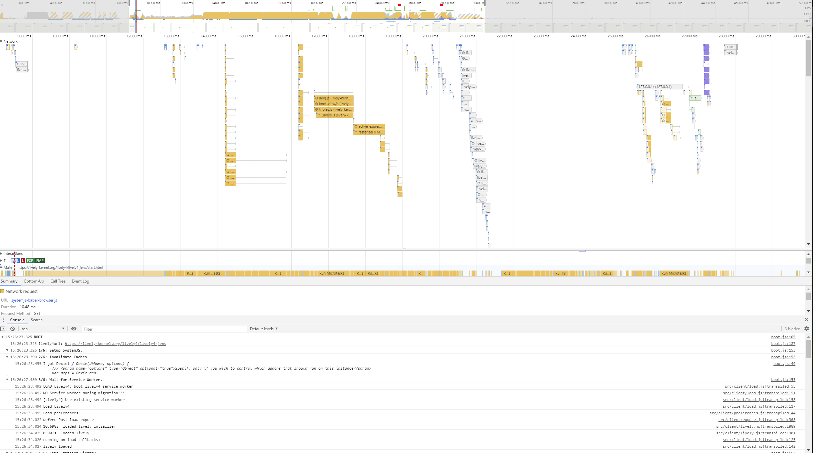

## 2019-04-15

Lively4 really takes a long time to load... for a dev environment / os it might be ok, but loading it on a different pages takes to long.

What are our options? Caching? Precompilation? Bundling? Damn, this will be hard, since all of these conflict with live and exploratory development. 

